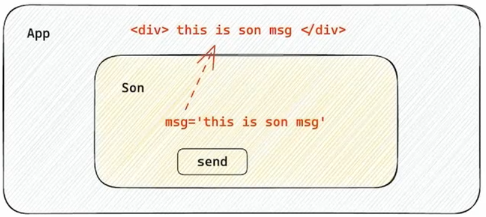

## React 简介

### React 是什么

React 由 Meta 公司研发，是一个用于构建 Web 和原生交互界面的库

### React 的优势

相较于传统的基于 DOM 开发的优势

- 组件化的开发方式
- 不错的性能

相较于其他前端框架的优势

- 丰富的生态
- 跨平台支持


## 开发环境搭建

### 使用 create-react-app 快速搭建开发环境

create-react-app 是一个快速创建 React 开发环境的工具，底层由 Webpack 构建，封装了配置细节，开箱即用

执行命令

```bash
pnpx create-react-app react-basic
```

使用 pnpx 执行 create-react-app 包，创建 React 项目，项目名称指定为 react-basic

清理 src 目录下的初始文件，只保留 App.js 和 index.js

index.js 内容如下

```jsx
import React from 'react';
import ReactDOM from 'react-dom/client';
import App from './App';
const root = ReactDOM.createRoot(document.getElementById('root'));
root.render(
  <App />
);
```

App.js 内容如下

```jsx
function App() {
  return (
    <div className="App">
      this is App
    </div>
  );
}

export default App;
```


## JSX 基础

### 概念和本质

什么是 JSX

概念：JSX 是 JavaScript 和 XML (HTML) 的缩写，表示在 JS 代码中编写 HTML 模板结构，它是 React 中编写 UI 模板的方式。

优势：

1. HTML 的声明式模板写法
2. JS 的可编程能力


JSX 的本质

JSX 并不是标准的 JS 语法，它是 JS 的语法扩展，浏览器本身不能识别，需要通过解析工具 (BABEL) 做解析之后才能在浏览器中运行


### 高频场景

#### JSX 中使用 JS 表达式

在 JSX 中可以通过大括号语法 {} 识别 JavaScript 中的表达式，比如常见的变量、函数调用、方法调用等等

1. 使用引号传递字符串
2. 使用 JavaScript 变量
3. 函数调用和方法调用
4. 使用 JavaScript 对象

示例代码

```jsx
const count = 100;

function getName() {
  return 'Tom';
}

function App() {
  return (
    <div className="App">
      this is App
      {/* 使用引号传递字符串 */}
      {'this is message'}
      {/* 识别js变量 */}
      {count}
      {/* 函数调用 */}
      {getName()}
      {/* 方法调用 */}
      {new Date().getDate()}
      {/* 使用js对象 */}
      <div style={{ color: 'red' }}>this is div</div>
    </div>
  );
}

export default App;
```

注意：if 语句、switch 语句、变量声明属于语句，不是表达式，不能出现在 {} 中


#### JSX 中实现列表渲染

语法：在 JSX 中可以使用原生 JS 中的 map 方法遍历渲染列表

有如下数据

```jsx
const list = [
  { id: 1001, name: 'Vue' },
  { id: 1002, name: 'React' },
  { id: 1003, name: 'Angular' }
]
```

使用 map 方法遍历渲染

```jsx
function App() {
  return (
    <div className="App">
      {/* 渲染列表 */}
      {/* map 循环哪个结构，返回哪个结构 */}
      {/* 注意：需要加上唯一性的key 字符串或number id */}
      {/* key 用于 react 内部提升更新性能 */}
      <ul>
        {list.map(item => <li key={item.id}>{item.name}</li>)}
      </ul>
    </div>
  );
}
```


#### JSX 中实现条件渲染


语法：在 React 中， 可以通过逻辑与运算符&&、三元表达式(?:) 实现基础的条件渲染

示例代码

```jsx
const isLogin = false;

function App() {
  return (
    <div className="App">
      {/* 逻辑与&& */}
      {isLogin && <span>this is span</span>}
      {/* 三元运算 */}
      {isLogin ? <span>Tom</span>: <span>please login</span>}
    </div>
  );
}

export default App;
```


#### JSX 中实现复杂条件渲染

需求：列表中需要根据文章状态适配三种情况，单图、三图和无图三种模式

解决方案：自定义函数+if判断语句

示例代码

```jsx
// 定义文章类型
const articleType = 1; // 0 1 3

// 定义核心函数，根据文章类型返回不同的 JSX 结构
function getArticleTem() {
  if (articleType === 0) {
    return <div>无图</div>;
  } else if (articleType === 1) {
    return <div>单图</div>;
  } else {
    return <div>三图</div>;
  }
}

function App() {
  return (
    <div className="App">
      {/* 调用函数渲染不同的模板 */}
      {getArticleTem()}
    </div>
  );
}

export default App;
```


## React 中的事件绑定

### React 基础事件绑定

语法：on + 事件名称 = { 事件处理程序 }，整体上遵循驼峰命名法

示例代码

```jsx
function App() {
  const handleClick = () => {
    console.log('button clicked')
  }
  return (
    <div className="App">
      <button onClick={handleClick}>Click me</button>
    </div>
  );
}

export default App;
```

### 使用事件对象参数

语法：在事件回调函数中设置形参 e

示例代码

```jsx
function App() {
  const handleClick = (e) => {
    console.log('button clicked', e)
  }
  return (
    <div className="App">
      <button onClick={handleClick}>Click me</button>
    </div>
  );
}

export default App;
```

### 传递自定义参数

语法：事件绑定的位置改造成箭头函数的写法，在执行 clickHandler 实际处理业务函数的时候传递实参

注意：不能直接写函数调用，这里事件绑定需要传入函数引用

示例代码

```jsx
function App() {
  const handleClick = (name) => {
    console.log('button clicked', name)
  }
  return (
    <div className="App">
      <button onClick={() => handleClick('Tom')}>Click me</button>
    </div>
  );
}

export default App;

```

### 同时传递事件对象和自定义参数

语法：在事件绑定的位置传递事件参数 e 和自定义参数，clickHandler 中声明形参，注意顺序对应

```jsx
function App() {
  const handleClick = (name, e) => {
    console.log('button clicked', name, e)
  }
  return (
    <div className="App">
      <button onClick={(e) => handleClick('Tom', e)}>Click me</button>
    </div>
  );
}

export default App;
```


## React 中的组件

### 组件是什么

概念：一个组件就是用户界面的一部分，它可以有自己的逻辑和外观，组件之间可以互相嵌套，也可以复用多次。

### React 组件

在 React 中，一个组件就是首字母大写的函数，内部存放了组件的逻辑和视图 UI，渲染组件只需要把组件当成标签书写即可

定义组件

```jsx
function Button() {
  return <button>click me</button>
}
```

使用组件

```jsx
function App() {
  return (
    <div className="App">
      {/* 自闭合 */}
      <Button />
      {/* 成对标签 */}
      <Button></Button>
    </div>
  );
}
```


## useState

### useState 基础使用

useState 是一个 React Hook (函数)，它允许我们向组件添加一个状态变量，从而控制影响组件的渲染结果

本质：和普通 JS 变量不同的是，状态变量一旦发生变化组件的视图 UI 也会跟着变化 (数据驱动视图)

```jsx
const [count, setCount] = useState(0)
```

1. useState 是一个函数，返回值是一个数组
2. 数组中的第一个参数是状态变量，第二个参数是 set 函数，用来修改状态变量
3. useState 的参数将作为 count 的初始值

示例代码

```jsx
// useState 实现一个计数器按钮

import { useState } from "react";

function App() {
  // 1. 调用useState添加状态变量
  // count状态变量
  // setCount 修改状态变量的方法
  const [count, setCount] = useState(0);

  // 2. 点击事件回调
  const handleClick = () => {
    // 修改count值，触发组件重新渲染
    setCount(count + 1);
  }
  return (
    <div className="App">

      <button onClick={handleClick}>{count}</button>
    </div>
  );
}

export default App;
```


## 修改状态的规则

### 状态不可变

在 React 中，状态被认为是只读的，我们应该始终替换它而不是修改它，直接修改状态不能引发视图更新

以下代码不会更新视图

```jsx
let [count, setCount] = useState(0)

const handleClick = () => {
    count++;
    console.log(count)
}
```

### 修改对象状态

规则：对于对象类型的状态变量，应该始终传给 set 方法一个全新的对象来进行修改

以下代码不会引起视图变化

```jsx
const [form, setForm] = useState({
    name: 'Tom',
})

const handleChangeName = () => {
    form.name = 'Jerry'
}
```

直接修改原对象，不会引发视图变化

以下是正确的做法

```jsx
const [form, setForm] = useState({ name: 'Tom' });

const changeForm = () => {
    setForm({
        ...form,
        name: 'Jerry'
    });
}
```

调用 set 传入新对象用于修改


## 组件的样式处理

### 组件基础样式方案

React 组件基础的样式控制有两种方式

1.行内样式 (不推荐)

```jsx
function App() {
  return (
    <div>
      {/* 行内样式控制 */}
      <span style={{ color: 'red', fontSize: '50px' }}>this is span</span>
    </div>
  );
}
```

2.class 类名控制

index.css

```css
.foo {
    color: red;
}
```

App.js

```jsx
import './index.css'

function App() {
  return (
    <div>
      {/* 通过className类名控制 */}
      <span className="foo">this is span</span>
    </div>
  );
}
```


## 案例：B站评论

B站评论案例

1.[渲染评论列表](#渲染评论列表)

2.[实现评论删除](#实现评论删除)

3.[渲染导航 Tab 和高亮实现](#渲染导航 Tab 和高亮实现)

4.[评论列表排序功能实现](#评论列表排序功能实现)


### 渲染评论列表

核心思路：

1. 使用 useState 维护评论列表
2. 使用 map 方法对列表数据进行遍历渲染

示例代码

```jsx
// 评论列表数据
const list = [
  {
    rpid: 3,
    user: {
      uid: '12121244',
      avatar: 'https://example.com/',
      uname: '小明',
    },
    content: '这是评论内容',
    ctime: '2020-01-01 12:11:00',
    like: 10,
  },
  {
    rpid: 4,
    user: {
      uid: '12121245',
      avatar: 'https://example.com/',
      uname: '小红',
    },
    content: '这是评论内容',
    ctime: '2020-01-01 12:14:00',
    like: 2,
  },
  {
    rpid: 5,
    user: {
      uid: '12121246',
      avatar: 'https://example.com/',
      uname: '小刚',
    },
    content: '这是评论内容',
    ctime: '2020-01-01 12:22:00',
    like: 7,
  },
]

function App() {
  // 渲染评论列表
  // 1. 使用useState维护list
  const [commentList, setCommentList] = useState(list)


  return (
    <div className='app'>
      <div className='reply-navigation'></div>

      <div className='reply-warp'>
        <div className='box-normal'></div>

        {/* 评论列表 */}
        <div className='reply-list'>
          {/* 评论项 */}
          {/* 2. 使用map方法对list数据进行遍历渲染 */}
          {commentList.map(item => (
            <div key={item.rpid} className='reply-item'>
              {/* 头像 */}
              <div className='root-reply-avatar'>
                <div className='bili-avatar'>
                  
                </div>
              </div>

              <div className='content-warp'>
                {/* 用户名 */}
                <div className='user-info'>
                  <div className='user-name'>{item.user.uname}</div>
                </div>
                {/* 评论内容 */}
                <div className='root-reply'>
                  <span className='reply-content'>{item.content}</span>
                  <div className='reply-info'>
                    {/* 评论时间 */}
                    <span className='reply-time'>{item.ctime}</span>
                    {/* 评论数量 */}
                    <span className='trply-time'>点赞数:{item.like}</span>
                    <span className='delete-btn'>删除</span>
                  </div>
                </div>
              </div>
            </div>
          ))}
        </div>
        
      </div>
    </div>
  );
}
```


### 实现评论删除

需求：

1. 只有自己的评论才显示删除按钮
2. 点击删除按钮，删除当前评论，列表中不再显示

核心思路

1. 删除按钮显示 - 条件渲染
2. 删除功能 - 拿到当前项 id 以 id 为条件对评论列表做 filter 过滤

示例代码

```jsx
{/* 条件：user.uid === item.user.uid */}
{user.uid === item.user.uid &&
  <span className='delete-btn' onClick={() => handleDel(item.rpid)}>删除</span>
}
```

```jsx
// 删除功能
const handleDel = (id) => {
  // 使用filter方法过滤掉要删除的评论
  setCommentList(commentList.filter(item => item.rpid !== id))
}
```


### 渲染导航 Tab 和高亮实现

需求：点击哪个 tab 项，哪个做高亮处理

核心思路：点击谁就把谁的 type (独一无二的标识) 记录下来，然后和遍历时的每一项 type 做匹配，谁匹配到就设置高亮的类名

示例代码

```jsx
// 导航栏数据
const tabs = [
  { type: 'hot', text: '最热' },
  { type: 'time', text: '最新' }
]

function App() {
  // tab切换功能
  const handleTabChange = (type) => {
    console.log(type);
    setType(type)
  }
  return (
    <div className='app'>
      <div className='reply-navigation'>
        <ul className='nav-bar'>
          <li className='nav-title'>
            <span className='nav-title-text'>评论</span>
            {/* 评论数量 */}
            <span className='total-reply'>{1}</span>
          </li>
          <li className='nav-sort'>
            {/* 高亮类名：active */}
            {tabs.map(item =>
              <span
                key={item.type}
                className={`nav-item ${type === item.type && 'active'}`}
                onClick={() => handleTabChange(item.type)}>
                {item.text}
              </span>
            )}
          </li>
        </ul>
      </div>

      <div className='reply-warp'>
        <div className='box-normal'></div>

        {/* 评论列表 */}
        <div className='reply-list'>
          {/* 评论项 */}
          {/* 使用map方法对list数据进行遍历渲染 */}
          {commentList.map(item => (
            <div key={item.rpid} className='reply-item'>
              {/* 头像 */}
              <div className='root-reply-avatar'>
                <div className='bili-avatar'>
                  
                </div>
              </div>

              <div className='content-warp'>
                {/* 用户名 */}
                <div className='user-info'>
                  <div className='user-name'>{item.user.uname}</div>
                </div>
                {/* 评论内容 */}
                <div className='root-reply'>
                  <span className='reply-content'>{item.content}</span>
                  <div className='reply-info'>
                    {/* 评论时间 */}
                    <span className='reply-time'>{item.ctime}</span>
                    {/* 评论数量 */}
                    <span className='trply-time'>点赞数:{item.like}</span>
                    {/* 条件：user.uid === item.user.uid */}
                    {user.uid === item.user.uid &&
                      <span className='delete-btn' onClick={() => handleDel(item.rpid)}>删除</span>
                    }
                  </div>
                </div>
              </div>
            </div>
          ))}
        </div>

      </div>
    </div>
  );
}
```


### 评论列表排序功能实现

需求：点击最新，评论列表按照创建时间倒序排列 (新的在前)，点击最热，按照点赞数排序 (多的在前)

核心思路：把评论列表状态数据进行不同的排序处理，当成新值传给 set 函数重新渲染视图 UI

示例代码

```jsx
// tab切换功能
const handleTabChange = (type) => {
  console.log(type);
  setType(type)
  // 基于列表的排序
  if (type === 'hot') {
    // 根据点赞数排序
    // setCommentList(_.orderBy(commentList, 'like', 'desc'))
    setCommentList([...commentList].sort((a, b) => a.like > b.like ? -1 : 1))
  } else {
    // 根据时间排序
    // setCommentList(_.orderBy(commentList, 'ctime', 'desc'))
    setCommentList([...commentList].sort((a, b) => a.ctime > b.ctime ? -1 : 1))
  }
}
```

可以使用 [lodash](https://www.lodashjs.com/) 提供的简化方法排序 (返回的是新数组)，也可以使用原生 JS 的 sort 方法，不过需要使用展开运算符 `[...commentList]` 创建 commentList 的浅拷贝，然后排序完返回新数组，以保证 React 中状态不可变的原则。

可以在状态变量初始化时就对数据排序，满足首屏默认排序的功能

```jsx
const [commentList, setCommentList] = useState(_.orderBy(list, 'like', 'desc'))
```


### classnames 优化类名控制

[classnames](https://github.com/JedWatson/classnames) 是一个简单的 JS 库，可以非常方便的通过条件动态控制 class 类名的显示

之前的示例代码

```jsx
<span
  key={item.type}
  onClick={()=>handleTabChange(item.type)}
  className={`nav-item ${type === item.type && active}`}>
  {item.text}
</span>
```

其中的 `className` 的值就是一个模板字符串，本质上是字符串拼接

现在的问题：字符串的拼接方式不够直观，也容易出错

使用classnames 库之后

```jsx
<span
  className={classNames('nav-item', { active: type === item.type })}>
</span>
```


## 受控表单绑定

概念：使用 React 组件的状态 (useState) 控制表单的状态


1.准备一个 React 状态值

```jsx
const [value, setValue] = useState('')
```

2.通过 value 属性绑定状态，通过 onChange 属性绑定状态同步的函数

```jsx
<input
  type="text"
  value={value}
  onChange={(e) => setValue(e.target.value)} 
/>
```


示例代码

```jsx
// 受控表单绑定
import { useState } from 'react'

function App() {

  // 声明一个react状态
  const [value, setValue] = useState('')

  // 核心绑定流程
  // 1. 通过value属性绑定react状态
  // 2. 绑定onChange事件，通过事件参数e获取输入框的最新值，反向修改react状态
  return (
    <div>
      <input
        value={value}
        type="text"
        onChange={(e) => setValue(e.target.value)}
      />
    </div>
  );
}

export default App;
```

使用浏览器插件 react dev tools 可以查看 state 的变化，并可以通过在插件中修改 state 反应到视图上


## React 中获取 DOM

在React 组件中获取/操作 DOM，需要使用 useRef 钩子函数，分为两步：

1.使用 useRef 创建 ref 对象，并与 JSX 绑定

```jsx
const inputRef = useRef(null)
```

```jsx
<input type="text" ref={inputRef} />
```

2.在 DOM 可用时，通过 inputRef.current 拿到 DOM 对象

```jsx
console.log(inputRef.current)
```


示例代码

```jsx
// React中获取DOM
import { useRef } from 'react'

function App() {

  // 1. useRef生成ref对象 绑定到dom标签上
  // 2. dom可用时，ref.current获取dom对象
  // 渲染完毕之后dom生成之后才可用
  const inputRef = useRef(null)

  const showDom = () => {
    // console.log(inputRef.current);
    console.dir(inputRef.current)
  }
  return (
    <div>
      <input
        type="text"
        ref={inputRef}
      />
      <button onClick={showDom}>获取dom</button>
    </div>
  )
}

export default App;
```


## B站评论案例 —  核心功能实现

### 发表评论

1.获取评论内容

2.点击发布按钮发布评论

示例代码参考此 [commit](https://github.com/s-chance/react-learning/commit/60fe2ce7c903f264f898cf90558933ece4dc8174) 的代码改动


### id处理和时间处理

1.rpid 要求一个唯一的随机数id — [uuid](https://github.com/uuidjs/uuid)

安装 uuid

```bash
pnpm install uuid
```

使用示例

```jsx
import { v4 as uuidV4 } from 'uuid'
```

```jsx
const handlePublish = () => {
  setCommentList([
    ...commentList,
    {
      rpid: uuidV4(), // 随机id
      user: {
        uid: '12121246',
        avatar: 'https://example.com/',
        uname: '小刚',
      },
      content: content,
      ctime: '2020-01-01 12:44:00',
      like: 7,
    },
  ])
}
```


2.ctime 要求以当前时间为标准，生成固定格式 - [dayjs](https://dayjs.fenxianglu.cn/)

安装 dayjs

```bash
pnpm install dayjs
```

使用示例

```jsx
const handlePublish = () => {
  setCommentList([
    ...commentList,
    {
      rpid: uuidV4(), // 随机id
      user: {
        uid: '12121246',
        avatar: 'https://example.com/',
        uname: '小刚',
      },
      content: content,
      ctime: dayjs().format('MM-DD HH:mm'), // 格式化 月-日 时:分
      like: 7,
    },
  ])
}
```


### 清空内容并重新聚焦

1.清空内容 - 把控制 input 框的 value 状态设置为空串

2.重新聚焦 - 拿到 input 的 dom 元素，调用 focus 方法


示例代码

```jsx
const inputRef = useRef(null)

const handlePublish = () => {
  setCommentList([
    ...commentList,
    {
      rpid: uuidV4(), // 随机id
      user: {
        uid: '12121246',
        avatar: 'https://example.com/',
        uname: '小刚',
      },
      content: content,
      ctime: dayjs().format('MM-DD HH:mm'), // 格式化 月-日 时:分
      like: 7,
    },
  ])

  // 清空评论框
  setContent('')
  // 重新聚焦
  inputRef.current.focus()
}
```

```jsx
<textarea
  className='reply-box-textarea'
  placeholder='发表一条友善的评论'
  ref={inputRef}
  value={content}
  onChange={(e) => setContent(e.target.value)}
  />
```


## 组件通信

概念：组件通信就是组件之间的数据传递，根据组件嵌套关系的不同，有不同的通信方法


### 父传子 - 基础实现


实现步骤

1.父组件传递数据 - 在子组件标签上绑定属性

2.子组件接收数据 - 子组件通过 props 参数接收数据


示例代码

```jsx
// 父传子
// 1. 父组件传递数据 子组件传递
// 2. 子组件接收数据 props的参数

function Son(props) {
  // props对象里面包含了父组件传递过来的所有数据
  console.log(props);
  // { name: '父组件中的数据' }
  return <div>this is son, {props.name}</div>
}

function App() {
  const name = 'this is app name'
  return (
    <div>
      <Son name={name} />
    </div>
  )
}

export default App;
```


### 父传子 - props说明

1.props 可传递任意的数据

数字、字符串、布尔值、数组、对象、函数、JSX

2.props 是只读对象

子组件只能读取 props 中的数据，不能直接进行修改，父组件的数据只能由父组件修改


### 父传子 - 特殊的 prop children

场景：当我们把内容嵌套在子组件标签中时，父组件会自动在名为 children 的 prop 属性中接收该内容

```jsx
<Son>
  <span>this is span</span>
</Son>
```

```jsx
function Son(props) {
  return <div>this is son, {props.children}</div>
}
```


### 父子组件通信 - 子传父



核心思路：在子组件中调用父组件中的函数并传递参数

```jsx
function App() {
  const getMsg = (msg) => console.log(msg)
  return (
    <div>
      <Son onGetMsg={getMsg} />
    </div>
  )
}
```

```jsx
function Son({ onGetMsg }) {
  const sonMsg = 'this is son msg'
  return (
    <div>
      <button onClick={()=>onGetMsg(sonMsg)}>send</button>
    </div>
  )
}
```


示例代码

```jsx
import { useState } from 'react'

function Son({ onGetMsg }) {
  const sonMsg = 'this is son msg'
  return (
    <div>
      this is Son
      <button onClick={() => onGetMsg(sonMsg)}>sendMsg</button>
    </div>
  )
}

function App() {

  const [msg, setMsg] = useState('')
  
  const getMsg = (msg) => {
    console.log(msg)
    setMsg(msg)
  }

  return (
    <div>
      this is App, {msg}
      <Son onGetMsg={getMsg} />
    </div>
  )
}

export default App;
```


### 使用状态提升实现兄弟组件通信


实现思路：借助“状态提升”机制，通过父组件进行兄弟之间的数据传递

1.A组件先通过子传父的方式把数据传给父组件App

2.App拿到数据后通过父传子的方式再传递给B组件


示例代码

```jsx
// 通过子传父 A -> App
// 通过父传子 App -> B
import { useState } from 'react'

function A({ onGetAName }) {
  const name = 'this is A name'
  return (
    <div>
      this is A component
      <button onClick={() => onGetAName(name)}>send</button>
    </div>
  )
}

function B({ name }) {
  return (
    <div>
      this is B component, {name}
    </div>
  )
}


function App() {
  const [name, setName] = useState('')

  const getAName = (name) => {
    console.log(name);
    setName(name)
  }

  return (
    <div>
      this is App component
      <A onGetAName={getAName} />
      <B name={name} />
    </div>
  )
}

export default App;
```


### 使用 Context 机制跨层级组件通信


实现步骤：

1.使用 createContext 方法创建一个上下文对象 Ctx

2.在顶层组件 (App) 中通过 Ctx.Provider 组件提供数据

3.在底层组件 (B) 中通过 useContext 钩子函数获取消费数据


示例代码

```jsx
// App -> A -> B
import { createContext, useContext } from 'react'
// 1. createContext方法创建一个上下文对象
const MsgContext = createContext()

// 2. 在顶层组件 通过provider组件提供数据

// 3. 在底层组件 通过useContext钩子函数使用数据

function A() {
  return (
    <div>
      this is A component
      <B />
    </div>
  )
}

function B() {
  const msg = useContext(MsgContext)
  return (
    <div>
      this is B component, {msg}
    </div>
  )
}
function App() {
  const msg = 'this is app msg'
  return (
    <div>
      <MsgContext.Provider value={msg}>
        this is App component
        <A />
      </MsgContext.Provider>
    </div>
  )
}

export default App;
```


## useEffect 的使用

### useEffect 的概念理解

useEffect 是一个 React Hook 函数，用于在 React 组件中创建不是由事件引起而是由渲染本身引起的操作，比如发送 AJAX 请求，更改 DOM 等等。


说明：上面的组件中没有发生任何的用户事件，组件渲染完毕之后就需要和服务器要数据，整个过程属于“只由渲染引起的操作”


### useEffect 的基础使用

需求：在组件渲染完毕之后，立刻从服务端获取频道列表数据并显示到页面中

语法：`useEffect(() => {}, [])`

参数1是一个函数，可以把它叫做副作用函数，在函数内部可以放置要执行的操作

参数2是一个数组 (可选参数)，在数组里放置依赖项，不同依赖项会影响第一个参数函数的执行，当是一个空数组的时候，副作用函数只会在组件渲染完毕之后执行一次

公益接口：https://geek.itheima.net/v1_0/channels

示例代码

```jsx
import { useEffect, useState } from 'react'

const URL = 'https://geek.itheima.net/v1_0/channels'

function App() {
  // 创建状态数据
  const [list, setList] = useState([])

  useEffect(() => {
    // 获取数据
    async function getList() {
      const res = await fetch(URL)
      const jsonRes = await res.json()
      console.log(jsonRes)
      setList(jsonRes.data.channels)
    }
    getList()
  }, [])
  return (
    <div>
      this is app
      <ul>
        {list.map(item => <li key={item.id}>{item.name}</li>)}
      </ul>
    </div>
  )
}

export default App;
```


### useEffect 依赖项参数说明

useEffect 副作用函数的执行时机存在多种情况，根据传入依赖项的不同，会有不同的执行表现


示例代码

```jsx
import { useEffect, useState } from 'react'

function App() {

  const [count, setCount] = useState(0)

  // 没有依赖项 只会在组件挂载和状态更新时执行
  // useEffect(() => {
  //   console.log('副作用函数执行了')
  // })

  // 传入空数组依赖 仅在组件挂载时执行
  // useEffect(() => {
  //   console.log('副作用函数执行了')
  // }, [])
  
  // 传入特定依赖项 仅在组件挂载和依赖项发生变化时执行
  useEffect(() => {
    console.log('副作用函数执行了')
  },[count])
  return (
    <div>
      this is app
      <button onClick={() => setCount(count + 1)}>{count}</button>
    </div>
  )
}

export default App;
```


### useEffect — 清除副作用

在 useEffect 中编写的由渲染本身引起的对接外组件外部的操作，社区也经常把它叫做副作用操作，比如在 useEffect 中开启了一个定时器，我们想在组件卸载时把这个定时器再清理掉，这个过程就是清理副作用

```jsx
useEffect(() => {
  // 副作用操作逻辑
  return () => {
    // 清除副作用逻辑
  }
},[])
```

说明：清除副作用的函数最常见的执行时机是在组件卸载时自动执行

需求：在 Son 组件渲染时开启一个定制器，卸载时清除这个定时器

示例代码

```jsx
import { useEffect, useState } from 'react';

function Son() {
  //  渲染时开启一个定时器
  useEffect(() => {
    const timer = setInterval(() => {
      console.log('定时器执行中...');
    }, 1000)
    return () => {
      // 清除副作用(组件卸载时)
      clearInterval(timer)
    }
  }, [])
  return <div>this is son</div>
}

function App() {
  const [show, setShow] = useState(true)
  return (
    <div>
      {show && <Son />}
      <button onClick={() => setShow(false)}>卸载Son组件</button>
    </div>
  )
}

export default App;
```


## 自定义 Hook 函数

概念：自定义 Hook 是以 use 开头的函数，通过自定义 Hook 函数可以用来实现逻辑的封装和复用


通过 toggle 按钮控制div 的显示/隐藏


不封装直接实现

```jsx
import { useState } from 'react';
function App() {
  const [value, setValue] = useState(true);

  const toggle = () => setValue(!value);
  return (
    <div>
      {value && <div>this is div</div>}
      <button onClick={toggle}>toggle</button>
    </div>
  )
}

export default App;
```

问题：布尔切换的逻辑，当前组件耦合在一起，不方便复用

解决思路：自定义 hook


封装自定义 Hook 实现

```jsx
import { useState } from 'react';


// 自定义hook
function useToggle() {
  // 可复用的逻辑
  const [value, setValue] = useState(true);

  const toggle = () => setValue(!value);

  // 哪些状态和回调函数需要在外部使用，就返回哪些
  return { value, toggle };
}

function App() {

  const { value, toggle } = useToggle();

  return (
    <div>
      {value && <div>this is div</div>}
      <button onClick={toggle}>toggle</button>
    </div>
  )
}

export default App;
```

封装自定义 hook 的通用思路

1.声明一个以 use 开头的函数

2.在函数体内封装可复用的逻辑

3.把组件中用到的状态或者回调函数 return (可以是对象或数组的形式)

4.在哪个组件中要使用这个逻辑，就执行这个函数，解构出状态和回调函数进行使用


## React Hooks 使用规则

使用规则

1.只能在组件中或者其他自定义 Hook 函数中调用

2.只能在组件的顶层调用，不能嵌套在 if、for、其他函数中


## 案例：优化B站评论案例

### 优化需求

1.使用请求接口的方式获取评论列表并渲染

2.使用自定义 Hook 函数封装数据请求的逻辑

3.把评论中的每一项抽象成一个独立的组件实现渲染


### 通过接口获取评论列表

1.使用 [json-server](https://github.com/typicode/json-server) 工具模拟接口服务，通过 [axios](https://github.com/axios/axios) 发送接口请求

json-server 是一个快速以 json 文件作为数据源模拟接口服务的工具

axios 是一个广泛使用的前端请求库

安装 json-server

```jsx
pnpm install -D json-server
```

准备一个 db.json 文件，放在 项目根目录下，测试数据如下

```json
{
  "list": [
    {
      "rpid": 1,
      "user": {
        "uid": 1,
        "avatar": "http://www.gravatar.com/avatar/1",
        "uname": "user1"
      },
      "content": "hello world",
      "ctime": "2011-11-11 11:11:11",
      "like": 1221
    },
    {
      "rpid": 2,
      "user": {
        "uid": 2,
        "avatar": "http://www.gravatar.com/avatar/2",
        "uname": "user2"
      },
      "content": "react is the best!",
      "ctime": "2011-11-12 12:11:11",
      "like": 991
    },
    {
      "rpid": 3,
      "user": {
        "uid": 3,
        "avatar": "http://www.gravatar.com/avatar/3",
        "uname": "user3"
      },
      "content": "vue is the best!",
      "ctime": "2011-11-12 11:13:11",
      "like": 987
    }
  ]
}
```

在 package.json 的 “scripts” 中添加命令

```json
"scripts": {
  "serve": "json-server db.json --port 3004"
},
```

启动服务，访问 http://localhost:3004/list 即可获取到 db.json 提供的数据

```bash
pnpm serve
```


安装 axios

```bash
pnpm install axios
```


2.使用 useEffect 调用接口获取数据

```jsx
import axios from 'axios'
```

```jsx
const [commentList, setCommentList] = useState([])

useEffect(() => {
  // 请求数据
  async function getList() {
    // axios请求数据
    const res = await axios.get('http://localhost:3004/list')
    setCommentList(res.data)
  }
  getList()
}, [])

```


### 自定义 Hook 函数封装数据请求

一般思路：

1.编写一个 use 开头的函数

2.函数内部编写封装的逻辑

3.return 出去组件中用到的状态和方法

4.组件中调用函数结构赋值使用


### 封装评论项 Item 组件

抽象原则：App 作为“智能组件”负责数据的获取，Item 作为“UI组件”负责数据的渲染

```jsx
// 封装Item组件
function Item({ item, onDel }) {
  return (
    <div className='reply-item'>
      {/* 头像 */}
      <div className='root-reply-avatar'>
        <div className='bili-avatar'>
          
        </div>
      </div>

      <div className='content-warp'>
        {/* 用户名 */}
        <div className='user-info'>
          <div className='user-name'>{item.user.uname}</div>
        </div>
        {/* 评论内容 */}
        <div className='root-reply'>
          <span className='reply-content'>{item.content}</span>
          <div className='reply-info'>
            {/* 评论时间 */}
            <span className='reply-time'>{item.ctime}</span>
            {/* 评论数量 */}
            <span className='trply-time'>点赞数:{item.like}</span>
            {/* 条件：user.uid === item.user.uid */}
            {user.uid === item.user.uid &&
              <span className='delete-btn' onClick={() => onDel(item.rpid)}>删除</span>
            }
          </div>
        </div>
      </div>
    </div>
  )
}
```

```jsx
{/* 评论列表 */}
<div className='reply-list'>
  {/* 评论项 */}
  {commentList.map(item => <Item key={item.rpid} item={item} onDel={handleDel} />)}
</div>
```

父组件中的函数需要传递给子组件使用。


## Redux 快速上手

Redux 是 React 最常用的集中状态管理工具，类似于 Vue 中的 Pinia (Vuex)，可以独立于框架运行

作用：通过集中管理的方式管理应用的状态


不和任何框架绑定，不使用任何构建工具，使用纯 Redux 实现计数器

使用步骤：

1.定义一个 reducer 函数 (根据当前想要做的修改返回一个新的状态)

2.使用 createStore 方法传入 reducer 函数生成一个 store 实例对象

3.使用 store 实例的 subscribe 方法订阅数据的变化 (数据一旦发生变化，可以得到通知)

4.使用 store 实例的 dispatch 方法提交 action 对象触发数据变化 (告诉 reducer 怎么改数据)

5.使用 store 实例的 getState 方法获取最新的状态数据并更新到视图中

示例代码

```html
<!DOCTYPE html>
<html lang="en">

<head>
    <meta charset="UTF-8">
    <meta name="viewport" content="width=device-width, initial-scale=1.0">
    <title>Redux-counter</title>
</head>

<body>
    <button id="decrement">-</button>
    <span id="count">0</span>
    <button id="increment">+</button>

    <script src="https://unpkg.com/redux@4.0.5/dist/redux.min.js"></script>
    <script>
        // 1. 定义reducer函数
        // 根据当前action对象返回新的state
        // state: 管理数据初始状态
        // action: 对象 type 标记当前需要进行什么样的修改
        function reducer(state = { count: 0 }, action) {
            // 数据不可变，基于原始状态生成新的状态
            if (action.type === 'INCREMENT') {
                return { count: state.count + 1 }
            }
            if (action.type === 'DECREMENT') {
                return { count: state.count - 1 }
            }
            return state
        }

        // 2. 创建store对象
        const store = Redux.createStore(reducer)

        // 3. 通过store实例的subscribe订阅数据变化
        // 当数据发生变化时，自动执行回调函数
        store.subscribe(() => {
            console.log('state变化', store.getState());
            // 5. 通过store实例的getState函数获取最新状态更新到视图中
            document.getElementById('count').innerText = store.getState().count
        })

        // 4. 通过store实例的dispatch函数提交action更改状态
        const inBtn = document.getElementById('increment');
        inBtn.addEventListener('click', () => {
            store.dispatch({ type: 'INCREMENT' })
        })

        const deBtn = document.getElementById('decrement');
        deBtn.addEventListener('click', () => {
            store.dispatch({ type: 'DECREMENT' })
        })
    </script>
</body>

</html>
```


Redux 管理数据流程梳理


为了职责清晰，数据流向明确，Redux 把整个数据修改的流程分成了三个核心概念，分别是：state、action 和 reducer

1.state: 一个对象，存放着管理的数据状态

2.action: 一个对象，用来描述如何修改数据

3.reducer: 一个函数，根据 action 的描述生成一个新的 state


## Redux 与 React - 环境准备

### 配套工具

在 React 中使用 redux，需要安装两个插件 - Redux Toolkit 和 react-redux

1.Redux Toolkit (RTK) - 官方推荐编写 Redux 逻辑的方式，是一套工具的集合。简化 store 的配置方式，内置 immer 支持可变式状态修改，内置 thunk 更好的异步创建

2.react-redux，用来链接 Redux 和 React 组件的中间件


### 配置基础环境

1.使用 CRA 快速创建 React 项目

```bash
pnpx create-react-app react-redux
```

2.安装配套工具

```bash
pnpm install @reduxjs/toolkit react-redux
```

3.启动项目

```bash
pnpm start
```


### store 目录结构设计

1.通常集中状态管理的部分都会单独创建一个单独的 store 目录

2.应用通常会有很多个子 store 模块，所以创建一个 modules 目录，在内部编写业务分类的子 store

3.store 中的入口文件 index.js 的作用是组合 modules 中所有的子模块，并导出 store


## Redux 与 React - 实现 counter


### 使用 React Toolkit 创建 counterStore

store/modules/counterStore.js

```js
import { createSlice } from '@reduxjs/toolkit'

const counterStore = createSlice({
    name: 'counter',
    // 初始化状态
    initialState: {
        count: 0
    },
    // 修改状态的方法 同步方法 支持直接修改
    reducers: {
        increment(state) {
            state.count++
        },
        decrement(state) {
            state.count--
        }
    }
})

// 解构actionCreater函数
const { increment, decrement } = counterStore.actions
// 获取reducer
const reducer = counterStore.reducer

// 以按需导出的方式导出方法
export { increment, decrement }
// 以默认导出的方式导出reducer
export default reducer
```

store/index.js

```js
import { configureStore } from "@reduxjs/toolkit"
// 导入子模块reducer
import counterReducer from './modules/counterStore'

const store = configureStore({
    reducer: {
        counter: counterReducer
    }
})

export default store
```


### 为 React 注入 store

react-redux 负责把 Redux 和 React 链接起来，内置 Provider 组件通过 store 参数把创建好的 store 实例注入到应用中，链接正式建立

项目根目录下的 index.js

```jsx
import store from './store';
import { Provider } from 'react-redux'

const root = ReactDOM.createRoot(document.getElementById('root'));
root.render(
  <React.StrictMode>
    <Provider store={store}>
      <App />
    </Provider>
  </React.StrictMode>
);
```


### React 组件中使用 store 中的数据

在 React 组件中使用 store 中的数据，需要用到一个钩子函数 - useSelector，它的作用是把 store 中的数据映射到组件中，使用示例如下

```jsx
import { useSelector } from "react-redux";

function App() {
  const { count } = useSelector(state => state.counter)
  return (
    <div className="App">
      {count}
    </div>
  );
}

export default App;
```


### React 组件修改 store 中的数据

React 组件中修改 store 中的数据需要借助另外一个 hook 函数 - useDispatch，它的作用是生成提交 action 对象的 dispatch 函数，使用示例如下

```jsx
import { useDispatch, useSelector } from "react-redux";
// 导入方法
import { increment, decrement } from "./store/modules/counterStore";
function App() {
  const { count } = useSelector(state => state.counter)
  const dispatch = useDispatch()
  return (
    <div className="App">
      <button onClick={() => dispatch(decrement())}>-</button>
      {count}
      <button onClick={() => dispatch(increment())}>+</button>
    </div>
  );
}

export default App;
```


### 总结

1.组件中使用哪个 hook 函数获取 store 中的数据？

useSelector

2.组件中使用哪个 hook 函数获取 dispatch 方法？

useDispatch

3.如何得到要提交的 action 对象？

执行 store 模块中导出的方法


## Redux 与 React - 提交 action 传参

### 需求说明

组件中有两个按钮 add to 10 和 add to 20 可以直接把 count 值修改到对应的数字，目标 count 值是在组件中传递过去的，需要在提交 action 的时候传递参数

### 提交 action 传参实现需求

在 reducers 的同步修改方法中添加 action 对象参数，在调用 actionCreator 的时候传递参数，参数会被传递到 action 对象 payload 属性上

在 counterStore.js 中新增 `addToNum` 方法

```js
import { createSlice } from '@reduxjs/toolkit'

const counterStore = createSlice({
    name: 'counter',
    // 初始化状态
    initialState: {
        count: 0
    },
    // 修改状态的方法 同步方法 支持直接修改
    reducers: {
        increment(state) {
            state.count++
        },
        decrement(state) {
            state.count--
        },
        addToNum(state, action) {
            state.count = action.payload
        }
    }
})

// 解构actionCreater函数
const { increment, decrement, addToNum } = counterStore.actions
// 获取reducer
const reducer = counterStore.reducer

// 以按需导出的方式导出actionCreater
export { increment, decrement, addToNum }
// 以默认导出的方式导出reducer
export default reducer
```

在 App.js 中传递参数

```jsx
import { useDispatch, useSelector } from "react-redux";
// 导入 actionCreator
import { increment, decrement, addToNum } from "./store/modules/counterStore";
function App() {
  const { count } = useSelector(state => state.counter)
  const dispatch = useDispatch()
  return (
    <div className="App">
      <button onClick={() => dispatch(decrement())}>-</button>
      {count}
      <button onClick={() => dispatch(increment())}>+</button>
      <button onClick={() => dispatch(addToNum(10))}>add To 10</button>
      <button onClick={() => dispatch(addToNum(20))}>add To 20</button>
    </div>
  );
}

export default App;
```


## Redux 与 React - 异步状态操作


### 异步操作样板代码

1.创建 store 的写法保持不变，配置好同步修改状态的方法

2.单独封装一个函数，在函数内部 return 一个新函数，在新函数中

- 封装异步请求获取数据
- 调用同步 actionCreater 传入异步数据生成一个 action 对象，并使用 dispatch 提交

3.组件中 dispatch 的写法保持不变


store/modules/channelStore.js

```js
import { createSlice } from "@reduxjs/toolkit"
import axios from 'axios'

const channelStore = createSlice({
    name: 'channel',
    initialState: {
        channelList: []
    },
    reducers: {
        setChannels(state, action) {
            state.channelList = action.payload
        }
    }
})

// 异步请求
const { setChannels } = channelStore.actions

const fetchChannelList = () => {
    return async (dispatch) => {
        const res = await axios.get('https://geek.itheima.net/v1_0/channels')
        dispatch(setChannels(res.data.data.channels))
    }
}

export { fetchChannelList }

const reducer = channelStore.reducer

export default reducer
```

store/index.js

```jsx
import { configureStore } from "@reduxjs/toolkit"
// 导入子模块reducer
import counterReducer from './modules/counterStore'
import channelReducer from './modules/channelStore'

const store = configureStore({
    reducer: {
        counter: counterReducer,
        channel: channelReducer
    }
})

export default store
```

App.js

```jsx
import { useEffect } from 'react'
import { useDispatch, useSelector } from "react-redux";
// 导入 actionCreator
import { increment, decrement, addToNum } from "./store/modules/counterStore";
import { fetchChannelList } from "./store/modules/channelStore";
function App() {
  const { count } = useSelector(state => state.counter)
  const { channelList } = useSelector(state => state.channel)
  const dispatch = useDispatch()
  // 使用useEffect触发异步请求
  useEffect(() => {
    dispatch(fetchChannelList())
  }, [dispatch])
  return (
    <div className="App">
      <button onClick={() => dispatch(decrement())}>-</button>
      {count}
      <button onClick={() => dispatch(increment())}>+</button>
      <button onClick={() => dispatch(addToNum(10))}>add To 10</button>
      <button onClick={() => dispatch(addToNum(20))}>add To 20</button>
      <ul>
        {channelList.map(item => <li key={item.id}>{item.name}</li>)}
      </ul>
    </div>
  );
}

export default App;
```


## Redux 调试 - devtools

Redux 浏览器调试插件下载：https://chromewebstore.google.com/detail/redux-devtools/lmhkpmbekcpmknklioeibfkpmmfibljd


## 美团外卖 - 环境准备

功能列表：

- 商品列表和分类渲染
- 添加商品
- 购物车操作
- 订单数量统计和高亮实现

基本开发思路：使用 RTK (Redux Toolkit) 来管理应用状态，组件负责数据渲染和 dispatch action


准备并熟悉环境

1.克隆项目到本地

```bash
git clone https://git.itcast.cn/heimaqianduan/redux-meituan.git
```

2.安装所有依赖

```bash
pnpm install
```

3.启动 mock 服务 (内置 json-server)

```bash
pnpm serve
```

4.启动前端服务

```bash
pnpm start
```


## 美团外卖 - 分类和商品列表渲染

实现步骤

- 启动项目 (mock 服务 + 前端服务)
- 使用 RTK 编写 store (异步 action)
- 组件触发 action 并且渲染数据

store/modules/takeaway.js

```js
// 编写store
import { createSlice } from '@reduxjs/toolkit'
import axios from 'axios'

const foodsStore = createSlice({
    name: 'foods',
    initialState: {
        // 商品列表
        foodsList: []
    },
    reducers: {
        // 更改商品列表
        setFoodsList(state, action) {
            state.foodsList = action.payload
        }
    }
})

// 异步获取部分
const { setFoodsList } = foodsStore.actions
const fetchFoodsList = () => {
    return async (dispatch) => {
        // 编写异步逻辑
        const res = await axios.get('http://localhost:3004/takeaway')
        // 调用dispatch函数提交action
        dispatch(setFoodsList(res.data))
    }
}

export { fetchFoodsList }

const reducer = foodsStore.reducer

export default reducer
```

store/index.js

```js
import foodsReducer from './modules/takeaway'
import { configureStore } from '@reduxjs/toolkit'

const store = configureStore({
    reducer: {
        foods: foodsReducer
    }
})

export default store
```

index.js

```jsx
import React from 'react'
import { createRoot } from 'react-dom/client'

import App from './App'
// 注入store
import store from './store'
import { Provider } from 'react-redux'

const root = createRoot(document.getElementById('root'))
root.render(
  <Provider store={store}>
    <App />
  </Provider>
)
```

App.js

```jsx
import { useDispatch, useSelector } from 'react-redux'
// 2. 导入actionCreator
import { fetchFoodsList } from './store/modules/takeaway'
import { useEffect } from 'react'

const App = () => {
  // 触发action执行
  // 1. useDispatch返回一个dispatch函数
  const dispatch = useDispatch()
  // 3. useEffect中调用fetchFoodsList
  useEffect(() => {
    dispatch(fetchFoodsList())
  }, [dispatch])

  // 获取foodsList渲染数据列表
  // useSelector返回一个state
  const { foodsList } = useSelector(state => state.foods)

  // ...
}
```


## 美团外卖 - 点击分类激活交互实现

Tab 切换类交互

- 记录当前点击项 (activeIndex)
- 动态控制激活类名 (activeIndex === index)

步骤分析

- 使用 RTK 编写管理 activeIndex
- 组件点击中时触发 action 更改 activeIndex
- 动态控制激活类名显示

store/modules/takeaway.js

```js
// 编写store
import { createSlice } from '@reduxjs/toolkit'
import axios from 'axios'

const foodsStore = createSlice({
    name: 'foods',
    initialState: {
        // 商品列表
        foodsList: [],
        // 菜单激活下标值
        activeIndex: 0,
    },
    reducers: {
        // 更改商品列表
        setFoodsList(state, action) {
            state.foodsList = action.payload
        },
        // 更改activeIndex
        changeActiveIndex(state, action) {
            state.activeIndex = action.payload
        }
    }
})

// 异步获取部分
const { setFoodsList, changeActiveIndex } = foodsStore.actions
const fetchFoodsList = () => {
    return async (dispatch) => {
        // 编写异步逻辑
        const res = await axios.get('http://localhost:3004/takeaway')
        // 调用dispatch函数提交action
        dispatch(setFoodsList(res.data))
    }
}

export { fetchFoodsList, changeActiveIndex }

const reducer = foodsStore.reducer

export default reducer
```

components/Menu/index.js

```jsx
import classNames from 'classnames'
import { useDispatch, useSelector } from 'react-redux'
import { changeActiveIndex } from '../../store/modules/takeaway'
import './index.scss'

const Menu = () => {
  const { foodsList, activeIndex } = useSelector(state => state.foods)
  const dispatch = useDispatch()
  const menus = foodsList.map(item => ({ tag: item.tag, name: item.name }))
  return (
    <nav className="list-menu">
      {/* 添加active类名会变成激活状态 */}
      {menus.map((item, index) => {
        return (
          <div
            onClick={() => dispatch(changeActiveIndex(index))}
            key={item.tag}
            className={classNames(
              'list-menu-item',
              activeIndex === index && 'active'
            )}
          >
            {item.name}
          </div>
        )
      })}
    </nav>
  )
}

export default Menu
```


## 美团外卖 - 商品列表切换显示

需求理解

- 条件渲染：控制对应项显示
- activeIndex === index && 视图

App.js

```jsx
import NavBar from './components/NavBar'
import Menu from './components/Menu'
import Cart from './components/Cart'
import FoodsCategory from './components/FoodsCategory'

import './App.scss'
import { useDispatch, useSelector } from 'react-redux'
// 2. 导入actionCreator
import { fetchFoodsList } from './store/modules/takeaway'
import { useEffect } from 'react'

const App = () => {
  // 触发action执行
  // 1. useDispatch返回一个dispatch函数
  const dispatch = useDispatch()
  // 3. useEffect中调用fetchFoodsList
  useEffect(() => {
    dispatch(fetchFoodsList())
  }, [dispatch])

  // 获取foodsList渲染数据列表
  // useSelector返回一个state
  const { foodsList } = useSelector(state => state.foods)

  const { activeIndex } = useSelector(state => state.foods)

  return (
    <div className="home">
      {/* 导航 */}
      <NavBar />

      {/* 内容 */}
      <div className="content-wrap">
        <div className="content">
          <Menu />

          <div className="list-content">
            <div className="goods-list">
              {/* 外卖商品列表 */}
              {foodsList.map((item, index) => {
                return (
                  activeIndex === index && <FoodsCategory
                    key={item.tag}
                    // 列表标题
                    name={item.name}
                    // 列表商品
                    foods={item.foods}
                  />
                )
              })}
            </div>
          </div>
        </div>
      </div>

      {/* 购物车 */}
      <Cart />
    </div>
  )
}

export default App
```


## 美团外卖 - 添加购物车实现

需求理解：点击 + 号添加当前商品到购物车列表

实现步骤

- 使用 RTK 管理新状态 cartList
- 思路：如果添加过，只更新数量 count，没有添加过，直接 push
- 组件中点击时收集数据提交 action 添加购物车

components/modules/takeaway.js

```js
// 编写store
import { createSlice } from '@reduxjs/toolkit'
import axios from 'axios'

const foodsStore = createSlice({
    name: 'foods',
    initialState: {
        // 商品列表
        foodsList: [],
        // 菜单激活下标值
        activeIndex: 0,
        // 购物车列表
        cartList: []
    },
    reducers: {
        // 更改商品列表
        setFoodsList(state, action) {
            state.foodsList = action.payload
        },
        // 更改activeIndex
        changeActiveIndex(state, action) {
            state.activeIndex = action.payload
        },
        // 添加购物车
        addCart(state, action) {
            // 是否添加过？以action.payload.id去cartList中查找
            const item = state.cartList.find(item => item.id === action.payload.id)
            if (item) {
                item.count++
            } else {
                state.cartList.push(action.payload)
            }
        }
    }
})

// 异步获取部分
const { setFoodsList, changeActiveIndex, addCart } = foodsStore.actions
const fetchFoodsList = () => {
    return async (dispatch) => {
        // 编写异步逻辑
        const res = await axios.get('http://localhost:3004/takeaway')
        // 调用dispatch函数提交action
        dispatch(setFoodsList(res.data))
    }
}

export { fetchFoodsList, changeActiveIndex, addCart }

const reducer = foodsStore.reducer

export default reducer
```

components/FoodsCategory/FoodItem/index.js

```jsx
import { useDispatch } from 'react-redux'
import { addCart } from '../../../store/modules/takeaway'
import './index.scss'

const Foods = ({
  id,
  picture,
  name,
  unit,
  description,
  food_tag_list,
  month_saled,
  like_ratio_desc,
  price,
  tag,
  count = 1
}) => {
  const dispatch = useDispatch()
  return (
    <dd className="cate-goods">
      <div className="goods-img-wrap">
        
      </div>
      <div className="goods-info">
        <div className="goods-desc">
          <div className="goods-title">{name}</div>
          <div className="goods-detail">
            <div className="goods-unit">{unit}</div>
            <div className="goods-detail-text">{description}</div>
          </div>
          <div className="goods-tag">{food_tag_list.join(' ')}</div>
          <div className="goods-sales-volume">
            <span className="goods-num">月售{month_saled}</span>
            <span className="goods-num">{like_ratio_desc}</span>
          </div>
        </div>
        <div className="goods-price-count">
          <div className="goods-price">
            <span className="goods-price-unit">¥</span>
            {price}
          </div>
          <div className="goods-count">
            <span className="plus" onClick={() => dispatch(addCart({
              id,
              picture,
              name,
              unit,
              description,
              food_tag_list,
              month_saled,
              like_ratio_desc,
              price,
              tag,
              count
            }))}>+</span>
          </div>
        </div>
      </div>
    </dd>
  )
}

export default Foods
```


## 美团外卖 - 统计区域功能实现

需求理解

1.购物车数量和总价统计

2.高亮功能实现

实现步骤

- 基于 store 中的 cartList 的 length 渲染数量

  ```jsx
  {cartList.length > 0 && <div className="cartCornerMark">{cartList.length}</div>}
  ```

- 基于 store 中的 cartList 累加 price * count

  ```jsx
  const { cartList } = useSelector(state => state.foods)
  
  // 计算总价
  const totalPrice = cartList.reduce((a, c) => a + c.price * c.count, 0)
  ```

  ```jsx
  {totalPrice.toFixed(2)}
  ```

- 购物车 cartList 的 length 不为零则高亮

  ```jsx
  <div className={classNames('icon', cartList.length > 0 && 'fill')}></div>
  ```


components/Cart/index.js

```jsx
import classNames from 'classnames'
import Count from '../Count'
import './index.scss'
import { useSelector } from 'react-redux'

const Cart = () => {
  const { cartList } = useSelector(state => state.foods)

  // 计算总价
  const totalPrice = cartList.reduce((a, c) => a + c.price * c.count, 0)
  const cart = []
  return (
    <div className="cartContainer">
      {/* 遮罩层 添加visible类名可以显示出来 */}
      <div
        className={classNames('cartOverlay')}
      />
      <div className="cart">
        {/* fill 添加fill类名可以切换购物车状态*/}
        {/* 购物车数量 */}
        <div className={classNames('icon', cartList.length > 0 && 'fill')}>
          {cartList.length > 0 && <div className="cartCornerMark">{cartList.length}</div>}
        </div>
        {/* 购物车价格 */}
        <div className="main">
          <div className="price">
            <span className="payableAmount">
              <span className="payableAmountUnit">¥</span>
              {totalPrice.toFixed(2)}
            </span>
          </div>
          <span className="text">预估另需配送费 ¥5</span>
        </div>
        {/* 结算 or 起送 */}
        {cartList.length > 0 ? (
          <div className="goToPreview">去结算</div>
        ) : (
          <div className="minFee">¥20起送</div>
        )}
      </div>
      {/* 添加visible类名 div会显示出来 */}
      <div className={classNames('cartPanel')}>
        <div className="header">
          <span className="text">购物车</span>
          <span className="clearCart">
            清空购物车
          </span>
        </div>

        {/* 购物车列表 */}
        <div className="scrollArea">
          {cart.map(item => {
            return (
              <div className="cartItem" key={item.id}>
                
                <div className="main">
                  <div className="skuInfo">
                    <div className="name">{item.name}</div>
                  </div>
                  <div className="payableAmount">
                    <span className="yuan">¥</span>
                    <span className="price">{item.price}</span>
                  </div>
                </div>
                <div className="skuBtnWrapper btnGroup">
                  <Count
                    count={item.count}
                  />
                </div>
              </div>
            )
          })}
        </div>
      </div>
    </div>
  )
}

export default Cart
```


## 美团外卖 - 购物车列表功能实现

需求理解

1.控制列表渲染

2.购物车增减逻辑实现

3.清空购物车实现

实现步骤

- 使用 cartList 遍历渲染列表

- RTK 中增加增减 reducer，组件中提交 action
- RTK 中增加清除购物车 reducer，组件中提交 action

store/modules/takeaway.js

```js
// 编写store
import { createSlice } from '@reduxjs/toolkit'
import axios from 'axios'

const foodsStore = createSlice({
    name: 'foods',
    initialState: {
        // 商品列表
        foodsList: [],
        // 菜单激活下标值
        activeIndex: 0,
        // 购物车列表
        cartList: []
    },
    reducers: {
        // 更改商品列表
        setFoodsList(state, action) {
            state.foodsList = action.payload
        },
        // 更改activeIndex
        changeActiveIndex(state, action) {
            state.activeIndex = action.payload
        },
        // 添加购物车
        addCart(state, action) {
            // 是否添加过？以action.payload.id去cartList中查找
            const item = state.cartList.find(item => item.id === action.payload.id)
            if (item) {
                item.count++
            } else {
                state.cartList.push(action.payload)
            }
        },
        // count增
        increCount(state, action) {
            // 关键点：找到当前要修改的count
            const item = state.cartList.find(item => item.id === action.payload.id)
            item.count++
        },
        // count减
        decreCount(state, action) {
            const item = state.cartList.find(item => item.id === action.payload.id)
            if (item.count === 0) {
                return
            }
            item.count--
            if (item.count === 0) {
                const newItem = state.cartList.filter(item => item.id !== action.payload.id)
                state.cartList = newItem
            }
        },
        // 清除购物车
        clearCart(state) {
            state.cartList = []
        }
    }
})

// 异步获取部分
const { setFoodsList, changeActiveIndex, addCart, increCount, decreCount, clearCart } = foodsStore.actions
const fetchFoodsList = () => {
    return async (dispatch) => {
        // 编写异步逻辑
        const res = await axios.get('http://localhost:3004/takeaway')
        // 调用dispatch函数提交action
        dispatch(setFoodsList(res.data))
    }
}

export { fetchFoodsList, changeActiveIndex, addCart, increCount, decreCount, clearCart }

const reducer = foodsStore.reducer

export default reducer
```

components/Cart/index.js

```jsx
import classNames from 'classnames'
import Count from '../Count'
import './index.scss'
import { useDispatch, useSelector } from 'react-redux'
import { increCount, decreCount, clearCart } from '../../store/modules/takeaway'

const Cart = () => {
  const { cartList } = useSelector(state => state.foods)

  // 计算总价
  const totalPrice = cartList.reduce((a, c) => a + c.price * c.count, 0)

  const dispatch = useDispatch()

  return (
    <div className="cartContainer">
      {/* 遮罩层 添加visible类名可以显示出来 */}
      <div
        className={classNames('cartOverlay')}
      />
      <div className="cart">
        {/* fill 添加fill类名可以切换购物车状态*/}
        {/* 购物车数量 */}
        <div className={classNames('icon', cartList.length > 0 && 'fill')}>
          {cartList.length > 0 && <div className="cartCornerMark">{cartList.length}</div>}
        </div>
        {/* 购物车价格 */}
        <div className="main">
          <div className="price">
            <span className="payableAmount">
              <span className="payableAmountUnit">¥</span>
              {totalPrice.toFixed(2)}
            </span>
          </div>
          <span className="text">预估另需配送费 ¥5</span>
        </div>
        {/* 结算 or 起送 */}
        {cartList.length > 0 ? (
          <div className="goToPreview">去结算</div>
        ) : (
          <div className="minFee">¥20起送</div>
        )}
      </div>
      {/* 添加visible类名 div会显示出来 */}
      <div className={classNames('cartPanel', 'visible')}>
        <div className="header">
          <span className="text">购物车</span>
          <span className="clearCart" onClick={() => dispatch(clearCart())}>
            清空购物车
          </span>
        </div>

        {/* 购物车列表 */}
        <div className="scrollArea">
          {cartList.map(item => {
            return (
              <div className="cartItem" key={item.id}>
                
                <div className="main">
                  <div className="skuInfo">
                    <div className="name">{item.name}</div>
                  </div>
                  <div className="payableAmount">
                    <span className="yuan">¥</span>
                    <span className="price">{item.price}</span>
                  </div>
                </div>
                <div className="skuBtnWrapper btnGroup">
                  {/* 数量组件 */}
                  <Count
                    count={item.count}
                    onPlus={() => dispatch(increCount({ id: item.id }))}
                    onMinus={() => dispatch(decreCount({ id: item.id }))}
                  />
                </div>
              </div>
            )
          })}
        </div>
      </div>
    </div>
  )
}

export default Cart
```


## 美团外卖 - 控制购物车显示和隐藏

需求理解

1.点击统计区域时，购物车列表显示

2.点击蒙层区域时，购物车和蒙层隐藏

实现步骤

- 使用 useState 声明控制显隐的状态
- 点击统计区域设置状态为 true
- 点击蒙层区域设置状态为 false

components/Cart/index.js

```jsx
import classNames from 'classnames'
import Count from '../Count'
import './index.scss'
import { useState } from 'react'
import { useDispatch, useSelector } from 'react-redux'
import { increCount, decreCount, clearCart } from '../../store/modules/takeaway'

const Cart = () => {
  const { cartList } = useSelector(state => state.foods)

  // 计算总价
  const totalPrice = cartList.reduce((a, c) => a + c.price * c.count, 0)

  const dispatch = useDispatch()

  const [visible, setVisible] = useState(false)

  const onShow = () => {
    if (cartList.length > 0) {
      setVisible(true)
    }
  }

  return (
    <div className="cartContainer">
      {/* 遮罩层 添加visible类名可以显示出来 */}
      <div
        className={classNames('cartOverlay', { visible: visible })}
        onClick={() => setVisible(false)}
      />
      <div className="cart">
        {/* fill 添加fill类名可以切换购物车状态*/}
        {/* 购物车数量 */}
        <div onClick={onShow} className={classNames('icon', cartList.length > 0 && 'fill')}>
          {cartList.length > 0 && <div className="cartCornerMark">{cartList.length}</div>}
        </div>
        {/* 购物车价格 */}
        <div className="main">
          <div className="price">
            <span className="payableAmount">
              <span className="payableAmountUnit">¥</span>
              {totalPrice.toFixed(2)}
            </span>
          </div>
          <span className="text">预估另需配送费 ¥5</span>
        </div>
        {/* 结算 or 起送 */}
        {cartList.length > 0 ? (
          <div className="goToPreview">去结算</div>
        ) : (
          <div className="minFee">¥20起送</div>
        )}
      </div>
      {/* 添加visible类名 div会显示出来 */}
      <div className={classNames('cartPanel', { visible: visible })}>
        <div className="header">
          <span className="text">购物车</span>
          <span className="clearCart" onClick={() => dispatch(clearCart())}>
            清空购物车
          </span>
        </div>

        {/* 购物车列表 */}
        <div className="scrollArea">
          {cartList.map(item => {
            return (
              <div className="cartItem" key={item.id}>
                
                <div className="main">
                  <div className="skuInfo">
                    <div className="name">{item.name}</div>
                  </div>
                  <div className="payableAmount">
                    <span className="yuan">¥</span>
                    <span className="price">{item.price}</span>
                  </div>
                </div>
                <div className="skuBtnWrapper btnGroup">
                  {/* 数量组件 */}
                  <Count
                    count={item.count}
                    onPlus={() => dispatch(increCount({ id: item.id }))}
                    onMinus={() => dispatch(decreCount({ id: item.id }))}
                  />
                </div>
              </div>
            )
          })}
        </div>
      </div>
    </div>
  )
}

export default Cart
```


## ReactRouter - 快速开始

### 什么是前端路由

一个路径 path 对应一个组件 component。当我们在浏览器中访问一个 path 的时候，path 对应的组件会在页面中进行渲染

```js
const routes = [
  {
    path: '/about',
    component: About,
  },
  {
    path: '/article',
    component: Article,
  },
]
```

### 创建路由开发环境

使用路由还是采用 CRA 创建项目的方式进行基础环境配置

1.创建项目并安装所有依赖

```bash
pnpx create-react-app react-router
pnpm install
```

2.安装最新的 ReactRouter 包

```bash
pnpm install react-router-dom
```

3.启动项目

```bash
pnpm start
```

### 快速开始

需求：创建一个可以切换登录页和文章页的路由系统

index.js

```jsx
import React from 'react';
import ReactDOM from 'react-dom/client';
import './index.css';
import App from './App';
import { createBrowserRouter, RouterProvider } from 'react-router-dom';

// 1. 创建router实例对象并且配置路由对应关系

const router = createBrowserRouter([
  {
    path: '/login',
    element: <div>登录页</div>
  },
  {
    path: '/article',
    element: <div>文章页</div>
  }
])

const root = ReactDOM.createRoot(document.getElementById('root'));
root.render(
  <React.StrictMode>
    {/* 2. 路由绑定 */}
    <RouterProvider router={router}>
      <App />
    </RouterProvider>
    <App />
  </React.StrictMode>
);
```

访问 localhost:3000/login 和 localhost:3000/article 可以跳转到对应的页面

这里的组件引入方式以及路由编写会在后续优化。


## ReactRouter - 抽象路由模块

### 实际开发中的 router 配置


page/Article/index.js

```jsx
const Article = () => {
    return <div>文章页</div>
}

export default Article
```

page/Login/index.js

```jsx
const Login = () => {
    return <div>登录页</div>
}

export default Login
```

router/index.js

```js
import Login from "../page/Login"
import Article from "../page/Article"
import { createBrowserRouter } from "react-router-dom"


const router = createBrowserRouter([
    {
        path: '/login',
        element: <Login />
    },
    {
        path: '/article',
        element: <Article />
    }
])

export default router
```

index.js

```jsx
import React from 'react';
import ReactDOM from 'react-dom/client';
import './index.css';
import App from './App';
import { RouterProvider } from 'react-router-dom';
import router from './router';
// 1. 导入路由router
const root = ReactDOM.createRoot(document.getElementById('root'));
root.render(
  <React.StrictMode>
    {/* 2. 路由绑定 */}
    <RouterProvider router={router}>
      <App />
    </RouterProvider>
    <App />
  </React.StrictMode>
);
```


## ReactRouter - 路由导航

### 什么是路由导航

路由系统中的多个路由之间需要进行路由跳转，并且在跳转的同时有可能需要传递参数进行通信

### 声明式导航

声明式导航是指在模板中通过 `<Link />` 组件描述要跳转到哪里去，比如后台管理系统的左侧菜单通常使用这种方式进行

```jsx
import { Link } from "react-router-dom"
const Login = () => {
    return (
        <div>
            登录页
            <Link to='/article'>跳转到文章页</Link>
        </div>
    )
}

export default Login
```

语法说明：通过给组件的 to 属性指定要跳转到路由 path，组件会被渲染为浏览器支持的 a 链接，如果需要传参直接通过字符串拼接的方式拼接参数即可

### 编程式导航

编程式导航是指通过 `useNavigate` 钩子得到导航方法，然后通过调用方法以命令式的形式进行路由跳转，比如想在登录请求完毕之后跳转就可以选择这种方式，更加灵活

```jsx
import { Link, useNavigate } from "react-router-dom"
const Login = () => {
    const navigate = useNavigate()
    return (
        <div>
            登录页
            {/* 声明式写法 */}
            <Link to='/article'>跳转到文章页</Link>
            {/* 编程式写法 */}
            <button onClick={() => navigate('/article')}>跳转到文章页</button>
        </div>
    )
}

export default Login
```

语法说明：通过调用 navigate 方法传入地址 path 实现跳转

 

## ReactRouter - 导航传参

### 路由导航传参

searchParams 传参

```jsx
navigate('/article?id=1001&name=Tom')
```

```js
const [params] = useSearchParams()
let id = params.get('id')
```

params 传参

```jsx
navigate('/article/1001')
```

```js
const params = useParams()
let id = params.id
```

使用 params 传参需要修改路由导航使用占位符

```js
const router = createBrowserRouter([
    {
        path: '/login',
        element: <Login />
    },
    {
        path: '/article/:id',
        element: <Article />
    }
])
```


## ReactRouter - 嵌套路由配置

### 什么是嵌套路由

在一级路由中又内嵌了其他路由，这种关系就叫做嵌套路由，嵌套至一级路由内的路由又称作二级路由，例如：


### 嵌套路由配置

实现步骤：

1.使用 children 属性配置路由嵌套关系

2.使用 `<Outlet />` 组件配置二级路由渲染位置

page/Layout/index.js

```jsx
const Layout = () => {
    return (
        <div>
            一级路由layout组件
        </div>
    )
}

export default Layout
```

page/About/index.js

```jsx
const About = () => {
    return (
        <div>
            关于页
        </div>
    )
}

export default About
```

page/Board/index.js

```jsx
const Board = () => {
    return (
        <div>
            面板
        </div>
    )
}

export default Board
```

router/index.js

```js
{
  path: '/',
    element: <Layout />,
      children: [
        {
          path: 'board',
          element: <Board />
        },
          {
          path: 'about',
          element: <About />
        }
      ]
},
```

page/Layout/index.js

```jsx
import { Link, Outlet } from "react-router-dom"

const Layout = () => {
    return (
        <div>
            一级路由layout组件
            {/* 配置二级路由的出口 */}
            <Link to="/board">面板</Link>
            <Link to="/about">关于</Link>
            <Outlet />
        </div>
    )
}

export default Layout
```


## ReactRouter - 默认二级路由

### 场景和配置方式

当访问的是一级路由时，默认的二级路由组件可以得到渲染，只需要在二级路由的位置去掉 path，设置 index 属性为 true

```js
children: [
  {
    index: true,
    element: <Board />,
  },
  {
    path: 'about',
    element: <About />,
  },
],
```


## ReactRouter  - 404 路由配置

### 404 路由

场景：当浏览器输入 url 的路径在整个路由配置中都找不到对应的 path，为了用户体验，可以使用 404 兜底组件进行渲染

实现步骤：

1.准备一个 NotFound 组件

2.在路由表数组的末尾，以 * 号作为路由 path 配置路由

page/NotFound/index.js

```jsx
const NotFound = () => {
    return <div>this is NotFound</div>
}

export default NotFound
```

router/index.js

```js
const router = createBrowserRouter([
    {
        path: '/',
        element: <Layout />,
        children: [
            {
                index: true,
                element: <Board />
            },
            {
                path: 'about',
                element: <About />
            }
        ]
    },
    {
        path: '/login',
        element: <Login />
    },
    {
        path: '/article/:id/:name',
        element: <Article />
    },
    {
        path: '*',
        element: <NotFound />
    }
])
```


## ReactRouter - 两种路由模式

### 两种路由模式

各个主流框架的路由常用的路由模式有两种，history 模式和 hash 模式，ReactRouter 分别由 createBrowserRouter 和 createHashRouter 函数负责创建

| 路由模式 | url 表现    | 底层原理                      | 是否需要后端支持 |
| -------- | ----------- | ----------------------------- | ---------------- |
| history  | url/login   | history 对象 + pushState 事件 | 需要             |
| hash     | url/#/login | 监听 hashChange 事件          | 不需要           |

切换路由模式只需要修改为对应的函数即可，其余不用修改。


## 记账本 - 环境搭建

### 环境搭建

使用 CRA 创建项目，并安装必要依赖，包括下列基础包

1.Redux 状态管理 - @reduxjs/toolkit、react-redux

2.路由 - react-router-dom

3.时间处理 - dayjs

4.class 类名处理 - classnames

5.移动端组件库 - antd-mobile

6.请求插件 - axios

```bash
pnpm create react-app react-bill
cd react-bill
pnpm add @reduxjs/toolkit react-redux react-router-dom dayjs classnames antd-mobile axios
```


## 记账本 - 配置别名路径@

### 别名路径配置

1.路径解析配置 (webpack)，把 @/ 解析为 src/

2.路径联想配置 (VsCode)，VsCode 在输入 @/ 时，自动联想出来对应的 src/ 下的子级目录

### 路径解析配置

CRA 本身把 webpack 配置包装到了黑盒里无法直接修改，需要借助一个插件 - craco

配置步骤：

1.安装 craco

```bash
pnpm add -D @craco/craco
```

2.项目根目录下创建配置文件 carco.config.js

3.配置文件中添加路径解析配置

```js
const path = require('path')

module.exports = {
    webpack: {
        alias: {
            '@': path.resolve(__dirname, 'src')
        }
    }
}
```

4.包文件中配置启动和打包命令

package.json

```json
"scripts": {
  "start": "craco start",
  "build": "craco build",
  "test": "react-scripts test",
  "eject": "react-scripts eject"
},
```

### 联想路径配置

VsCode 的联想配置，需要在项目目录下添加 jsconfig.json 文件，加入配置之后 VsCode 会自动读取配置进行联想提示

配置步骤：

1.根目录下新增配置文件 - jsconfig.json

2.添加路径提示配置

```json
{
  "compilerOptions": {
    "baseUrl": "./",
    "paths": {
      "@/*": ["src/*"]
    }
  }
}
```


## 记账本 - 数据 Mock 实现

### 什么是数据 Mock

在前后端分类的开发模式下，前端可以在没有实际后端接口的支持下先进行数据的模拟，进行正常的业务功能开发

市场常见的 Mock 方式

1.前端直接写假数据：纯静态，没有服务

2.自研 Mock 平台：成本太高

3.json-server 等工具：有服务，成本低

### json-server 实现数据 Mock

json-server 是一个 node 包，可以快速获得完整的 Mock 服务

实现步骤：

1.项目中安装 json-server

```bash
pnpm add -D json-server
```

2.准备一个 data.json 文件，存放假数据

```json
{
  "ka": [
    {
      "type": "pay",
      "money": -99,
      "date": "2017-01-01 12:00:00",
      "useFor": "drinks",
      "id": 1
    },
    {
      "type": "pay",
      "money": -88,
      "date": "2017-01-01 12:01:22",
      "useFor": "longdistance",
      "id": 2
    },
    {
      "type": "pay",
      "money": -77,
      "date": "2017-01-01 12:02:33",
      "useFor": "food",
      "id": 3
    },
    {
      "type": "pay",
      "money": -66,
      "date": "2017-01-01 12:03:44",
      "useFor": "drinks",
      "id": 4
    }
  ]
}
```

3.添加启动命令

```json
"mock": "json-server ./server/data.json --port 8888"
```

4.访问接口进行测试

```bash
pnpm mock
```

访问 http://localhost:8888/ka


## 记账本 - 整体路由设计

### 路由设计


1.两个一级路由 (Layout / new)

2.两个二级路由 (Layout - month/year)

page/Layout/index.js

```jsx
import { Outlet } from "react-router-dom"

const Layout = () => {
    return (
        <div>
            <Outlet />
            this is Layout
        </div>
    )
}

export default Layout
```

page/New/index.js

```jsx
const New = () => {
    return <div>this is New</div>
}

export default New
```

page/Month/index.js

```jsx
const Month = () => {
    return <div>this is Month</div>
}

export default Month
```

page/Year/index.js

```jsx
const Year = () => {
    return <div>this is Year</div>
}

export default Year
```

router/index.js

```jsx
// 创建路由实例 绑定path、element
import Layout from "@/page/Layout"
import Month from "@/page/Month"
import New from "@/page/New"
import Year from "@/page/Year"
import { createBrowserRouter } from "react-router-dom"

const router = createBrowserRouter([
    {
        path: '/',
        element: <Layout />,
        children: [
            {
                index: true,
                element: <Month />
            },
            {
                path: 'month',
                element: <Month />
            },
            {
                path: 'year',
                element: <Year />
            }
        ]
    },
    {
        path: '/new',
        element: <New />
    }
])

export default router
```

index.js

```jsx
import React from 'react';
import ReactDOM from 'react-dom/client';
import './index.css';
import { RouterProvider } from 'react-router-dom';
import sum from '@/test';
import router from '@/router';

const total = sum(1, 3)
console.log(total);


const root = ReactDOM.createRoot(document.getElementById('root'));
root.render(
  <RouterProvider router={router} />
);
```


## 记账本 - antD-mobile 主题定制

### antD-mobile 主题定制

定制方案：

1.全局定制

整个应用范围内的组件都生效

2.局部定制

只在某些元素内部的组件生效


```jsx
<div className="purple-theme">
  <Button color="primary">局部测试</Button>
</div>
<Button color="primary">测试</Button>
```

实现方式：

全局

```css
:root:root {
  --adm-colo-primary: #a062d4;
}
```

局部

```css
.purple-theme {
  --adm-color-primary: #a062d4;
}
```


## 记账本 - Redux 管理账目列表

### 基于 RTK 管理账目列表


启动 mock 服务

```bash
pnpm mock
```

 

store/modules/billStore.js

```js
// 账单列表相关store

import { createSlice } from '@reduxjs/toolkit'
import axios from 'axios'

const billStore = createSlice({
    name: 'bill',
    // 数据状态state
    initialState: {
        billList: []
    },
    reducers: {
        // 同步修改方法
        setBillList(state, action) {
            state.billList = action.payload
        }
    }
})
// 解构actionCreator函数
const { setBillList } = billStore.actions
// 编写异步
const getBillList = () => {
    return async (dispatch) => {
        // 编写异步请求
        const res = await axios.get('http://localhost:8888/ka')
        // 触发同步reducer
        dispatch(setBillList(res.data))
    }
}

export { getBillList }

// 导出reducer
const reducer = billStore.reducer

export default reducer
```

store/index.js

```js
// 组合子模块 导出store实例
import { configureStore } from '@reduxjs/toolkit'
import billReducer from './modules/billStore'

const store = configureStore({
    reducer: {
        bill: billReducer
    }
})

export default store
```

index.js

```jsx
import React from 'react';
import ReactDOM from 'react-dom/client';
import './index.css';
import { RouterProvider } from 'react-router-dom';
import sum from '@/test';
import router from '@/router';
import { Provider } from 'react-redux'
import store from '@/store'

// 导入定制主题文件
import './theme.css'

const total = sum(1, 3)
console.log(total);


const root = ReactDOM.createRoot(document.getElementById('root'));
root.render(
  <Provider store={store}>
    <RouterProvider router={router} />
  </Provider>
);
```

theme.css

```css
:root:root {
  --adm-color-primary: rgb(105, 174, 120);
}
```


## 记账本 - TabBar 功能实现

### 需求理解和实现方式

需求：使用 antD 的 TabBar 标签栏组件进行布局以及路由的切换

实现方式：阅读官方文档 (找到相似 Demo - 复制代码跑通 - 定制化修改)

官方文档地址：https://mobile.ant.design/


安装 antd-mobile-icons 图标支持

```bash
pnpm add antd-mobile-icons
```


静态布局实现

page/Layout/index.js

```jsx
import { useEffect } from "react"
import { useDispatch } from "react-redux"
import { Outlet } from "react-router-dom"
import { getBillList } from "@/store/modules/billStore"
import {
    BillOutline,
    AddCircleOutline,
    CalculatorOutline
} from 'antd-mobile-icons'
import { TabBar } from "antd-mobile"
import './index.scss'

const tabs = [
    {
        key: '/month',
        title: '月度账单',
        icon: <BillOutline />,
    },
    {
        key: '/new',
        title: '记账',
        icon: <AddCircleOutline />,
    },
    {
        key: '/year',
        title: '年度账单',
        icon: <CalculatorOutline />,
    }
]

const Layout = () => {
    const dispatch = useDispatch()
    useEffect(() => {
        dispatch(getBillList())
    }, [dispatch])
    return (
        <div className="layout">
            <div className="container">
                <Outlet />
            </div>
            <div className="footer">
                <TabBar>
                    {
                        tabs.map(item =>
                            <TabBar.Item key={item.key} title={item.title} icon={item.icon} />
                        )
                    }
                </TabBar>
            </div>
        </div>
    )
}

export default Layout
```

page/Layout/index.scss

```scss
.layout {
  .container {
    position: flex;
    top: 0;
    bottom: 50px;
  }
  .footer {
    position: flex;
    bottom: 0;
    width: 100%;
  }
}
```


切换路由实现

```jsx
<TabBar onChange={switchRoute}>
  {
    tabs.map(item =>
             <TabBar.Item key={item.key} title={item.title} icon={item.icon} />
            )
  }
</TabBar>
```

```jsx
const navigate = useNavigate()
const switchRoute = (path) => {
  console.log(path);
  navigate(path)
}
```

参考 antd-mobile 文档，TabBar 组件的 onChange 属性可以获取到 item 的 key 值，配合 navigate 实现路由导航。


## 记账本 - 月度账单 - 统计区域

### 静态结构搭建

功能点：

1.点击切换月份

2.适配箭头显示

3.统计支出、收人、结余数据


page/Month/index.js

```jsx
import { NavBar, DatePicker } from "antd-mobile"
import './index.scss'

const Month = () => {
    return (
        <div className="monthlyBill">
            <NavBar className="nav" backArrow={false}>
                月度收支
            </NavBar>
            <div className="content">
                <div className="header">
                    {/* 时间切换区域 */}
                    <div className="date">
                        <span className="text">
                            2023 | 3月账单
                        </span>
                        <span className="arrow expand"></span>
                    </div>
                    {/* 统计区域 */}
                    <div className="twoLineOverview">
                        <div className="item">
                            <span className="money">{100}</span>
                            <span className="type">支出</span>
                        </div>
                        <div className="item">
                            <span className="money">{100}</span>
                            <span className="type">收入</span>
                        </div>
                        <div className="item">
                            <span className="money">{200}</span>
                            <span className="type">结余</span>
                        </div>
                    </div>
                    {/* 时间选择器 */}
                    <DatePicker
                        className="kaDate"
                        title="记账日期"
                        precision="month"
                        visible={false}
                        max={new Date()} />
                </div>
            </div>
        </div>
    )
}

export default Month
```

page/Month/index.scss

```scss
.monthlyBill {
  --ka-text-color: #191d26;
  height: 100%;
  background: linear-gradient(180deg, #ffffff, #f5f5f5, 100%);
  background-size: 100% 240px;
  background-repeat: no-repeat;
  background-color: rgba(245, 245, 245, 0.9);
  color: var(--ka-text-color);

  .nav {
    --adm-font-size-10: 16px;
    color: #121826;
    background-color: transparent;
    .adm-nav-bar-back-arrow {
      font-size: 20px;
    }
  }
}

.content {
  height: 573px;
  padding: 0 10px;
  overflow-y: scroll;
  -ms-overflow-style: none;
  scrollbar-width: none;
  &::-webkit-scrollbar {
    display: none;
  }

  > .header {
    height: 135px;
    padding: 20px 20px 0px 18.5px;
    margin-bottom: 10px;
    background-image: url(https://example.com);
    background-size: 100% 100%;

    .date {
      display: flex;
      align-items: center;
      margin-bottom: 25px;
      font-size: 16px;

      .arrow {
        display: inline-block;
        width: 7px;
        height: 7px;
        margin-top: -3px;
        margin-left: 9px;
        border-top: 2px solid #121826;
        border-left: 2px solid #121826;
        transform: rotate(225deg);
        transform-origin: center;
        transition: all 0.3s;
      }
      .arrow.expand {
        transform: translate(0, 7px) rotate(45deg);
      }
    }
  }

  .twoLineOverview {
    display: flex;
    justify-content: space-between;
    width: 250px;

    .item {
      display: flex;
      flex-direction: column;

      .money {
        height: 24px;
        line-height: 24px;
        margin-bottom: 5px;
        font-size: 18px;
      }
      .type {
        height: 14px;
        line-height: 14px;
        font-size: 12px;
      }
    }
  }
}
```


### 点击切换选择框功能实现

功能要求：

1.点击打开时间选择弹框

2.点击取消/确认按钮以及蒙层区域都可以关闭弹框

3.弹框关闭时箭头朝下，打开时箭头朝上

基础思路：

准备一个状态数据，通过切换状态变化实现功能

```jsx
// 控制弹框的打开和关闭
const [dateVisible, setDateVisible] = useState(false)
```

DatePicker 传递状态数据控制弹框打开与关闭

```jsx
{/* 时间选择器 */}
<DatePicker
  className="kaDate"
  title="记账日期"
  precision="month"
  visible={dateVisible}
  max={new Date()} />
```

点击触发弹框

```jsx
{/* 时间切换区域 */}
<div className="date" onClick={() => setDateVisible(true)}>
  <span className="text">
    2023 | 3月账单
  </span>
  <span className="arrow expand"></span>
</div>
```

绑定弹框关闭对应的事件

```jsx
{/* 时间选择器 */}
<DatePicker
  className="kaDate"
  title="记账日期"
  precision="month"
  visible={dateVisible}
  onCancel={() => setDateVisible(false)}
  onConfirm={onConfirm}
  onClose={() => setDateVisible(false)}
  max={new Date()} />
```

onConfirm 函数

```jsx
const onConfirm = (date) => {
  setDateVisible(false)
  // 其他逻辑
}
```

弹框状态与箭头的朝向

```jsx
{/* 根据当前弹框打开的状态控制expand类名是否存在 */}
<span className={classNames('arrow', { expand: dateVisible })}></span>
```


### 点击确定切换时间显示

基础思路：创建一个控制时间显示的状态，拿到当前选中的时间赋值给状态。

初始状态

```jsx
// 控制时间显示的状态
const [currentDate, setCurrentDate] = useState(new Date())
```

onConfirm 函数逻辑

```jsx
const onConfirm = (date) => {
  setDateVisible(false)
  // 其他逻辑
  console.log(date);
  setCurrentDate(date)
}
```

使用 dayjs 格式化时间

```jsx
// 控制时间显示的状态
const [currentDate, setCurrentDate] = useState(dayjs().format('YYYY-MM'))
```

```jsx
const onConfirm = (date) => {
  setDateVisible(false)
  // 其他逻辑
  console.log(date);
  const formatDate = dayjs(date).format('YYYY-MM')
  setCurrentDate(formatDate)
}
```

jsx 中赋值

```jsx
<span className="text">
  {currentDate.toString()}月账单
</span>
```


### 账单数据按月分组实现

为什么要按月分组？

当前后端返回的数据是简单平铺的，不是按月划分的，要实现的功能是以月为单位的统计

实现步骤：从 Redux 中拿到数据，数据二次处理 (useMemo)，按月分组逻辑实现 (lodash)

```jsx
// 获取redux中的数据
const billList = useSelector(state => state.bill.billList)
```

安装 lodash

```bash
pnpm add lodash
```

按月分组逻辑

```jsx
const monthGroup = useMemo(() => {
  // 返回计算后的数据
  return _.groupBy(billList, item => dayjs(item.date).format('YYYY-MM'))
}, [billList])
```


### 计算选择月份的统计数据

需求：点击时间确认按钮之后，把当前月的统计数据计算出来显示到页面中

步骤：点击确认获取到当前月，在按月分组中找到对应数组，基于数组做计算

```jsx
const [currentMonthList, setCurrentMonthList] = useState([])
const monthResult = useMemo(() => {
  // 支出 收入 结余
  const pay = currentMonthList.filter(item => item.type === 'pay').reduce((a, c) => a + c.money, 0)
  const income = currentMonthList.filter(item => item.type === 'income').reduce((a, c) => a + c.money, 0)
  return {
    pay,
    income,
    total: pay + income
  }
}, [currentMonthList])

const onConfirm = (date) => {
  setDateVisible(false)
  // 其他逻辑
  console.log(date);
  const formatDate = dayjs(date).format('YYYY-MM')
  setCurrentMonthList(monthGroup[formatDate])
  setCurrentDate(formatDate)
}
```

jsx 中赋值

```jsx
<div className="item">
  <span className="money">{monthResult.pay.toFixed(2)}</span>
  <span className="type">支出</span>
</div>
<div className="item">
  <span className="money">{monthResult.income.toFixed(2)}</span>
  <span className="type">收入</span>
</div>
<div className="item">
  <span className="money">{monthResult.total.toFixed(2)}</span>
  <span className="type">结余</span>
</div>
```


### 月度初始化时渲染统计数据

需求：打开月度账单时，把当前月份的统计数据渲染到页面中

步骤：useEffect、以当前时间作为 key 取账单数组、monthResult 自动重新计算

```jsx
useEffect(() => {
  const nowDate = dayjs().format('YYYY-MM')
  // 边界值控制
  if (monthGroup[nowDate]) {
    setCurrentMonthList(monthGroup[nowDate])
  }
  // 语法糖写法
  // setCurrentMonthList(monthGroup[nowDate] ?? [])
}, [monthGroup])
```


### 单日统计列表实现

需求：把当前月的账单数据以单日为单位进行统计显示

步骤：准备单日账单统计组件，把当前月的数据按照日来分组 (日期列表和账单分组数据)，遍历数据给组件传入日期数据和当日列表数据

page/Month/components/DayBill/index.js

```jsx
import classNames from "classnames"
import './index.scss'

const DayBill = () => {
    return (
        <div className={classNames('dailBill')}>
            <div className="header">
                <div className="dateIcon">
                    <span className="date">{'05月11日'}</span>
                    <span className={classNames('arrow')}></span>
                </div>
                <div className="oneLineOverview">
                    <div className="pay">
                        <span className="type">支出</span>
                        <span className="money">{100}</span>
                    </div>
                    <div className="income">
                        <span className="type">收入</span>
                        <span className="money">{200}</span>
                    </div>
                    <div className="balance">
                        <span className="money">{100}</span>
                      	<span className="type">结余</span>
                    </div>

                </div>
            </div>
        </div>
    )
}

export default DayBill
```

page/Month/components/DayBill/index.scss

```scss
.dailyBill {
  margin-bottom: 10px;
  border-radius: 10px;
  background: #ffffff;

  .header {
    --ka-text-color: #888c98;
    padding: 15px 15px 10px 15px;

    .dateIcon {
      display: flex;
      justify-content: space-between;
      align-items: center;
      height: 21px;
      margin-bottom: 9px;
      .arrow {
        display: inline-block;
        width: 5px;
        height: 5px;
        margin-top: -3px;
        margin-left: 9px;
        border-top: 2px solid #888c98;
        border-left: 2px solid #888c98;
        transform: rotate(225deg);
        transform-origin: center;
        transition: all 0.3s;
      }
      .arrow.expand {
        transform: translate(0, 2px) rotate(45deg);
      }

      .date {
        font-size: 14px;
      }
    }
  }
  .oneLineOverview {
    display: flex;
    justify-content: space-between;

    .pay {
      flex: 1;
      .type {
        font-size: 10px;
        margin-right: 2.5px;
        color: #f56e77;
      }
      .money {
        color: var(--ka-text-color);
        font-size: 13px;
      }
    }

    .income {
      flex: 1;
      .type {
        font-size: 10px;
        margin-right: 2.5px;
        color: #4caf50;
      }
      .money {
        color: var(--ka-text-color);
        font-size: 13px;
      }
    }

    .balance {
      flex: 1;
      margin-bottom: 5px;
      text-align: right;

      .money {
        line-height: 17px;
        margin-right: 6px;
        font-size: 17px;
      }
      .type {
        font-size: 10px;
        color: var(--ka-text-color);
      }
    }
  }

  .billList {
    padding: 15px 10px 15px 15px;
    border-top: 1px solid #ececec;
    .bill {
      display: flex;
      justify-content: space-between;
      align-items: center;
      height: 43px;
      margin-bottom: 15px;

      &:last-child {
        margin-bottom: 0;
      }

      .icon {
        margin-right: 10px;
        font-size: 25px;
      }
      .detail {
        flex: 1;
        padding: 4px 0;

        .billType {
          height: 17px;
          line-height: 17px;
          font-size: 15px;
        }
      }
      .money {
        font-size: 17px;

        &.pay {
          color: #ff917b;
        }
        &.income {
          color: #4f827c;
        }
      }
    }
  }
}
.dailyBill.expand {
  .header {
    border-bottom: 1px solid #ececec;
  }
  .billList {
    display: block;
  }
}
```

在 page/Month/index.js 中引入使用


当前月按日进行分组

```jsx
// 当前月按照日来做分组
const dayGroup = useMemo(() => {
  // 返回计算后的数据
  const groupData = _.groupBy(currentMonthList, item => dayjs(item.date).format('YYYY-MM-DD'))
  const keys = Object.keys(groupData)
  return {
    groupData,
    keys
  }
}, [currentMonthList])
```

数据传递给子组件

```jsx
{/* 单日列表统计 */}
{
  dayGroup.keys.map(key => {
    return <DailyBill key={key} date={key} billList={dayGroup.groupData[key]} />
  })
}
```

子组件接收数据，二次处理后渲染

```jsx
import classNames from "classnames"
import './index.scss'
import { useMemo } from "react"

const DayBill = ({ date, billList }) => {
    const dayResult = useMemo(() => {
        // 支出 收入 结余
        const pay = billList.filter(item => item.type === 'pay').reduce((a, c) => a + c.money, 0)
        const income = billList.filter(item => item.type === 'income').reduce((a, c) => a + c.money, 0)
        return {
            pay,
            income,
            total: pay + income
        }
    }, [billList])
    return (
        <div className={classNames('dailyBill')}>
            <div className="header">
                <div className="dateIcon">
                    <span className="date">{date}</span>
                    <span className={classNames('arrow')}></span>
                </div>
                <div className="oneLineOverview">
                    <div className="pay">
                        <span className="type">支出</span>
                        <span className="money">{dayResult.pay.toFixed(2)}</span>
                    </div>
                    <div className="income">
                        <span className="type">收入</span>
                        <span className="money">{dayResult.income.toFixed(2)}</span>
                    </div>
                    <div className="balance">
                        <span className="money">{dayResult.total.toFixed(2)}</span>
                        <span className="type">结余</span>
                    </div>
                </div>
            </div>
        </div>
    )
}

export default DayBill
```


### 单日账单列表显示

需求：把单日的账单列表渲染到视图中

准备列表模板，渲染模板数据，适配中文显示

page/Month/components/DayBill/index.js

```jsx
{/* 单日列表 */}
<div className="billList">
  {billList.map(item => {
    return (
      <div className="bill" key={item.id}>
        <div className="detail">
          <div className="billType">{item.useFor}</div>
        </div>
        <div className={classNames('money', item.type)}>
          {item.money.toFixed(2)}
        </div>
      </div>
    )
  })}
</div>
```

contants/index.js

```jsx
export const billListData = {
    pay: [
        {
            type: 'foods',
            name: '餐饮',
            list: [
                { type: 'food', name: '餐费' },
                { type: 'drinks', name: '饮料' },
                { type: 'dessert', name: '甜品' },
            ],
        },
        {
            type: 'taxi',
            name: '交通',
            list: [
                { type: 'taxi', name: '打车' },
                { type: 'longdistance', name: '长途' },
            ],
        },
        {
            type: 'recreation',
            name: '娱乐',
            list: [
                { type: 'bodybuilding', name: '健身' },
                { type: 'game', name: '游戏' },
                { type: 'audio', name: '影音' },
                { type: 'travel', name: '旅行' }
            ],
        },
        {
            type: 'daily',
            name: '日常支出',
            list: [
                { type: 'clothes', name: '衣服' },
                { type: 'bag', name: '背包' },
                { type: 'book', name: '书籍' },
                { type: 'promote', name: '培训' },
                { type: 'home', name: '家庭用品' },
            ],
        },
        {
            type: 'other',
            name: '其他支出',
            list: [{ type: 'community', name: '社交开销' }],
        },
    ],
    income: [
        {
            type: 'professional',
            name: '工作收入',
            list: [
                { type: 'salary', name: '工资' },
                { type: 'overtimepay', name: '加班费' },
                { type: 'bonus', name: '奖金' },
            ],
        },
        {
            type: 'other',
            name: '其他收入',
            list: [
                { type: 'financial', name: '理财' },
                { type: 'gift', name: '礼物' },
            ],
        },
    ],
}

export const billTypeToName = Object.keys(billListData).reduce((prev, key) => {
    billListData[key].forEach(bill => {
        bill.list.forEach(item => {
            prev[item.type] = item.name
        })
    })
    return prev
}, {})
```

在 page/Month/components/DayBill/index.js 中引入

```jsx
import { billTypeToName } from "@/contants"
```

```jsx
{billList.map(item => {
  return (
    <div className="bill" key={item.id}>
      <div className="detail">
        <div className="billType">{billTypeToName[item.useFor]}</div>
      </div>
      <div className={classNames('money', item.type)}>
        {item.money.toFixed(2)}
      </div>
    </div>
  )
})}
```


### 点击切换列表显示

需求：点击展开收起箭头，切换账单列表显示

步骤：准备控制显隐的状态，点击取反操作，根据状态适配箭头和显隐

```jsx
// 控制展开收起
const [visible, setVisible] = useState(false)
```

```jsx
<span className={classNames('arrow', { expand: visible })} onClick={() => setVisible(!visible)}></span>
```

```jsx
{/* 单日列表 */}
<div className="billList" style={{ display: visible ? 'block' : 'none' }}></div>
```


### 账单类型图标组件封装

要求：封装一个图标组件，可以根据不同的账单类型显示不同的图标

步骤：准备纯静态的组件结构，根据 Props 适配不同图标

components/Icon/index.js

```jsx
const Icon = () => {
    return (
        
    )
}

export default Icon
```

父组件传值

```jsx
<div className="bill" key={item.id}>
  {/* 图标 */}
  <Icon type={item.useFor} />
  <div className="detail">
    <div className="billType">{billTypeToName[item.useFor]}</div>
  </div>
  <div className={classNames('money', item.type)}>
    {item.money.toFixed(2)}
  </div>
</div>
```

子组件根据 Props 解析不同图标

```jsx
const Icon = ({ type }) => {

    const iconMap = [
        { food: 'https://www.iconninja.com/files/1006/532/1017/food-icon.svg' },
        { drinks: 'https://www.iconninja.com/files/800/707/678/tea-hot-drink-drink-coffee-icon.svg' },
        { longdistance: 'https://www.iconninja.com/files/528/878/506/taxi-icon.svg' },
        { game: 'https://www.iconninja.com/files/92/770/540/game-control-icon.png' },
        { salary: 'https://www.iconninja.com/files/340/421/114/currency-finance-financial-business-salary-money-coin-stroke-icon.svg' },
    ]
    return (
         item[type])?.[type]}
            alt="icon"
            style={{
                width: 20,
                height: 20,
            }}
        />
    )
}

export default Icon
```


## 记账本 - 新增账单

### 功能分析和静态结构搭建

1.不同类型的账单列表渲染

2.支出和收入两种状态切换

3.点击保存实现记账功能

page/New/index.js

```jsx
import { Button, Input, NavBar, DatePicker } from "antd-mobile"
import { useNavigate } from "react-router-dom"
import classNames from "classnames"
import { billListData } from "@/contants"
import Icon from "@/components/Icon"
import './index.scss'

const New = () => {
    const navigate = useNavigate()
    return (
        <div className="keepAccounts">
            <NavBar className="nav" onBack={() => navigate(-1)}>
                记一笔
            </NavBar>

            <div className="header">
                <div className="kaType">
                    <Button
                        shape="rounded"
                        className={classNames('selected')}
                    >
                        支出
                    </Button>
                    <Button
                        shape="rounded"
                        className={classNames('')}
                    >
                        收入
                    </Button>
                </div>

                <div className="kaFormWrapper">
                    <div className="kaForm">
                        <div className="date">
                            <Icon type="calendar" className="icon" />
                            <span className="text">{'今天'}</span>
                            <DatePicker
                                className="kaDate"
                                title="记账日期"
                                max={new Date()}
                            />
                        </div>
                        <div className="kaInput">
                            <Input
                                className="input"
                                placeholder="0.00"
                                type="number"
                            />
                            <span className="iconYuan">￥</span>
                        </div>
                    </div>
                </div>
            </div>

            <div className="kaTypeList">
                {billListData['pay'].map(item => {
                    return (
                        <div className="kaType" key={item.type}>
                            <div className="title">{item.name}</div>
                            <div className="list">
                                {item.list.map(item => {
                                    return (
                                        <div
                                            className={classNames(
                                                'item',
                                                ''
                                            )}
                                            key={item.type}
                                        >
                                            <div className="icon">
                                                <Icon type={item.type} />
                                            </div>
                                            <div className="text">{item.name}</div>
                                        </div>
                                    )
                                })}
                            </div>
                        </div>
                    )
                })}
            </div>

            <div className="btns">
                <Button className="btn save">
                    保存
                </Button>
            </div>
        </div>
    )
}

export default New
```

page/New/index.scss

```scss
.keepAccounts {
  --ka-bg-color: #daf2e1;
  --ka-color: #69ae78;
  --ka-border-color: #191d26;

  height: 100%;
  background-color: var(--ka-bg-color);

  .nav {
    --adm-font-size-10: 16px;
    color: #121826;
    background-color: transparent;
    &::after {
      height: 0;
    }

    .adm-nav-bar-back-arrow {
      font-size: 20px;
    }
  }

  .header {
    height: 132px;

    .kaType {
      padding: 9px 0;
      text-align: center;

      .adm-button {
        --adm-font-size-9: 13px;

        &:first-child {
          margin-right: 10px;
        }
      }
      .selected {
        color: #fff;
        --background-color: var(--ka-border-color);
      }
    }

    .kaFormWrapper {
      padding: 10px 22.5px 20px;

      .kaForm {
        display: flex;
        padding: 11px 15px 11px 12px;
        border: 0.5px solid var(--ka-border-color);
        border-radius: 9px;
        background-color: #fff;

        .date {
          display: flex;
          align-items: center;
          height: 28px;
          padding: 5.5px 5px;
          border-radius: 4px;
          color: var(--ka-color);
          background-color: var(--ka-bg-color);

          .icon {
            margin-right: 6px;
            font-size: 17px;
          }
          .text {
            font-size: 16px;
          }
        }

        .kaInput {
          flex: 1;
          display: flex;
          align-items: center;

          .input {
            flex: 1;
            margin-right: 10px;
            --text-align: right;
            --font-size: 24px;
            --color: var(--ka-color);
            --placeholder-color: #d1d1d1;
          }

          .iconYuan {
            font-size: 24px;
          }
        }
      }
    }
  }

  //   .container {
  //   }
  .kaTypeList {
    height: 490px;
    padding: 20px 11px;
    padding-bottom: 70px;
    overflow-y: scroll;
    background: #ffffff;
    border-radius: 20px 20px 0 0;
    -ms-overflow-style: none;
    scrollbar-width: none;
    &::-webkit-scrollbar {
      display: none;
    }

    .kaType {
      margin-bottom: 25px;
      font-size: 12px;
      color: #333;

      .title {
        padding-left: 5px;
        margin-bottom: 5px;
        font-size: 13px;
        color: #808080;
      }
      .list {
        display: flex;

        .item {
          width: 65px;
          height: 65px;
          padding: 9px 0;
          margin-right: 7px;
          text-align: center;
          border: 0.5px solid #fff;
          &:last-child {
            margin-right: 0;
          }

          .icon {
            height: 25px;
            line-height: 25px;
            margin-bottom: 5px;
            font-size: 25px;
          }
        }
        .item.selected {
          border: 0.5px solid var(--ka-border-color);
          border-radius: 5px;
          background: var(--ka-bg-color);
        }
      }
    }
  }

  .btns {
    position: fixed;
    bottom: 15px;
    width: 100%;
    text-align: center;

    .btn {
      width: 200px;
      --border-width: 0;
      --background-color: #fafafa;
      --text-color: #616161;
      &:first-child {
        margin-right: 15px;
      }
    }
    .btn.save {
      --background-color: var(--ka-bg-color);
      --text-color: var(--ka-color);
    }
  }
}
```


### 支出和收入切换功能实现

步骤：准备控制支出收入的状态，点击按钮切换状态，适配按钮样式，适配数据显示

page/New/index.js

```jsx
// 控制收入支出的状态
const [billType, setBillType] = useState('pay') // pay: 支出, income: 收入
```

```jsx
<Button
  shape="rounded"
  className={classNames(billType === 'pay' ? 'selected' : '')}
  onClick={() => setBillType('pay')}
  >
  支出
</Button>
<Button
  shape="rounded"
  className={classNames(billType === 'income' ? 'selected' : '')}
  onClick={() => setBillType('income')}
  >
  收入
</Button>
```

```jsx
{/* 数据区域 */}
{billListData[billType].map(item => {
  return (
    <div className="kaType" key={item.type}>
      <div className="title">{item.name}</div>
      <div className="list">
        {item.list.map(item => {
          return (
            <div
              className={classNames(
                'item',
                ''
              )}
              key={item.type}
              >
              <div className="icon">
                <Icon type={item.type} />
              </div>
              <div className="text">{item.name}</div>
            </div>
          )
        })}
      </div>
    </div>
  )
})}
```


### 新增账单实现


按钮绑定事件

```jsx
<Button className="btn save" onClick={saveBill}>
  保存
</Button>
```

补充状态数据以及函数逻辑

```jsx
// 收集表单金额
const [money, setMoney] = useState(0)
const moneyChange = (value) => {
  setMoney(value)
}

// 收集账单类型
const [useFor, setUseFor] = useState('')
```

输入组件绑定数据

```jsx
<Input
  className="input"
  placeholder="0.00"
  type="number"
  value={money}
  onChange={moneyChange}
  />
```

绑定数据

```jsx
<div
  className={classNames(
    'item',
    ''
  )}
  key={item.type}
  onClick={() => setUseFor(item.type)}
  >
```

在Redux 中编写异步代码

```jsx
// 同步添加账单方法
addBill(state, action) {
  state.billList.push(action.payload)
}
```

```jsx
// 解构actionCreator函数
const { setBillList, addBill } = billStore.actions
```

```jsx
const addBillList = (data) => {
  return async (dispatch) => {
    // 编写异步请求
    const res = await axios.post('http://localhost:8888/ka', data)
    // 触发同步reducer
    dispatch(addBill(res.data))
  }
}

export { getBillList, addBillList }
```

保存账单函数逻辑

page/New/index.js

```jsx
const dispatch = useDispatch()
// 保存账单
const saveBill = () => {
  // 收集表单数据
  const data = {
    type: billType,
    money: billType === 'pay' ? -money : +money,
    date: new Date(),
    useFor: useFor
  }
  console.log(data)
  dispatch(addBillList(data))
}
```


后续优化

数据区域绑定激活样式，通过 selected 类名控制

```jsx
<div
  className={classNames(
    'item',
    { selected: useFor === item.type }
  )}
  key={item.type}
  onClick={() => setUseFor(item.type)}
  >
```

时间选择器绑定账单数据

```jsx
// 存储选择的时间
const [date, setDate] = useState()
// 控制时间选择器的显示隐藏
const [dateVisible, setDateVisible] = useState(false)
// 确认选择时间
const dateConfirm = (value) => {
  console.log(value)
  setDate(value)
  // 隐藏时间选择器
  setDateVisible(false)
}
```

```jsx
<span className="text" onClick={() => setDateVisible(true)}>{dayjs(date).format('YYYY-MM-DD')}</span>
{/* 时间选择器 */}
<DatePicker
  className="kaDate"
  title="记账日期"
  max={new Date()}
  visible={dateVisible}
  onConfirm={dateConfirm}
  onCancel={() => setDateVisible(false)}
  />
```

