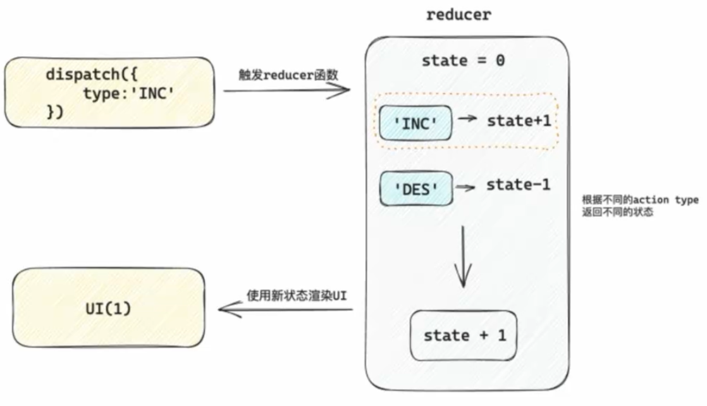
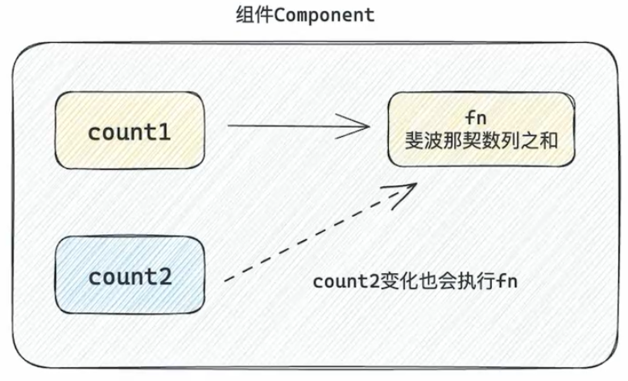
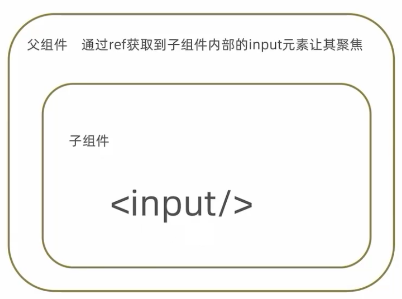
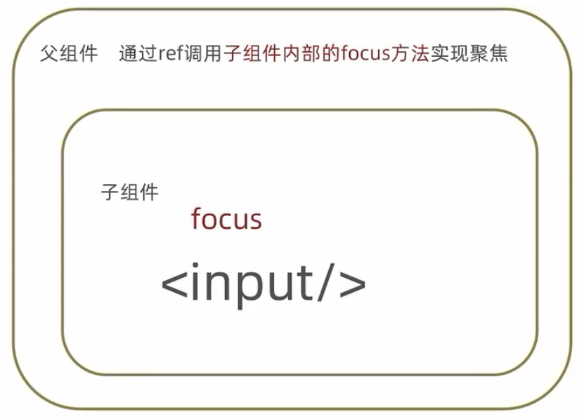
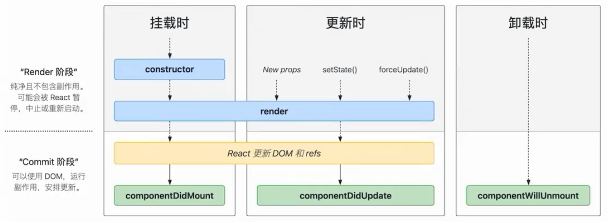
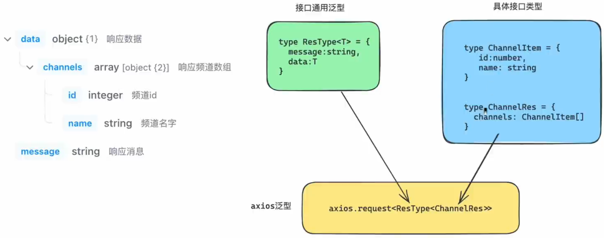
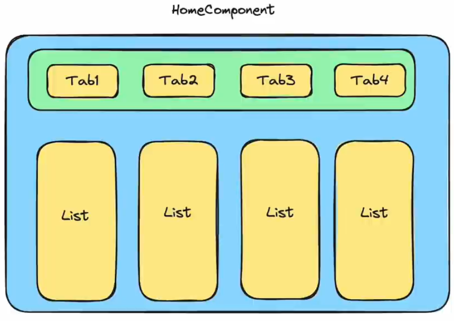
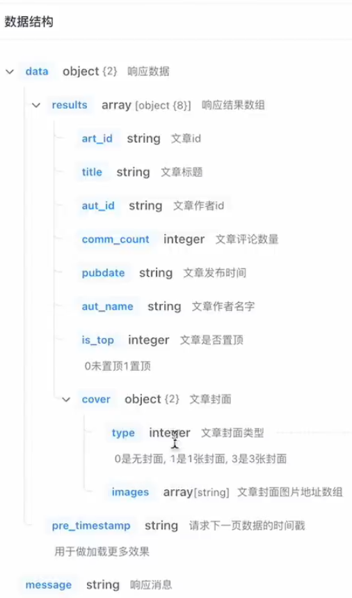

# react 拓展笔记

## useReducer

作用：和 useState 的作用类似，用来管理相对复杂的状态数据

### 基础用法

定义 reducer 函数，根据不同的 action 返回不同的新状态

```jsx
function reducer(state, action) {
  switch (action.type) {
    case 'INC':
      return state + 1
    case 'DEC':
      return state - 1
    default:
      return state
  }
}
```

在组件中调用 useReducer，传入 reducer 函数和状态的初始值

```jsx
const [state, dispatch] = useReducer(reducer, 0)
```

事件发生时，通过 dispatch 函数分派一个 action 对象，通知 reducer 要返回哪个新状态并渲染 UI

```jsx
dispatch({ type: 'INC' })
```


### 分派 action 时传参

```tsx
import { useReducer } from "react";

function reducer(state: number, action: { type: string; payload?: number }) {
  switch (action.type) {
    case "INC":
      return state + 1;
    case "DEC":
      return state - 1;
    case "SET":
      if (!action.payload) {
        throw new Error("payload is required");
      }
      return action.payload;
    default:
      return state;
  }
}

function App() {
  const [state, dispatch] = useReducer(reducer, 0);
  return (
    <div>
      <button onClick={() => dispatch({ type: "INC" })}>+</button>
      {state}
      <button onClick={() => dispatch({ type: "DEC" })}>-</button>
      <button onClick={() => dispatch({ type: "SET", payload: 100 })}>
        update
      </button>
    </div>
  );
}

export default App;
```





## useMemo

作用：在组件每次重新渲染的时候缓存计算的结果



上面 fn 的结果只取决于 count1，count2 的变化对 fn 的结果没有影响，count2 变化重新渲染视图时不应该重新调用 fn，需要使用 useMemo 为 fn 指定依赖于 count1 的变化而变化。

### 基础语法

```jsx
useMemo(() => {
  // 根据count1返回计算结果
}, [count1])
```

使用 useMemo 做缓存之后可以保证只有 count1 依赖项发生变化时才会重新计算

```tsx
import { useMemo, useState } from "react";

function fib(n: number): number {
  console.log("fib");
  if (n < 3) return 1;
  return fib(n - 1) + fib(n - 2);
}

function App() {
  const [count1, setCount1] = useState(0);

  const result = useMemo(() => {
    return fib(count1);
  }, [count1]);

  const [count2, setCount2] = useState(0);
  console.log("re-rendering");

  return (
    <div>
      <button onClick={() => setCount1(count1 + 1)}>{count1}</button>
      <button onClick={() => setCount2(count2 + 1)}>{count2}</button>
      {result}
    </div>
  );
}

export default App;
```

实际上大部分情况下不需要使用 useMemo，只有遇到消耗较大的计算逻辑时才会使用，例如这里递归调用的斐波那契数列。


## React.memo

作用：允许组件在 Props 没有改变的情况下跳过渲染

React 组件默认的渲染机制：只要父组件重新渲染子组件就会重新渲染

思考：如果子组件本身就不需要渲染更新，就存在浪费。

### 基础语法

```jsx
const MemoComponent = memo(function SomeComponent (props) {
  // ...
})
```

经过 memo 函数包裹生成的缓存组件只有在 props 发生变化的时候才会重新渲染

```tsx
import { memo, useState } from "react";

const MemoSon = memo(function Son(props: { props: number }) {
  console.log("son component,", props.props);
  return <div>this is son</div>;
});

function App() {
  const [count, setCount] = useState(0);

  const [props, setProps] = useState(0);

  return (
    <div>
      <button onClick={() => setCount(count + 1)}>+{count}</button>
      <button onClick={() => setProps(props + 1)}>change props: {props}</button>
      {/* <Son /> */}
      <MemoSon props={props} />
    </div>
  );
}

export default App;
```


### props 的比较机制

机制：在使用 memo 缓存组件之后，React 之后会对每一个 prop 使用 Object.is 比较新值和旧值。返回 true 表示没有变化

当 prop 是简单类型 (number/string)，`Object.is(3, 3) => true` 无变化

当 prop 是引用类型 (object/array)，`Object.is([], []) => false` 有变化 (引用发生了变化，这里是两个不同引用的数组)

```tsx
import { memo, useState } from "react";

const MemoSon = memo(function Son(props: { props: number | number[] }) {
  console.log("son component,", props.props);
  return <div>this is son</div>;
});

function App() {
  const [count, setCount] = useState(0);

  const [props, setProps] = useState(0);

  return (
    <div>
      <button onClick={() => setCount(count + 1)}>+{count}</button>
      <button onClick={() => setProps(props + 1)}>change props: {props}</button>
      {/* <Son /> */}
      <MemoSon props={100} />
      <MemoSon props={[1, 2, 3]} />
    </div>
  );
}

export default App;
```

要保证引用类型的稳定性可以使用 useMemo

```tsx
import { memo, useMemo, useState } from "react";

const MemoSon = memo(function Son(props: { props: number | number[] }) {
  console.log("son component,", props.props);
  return <div>this is son</div>;
});

function App() {
  const [count, setCount] = useState(0);

  const [props, setProps] = useState(0);

  const list = useMemo(() => {
    return [1, 2, 3];
  }, []);

  return (
    <div>
      <button onClick={() => setCount(count + 1)}>+{count}</button>
      <button onClick={() => setProps(props + 1)}>change props: {props}</button>
      {/* <Son /> */}
      <MemoSon props={100} />
      <MemoSon props={list} />
    </div>
  );
}

export default App;
```


## useCallback

作用：在组件多次重新渲染的时候缓存函数

### 基础语法

```jsx
const changeHandler = useCallback((value) => console.log(value), [])
```

这里的父组件更新时，子组件也会重新渲染，因为传递给子组件的函数不是简单类型，也没有缓存

```tsx
import { memo, useState } from "react";

type onChangeType = { onChange: (value: string) => void };

const Input = memo(function Input({ onChange }: onChangeType) {
  console.log("Input render");
  return <input type="text" onChange={(e) => onChange(e.target.value)} />;
});

function App() {
  const changeHandler = (value: string) => console.log(value);
  const [count, setCount] = useState(0);
  return (
    <div>
      <Input onChange={changeHandler} />
      <button onClick={() => setCount(count + 1)}>Count: {count}</button>
    </div>
  );
}

export default App;

```

使用 useCallback 包裹函数之后，函数可以保证在 App 重新渲染的时候保持引用稳定

```tsx
import { memo, useCallback, useState } from "react";

type onChangeType = { onChange: (value: string) => void };

const Input = memo(function Input({ onChange }: onChangeType) {
  console.log("Input render");
  return <input type="text" onChange={(e) => onChange(e.target.value)} />;
});

function App() {
  const changeHandler = useCallback((value: string) => console.log(value), []);
  const [count, setCount] = useState(0);
  return (
    <div>
      <Input onChange={changeHandler} />
      <button onClick={() => setCount(count + 1)}>Count: {count}</button>
    </div>
  );
}

export default App;
```


## React.forwardRef

使用 ref 暴露 DOM 节点给父组件

### 场景说明



### 语法实现

```jsx
const Input = forwardRef((props, ref) = > {
  return <input type="text" ref={ref} />
})

function App() {
  const inputRef = useRef(null)
  return (
    <div>
      <Input ref={inputRef} />
    </div>
  )
}
```

案例实现

```tsx
import { Ref, forwardRef, useRef } from "react";

const Son = forwardRef((_, ref: Ref<HTMLInputElement>) => {
  return <input type="text" ref={ref} />;
});

function App() {
  const sonRef = useRef<HTMLInputElement>(null);
  const showRef = () => {
    console.log(sonRef);
    sonRef.current?.focus();
  };
  return (
    <div>
      <Son ref={sonRef} />
      <button onClick={showRef}>focus</button>
    </div>
  );
}

export default App;
```


##  useImperativeHandle

通过 ref 暴露子组件中的方法

### 场景说明



```jsx
const Son = forwardRef((props, ref) => {
  const inputRef = useRef(null)
  const focusHandler = () => {
    inputRef.current.focus()
  }
   useImperativeHandle(ref, () => {
     return {
       focusHandler
     }
   })
  return <input type="text" ref={inputRef} />;
});
```

案例实现

```tsx
import { Ref, forwardRef, useImperativeHandle, useRef } from "react";

const Son = forwardRef((_, ref: Ref<object>) => {
  const inputRef = useRef<HTMLInputElement>(null);
  const focusHandler = () => {
    inputRef.current?.focus();
  };
  useImperativeHandle(ref, () => {
    return {
      focusHandler,
    };
  });
  return <input type="text" ref={inputRef} />;
});

function App() {
  const sonRef = useRef<HTMLInputElement & { focusHandler: () => void }>(null);
  const focusHandler = () => {
    console.log(sonRef.current);
    sonRef.current?.focusHandler();
  };
  return (
    <div>
      <Son ref={sonRef} />
      <button onClick={focusHandler}>focus</button>
    </div>
  );
}

export default App;
```


## Class API

类组件 (了解即可，不推荐在新的项目中使用)

### 类组件基础结构

类组件就是通过 JS 中的类来组织组件的代码

```jsx
class Counter extends Component {
  state = {
    count: 0
  }
  clickHandler = () => {
    this.setState({
      count: this.state.count + 1
    })
  }
  
  render() {
    return <button onClick={this.clickHandler}>{this.state.count}</button>
  }
}
```

通过类属性 state 定义状态数据，通过 setState 方法来修改状态数据，通过 render 渲染模板 (语法同 JSX)


### 类组件的生命周期函数

概念：组件从创建到销毁的各个阶段自动执行的函数就是生命周期函数



componentDidMount：组件挂载完毕自动执行，异步数据获取

componentWillUnmount：组件卸载时自动执行，清理副作用

示例代码

```tsx
import { Component, ReactNode, useState } from "react";

class Son extends Component {
  timer: NodeJS.Timeout | null = null;
  componentDidMount(): void {
    console.log("son componentDidMount");
    this.timer = setInterval(() => {
      console.log("timer running");
    }, 1000);
  }
  componentWillUnmount(): void {
    console.log("son componentWillUnmount");
    clearInterval(this.timer!);
  }
  render(): ReactNode {
    return <div>son</div>;
  }
}

function App() {
  const [show, setShow] = useState(true);
  return (
    <div>
      <button onClick={() => setShow(!show)}>toggle</button>
      {show && <Son />}
    </div>
  );
}

export default App;
```


### 类组件的组件通信

概念：类组件和 Hooks 编写的组件在组件通信的思想上完全一致

父传子：通过 prop 绑定数据

子传父：通过 prop 绑定父组件中的函数，子组件调用

兄弟通信：状态提升，通过父组件做桥接

示例代码

```tsx
import { Component, ReactNode } from "react";

interface SonProps {
  msg?: string;
  onGetMsg?: (msg: string) => void;
}

class Son extends Component<SonProps> {
  render(): ReactNode {
    return (
      <div>
        <div>son,{this.props.msg}</div>
        <button
          onClick={() => {
            this.props.onGetMsg?.("son message");
          }}
        >
          send msg to parent
        </button>
      </div>
    );
  }
}

class Parent extends Component {
  state = {
    msg: "parent message",
  };

  getSonMsg = (sonMsg: string) => {
    console.log(sonMsg);
  };
  render(): ReactNode {
    return (
      <div>
        parent<Son msg={this.state.msg} onGetMsg={this.getSonMsg} />
      </div>
    );
  }
}

function App() {
  return (
    <div>
      <Parent />
    </div>
  );
}

export default App;
```


## zustand

极简状态管理工具

### 快速使用

参考官方 [demo](https://zustand-demo.pmnd.rs/)

安装 zustand

```bash
pnpm add zustand
```

示例代码

```tsx
import { create } from "zustand";

type Store = {
  count: number;
  inc: () => void;
};

const useStore = create<Store>()((set) => ({
  count: 1,
  inc: () => set((state) => ({ count: state.count + 1 })),
}));

function Counter() {
  const { count, inc } = useStore();
  return (
    <div>
      <button onClick={inc}>{count}</button>
    </div>
  );
}

function App() {
  return (
    <div>
      <Counter />
    </div>
  );
}

export default App;
```


### 异步支持

对于异步的支持，不需要特殊的操作，直接在函数中编写异步逻辑，最后调用 set 方法传入新状态即可

```tsx
import { useEffect } from "react";
import { create } from "zustand";

type Store = {
  count: number;
  inc: () => void;
  data: {
    id: string;
    name: string;
  }[];
  fetchData: () => void;
};

const URL = "https://example.com";

const useStore = create<Store>()((set) => ({
  count: 1,
  inc: () => set((state) => ({ count: state.count + 1 })),
  data: [],
  fetchData: async () => {
    const res = await fetch(URL);
    const jsonRes = await res.json();
    console.log(jsonRes);
    set({ data: jsonRes.data.channels });
  },
}));

function Counter() {
  const { count, inc, data, fetchData } = useStore();
  useEffect(() => {
    fetchData();
  }, [fetchData]);
  return (
    <div>
      <button onClick={inc}>{count}</button>
      {data.map((item) => (
        <li key={item.id}>{item.name}</li>
      ))}
    </div>
  );
}

function App() {
  return (
    <div>
      <Counter />
    </div>
  );
}

export default App;
```


### 切片模式

场景：当单个 store 比较大的时候，可以采用切片模式进行模块拆分组合，类似于模块化

示例代码，参考官方文档 [Slices pattern](https://docs.pmnd.rs/zustand/guides/typescript#slices-pattern)

```tsx
import { useEffect } from "react";
import { StateCreator, create } from "zustand";

type CounterStore = {
  count: number;
  inc: () => void;
};

type DataStore = {
  data: {
    id: string;
    name: string;
  }[];
  fetchData: () => Promise<void>;
};

const createCounterStore: StateCreator<
  CounterStore & DataStore,
  [],
  [],
  CounterStore
> = (set) => ({
  count: 1,
  inc: () => set((state: { count: number }) => ({ count: state.count + 1 })),
});

const URL = "https://geek.itheima.net/v1_0/channels";

const createDataStore: StateCreator<
  CounterStore & DataStore,
  [],
  [],
  DataStore
> = (set) => ({
  data: [],
  fetchData: async () => {
    const res = await fetch(URL);
    const jsonRes = await res.json();
    console.log(jsonRes);
    set({ data: jsonRes.data.channels });
  },
});

const useStore = create<CounterStore & DataStore>()((...a) => {
  return {
    ...createCounterStore(...a),
    ...createDataStore(...a),
  };
});

function App() {
  const { count, inc, data, fetchData } = useStore();
  useEffect(() => {
    fetchData();
  }, [fetchData]);
  return (
    <div>
      <button onClick={inc}>{count}</button>
      {data.map((item) => (
        <li key={item.id}>{item.name}</li>
      ))}
    </div>
  );
}

export default App;
```


## React + TS

创建 React + TypeScript 的开发环境

```bash
pnpm create vite react-ts-demo --template react-ts
cd react-ts-demo
pnpm install
pnpm run dev
```


### useState 和 TypeScript

#### 自动推导

通常 React 会根据传入 useState 的默认值来自动推导类型，不需要显式标注类型

示例代码

```tsx
import { useState } from "react";

function App() {
  const [value, toggle] = useState(true);

  const [list, setList] = useState([1, 2, 3]);

  const changeValue = () => {
    // toggle(100);
    toggle(false);
  };

  const changeList = () => {
    // setList(['4'])
    setList([4, 5, 6]);
  };

  return <div>{list}</div>;
}

export default App;
```

在有明确的初始值的情况下，通常不需要显式标注类型


#### 泛型参数

useState 本身是一个泛型参数，可以传入具体的自定义类型

```tsx
type User = {
  name: string
  age: number
}

const [user, setUser] = useState<User>()
```

限制 useState 函数参数初始值必须满足类型为 User | () => User

限制 setUser 函数的参数必须满足类型为 User | () => User | undefined

user 状态数据具备 User 类型相关的类型提示

示例代码

```tsx
import { useState } from "react";

function App() {
  type User = {
    name: string;
    age: number;
  };

  // 限制初始值类型
  const [user, setUser] = useState<User>({
    name: "Tom",
    age: 25,
  });

  // const [user, setUser] = useState<User>(() => ({
  //   name: "Tom",
  //   age: 25,
  // }));

  const changeUser = () => {
    setUser(() => ({
      name: "Tom",
      age: 25,
    }));
  };

  return <div>{user.name}</div>;
}

export default App;
```


#### 初始值为 null

不明确状态的初始值时，常见的做法是设置初始值为 null，可以通过具体类型联合 null 来做显式注解

```tsx
type User = {
  name: string
  age: number
}

const [user, setUser] = useState<User | null>(null)
```

限制 useState 函数参数初始值类型可为 User | null

限制 setUser 函数的参数类型可为 User | null

示例代码

```tsx
import { useState } from "react";

function App() {
  type User = {
    name: string;
    age: number;
  };

  const [user, setUser] = useState<User | null>(null);

  const changeUser = () => {
    setUser(null);
    setUser({
      name: "Tom",
      age: 25,
    });
  };

  // 可选链做类型守卫，只有 user 不为 null 时才会显示 user.name
  return <div>{user?.name}</div>;
}

export default App;
```


### Props 和 TypeScript

#### 基础使用

为组件 prop 添加类型，本质是给函数的参数做类型注解，可以使用 type 对象类型或者 interface 接口来做注解

```tsx
type Props = {
  className: string
}

function Button(props: Props) {
  const { className } = props
  return <button className={className}>click me</button>
}
```

Button 组件只能传入名称为 className 的 prop 参数，类型为 string，必填

示例代码

```tsx
type Props = {
  className: string;
  title?: string;
};

function Button(props: Props) {
  const { className } = props;
  return <button className={className}>click me</button>;
}

function App() {
  return (
    <div>
      <Button className="btn" title="title" />
    </div>
  );
}

export default App;
```


#### 为 children 添加类型

children 是比较特殊的 prop，支持多种不同类型数据，需要通过内置的 ReactNode 类型做注解

```tsx
type Props = {
  className: string
  children: React.ReactNode
}

function Button(props: Props) {
  const { className, children } = props
  return <button className={className}>{children}</button>
}
```

注解之后，children 可以是多种类型，包括 React.ReactElement、string、number、React.ReactFragment、React.ReactPortal、boolean、null、undefined

示例代码

```tsx
type Props = {
  className: string;
  children?: React.ReactNode;
};

function Button(props: Props) {
  const { className, children } = props;
  return <button className={className}>{children}</button>;
}

function App() {
  return (
    <div>
      <Button className="btn">click me</Button>
      <Button className="btn">
        <span>this is span</span>
      </Button>
    </div>
  );
}

export default App;
```


#### 为事件 prop 添加类型

组件经常执行类型为函数的 prop 实现子传父，这类 prop 重点在于函数参数类型的注解

```tsx
type Props = {
  onGetMsg?: (msg: string) => void
}

function Son(props: Props) {
  const { onGetMsg } = props
  
  const clickHandler = () => {
    onGetMsg?.('this is msg')
  }
  
  return <button onClick={clickHandler}>sendMsg</button>
}
```

```tsx
function App() {
  const getMsgHandler = (msg: string) => {
    console.log(msg)
  }
  return (
    <div>
      <Son onGetMsg={getMsgHandler} />
    </div>
  )
}
```

```tsx
<Son onGetMsg={(msg) => console.log(msg)} />
```

在组件内部调用时需要遵循类型的约束，参数传递需要满足要求

绑定 prop 时如果绑定内联函数可以直接推断出参数类型，否则需要单独注解匹配的参数类型

示例代码

```tsx
type Props = {
  onGetMsg?: (msg: string) => void;
};

function Son(props: Props) {
  const { onGetMsg } = props;

  const clickHandler = () => {
    onGetMsg?.("this is msg");
  };

  return <button onClick={clickHandler}>sendMsg</button>;
}

function App() {
  const getMsgHandler = (msg: string) => {
    console.log(msg);
  };
  return (
    <div>
      <Son onGetMsg={getMsgHandler} />
      <Son onGetMsg={(msg) => console.log(msg)} />
    </div>
  );
}

export default App;
```


### useRef 和 TypeScript

#### 获取 dom

可以直接把要获取的 dom 元素的类型当成泛型参数传递给 useRef，可以推导出 .current 属性的类型

```tsx
function App() {
  const domRef = useRef<HTMLInputElement>(null)
  
  useEffect(() => {
    domRef.current?.focus()
  }, [])
  
  return (
    <div>
      <input ref={domRef} />
    </div>
  )
}
```


#### 引用稳定的存储器

把 useRef 当成引用稳定的存储器使用，可以通过泛型传入联合类型

定时器场景

```tsx
function App() {
  const timerRef = useRef<NodeJS.Timeout | undefined>(undefined)

  useEffect(() => {
    timerRef.current = setInterval(() => {
      console.log('1')
    }, 1000)

    return () => clearInterval(timerRef.current)
  }, [])

  return <div>this is div</div>	
}
```


## 基于 React + TS 的移动端项目

### 创建项目

```bash
pnpm create vite react-ts-mobile --template react-ts
```


### 安装 antDesignMobile

```bash
pnpm add antd-mobile
```

具体组件的使用参考[官方文档](https://mobile.ant.design/zh/guide/quick-start)


### 初始化路由

采用 react-router-dom 配置路由

```bash
pnpm add react-router-dom
```


基础组件编写

pages/Home/index.tsx

```tsx
const Home = () => {
  return <div>this is home</div>;
};

export default Home;
```

pages/Detail/index.tsx

```tsx
const Detail = () => {
  return <div>this is detail</div>;
};

export default Detail;
```

router/index.tsx

```tsx
import Detail from "@/pages/Detail";
import Home from "@/pages/Home";
import {
  createBrowserRouter,
  RouterProvider as Provider,
} from "react-router-dom";

const router = createBrowserRouter([
  {
    path: "/",
    element: <Home />,
  },
  {
    path: "/detail",
    element: <Detail />,
  },
]);

const RouterProvider = () => {
  return <Provider router={router} />;
};

export { RouterProvider };
```

main.tsx

```tsx
import ReactDOM from "react-dom/client";
import { RouterProvider } from "@/router";

ReactDOM.createRoot(document.getElementById("root")!).render(
  <RouterProvider />
);
```


### 配置路径别名

@ 别名简化路径，配置的 @ 相当于 src 目录

vite 路径解析，需要安装 @types/node

```bash
pnpm  add -D @types/node
```

vite.config.ts

```ts
import { defineConfig } from "vite";
import react from "@vitejs/plugin-react";
import { resolve } from "path";

// https://vitejs.dev/config/
export default defineConfig({
  resolve: {
    alias: {
      "@": resolve(__dirname, "src"),
    },
  },
  plugins: [react()],
});
```


vscode 智能提示支持，配置 tsconfig.json

```json
"compilerOptions": {
  "baseUrl": ".",
  "paths": {
    "@/*": [
      "src/*"
    ]
  },
}
```


### axios 基础配置

基于 axios 做基础封装

安装 axios

```bash
pnpm add axios
```

对 axios 进行基础配置，并统一导出

utils/http.ts 主要配置 axios 的接口基址、超时时间、拦截器

```ts
import axios from "axios";

const httpInstance = axios.create({
  baseURL: "http:/example.com",
  timeout: 5000,
});

httpInstance.interceptors.request.use(
  (config) => {
    return config;
  },
  (error) => {
    return Promise.reject(error);
  }
);

httpInstance.interceptors.response.use(
  (response) => {
    return response;
  },
  (error) => {
    return Promise.reject(error);
  }
);

export { httpInstance };
```

utils/index.ts 统一导出

```ts
import { httpInstance } from "./http";

export { httpInstance as http };
```


### 使用 axios + TS 封装 API 模块

axios 配合 ts 使用

axios 提供了 request 泛型方法，可以传入类型参数推导出接口返回值的类型

```ts
axios.request<Type>(requestConfig).then(res => {
  // res.data 的类型为 Type
  console.log(res.data)
})
```

泛型参数 Type 的类型决定了 res.data 的类型


步骤

1.根据接口文档创建通用的泛型接口类型 (多个接口返回值结构是类似的)

2.根据接口文档创建特有的接口数据类型 (每个接口有自己独特的数据结构)

3.组合泛型与特定类型，得到最终传递给 request 的泛型的参数类型


以下图接口文档为例



apis/list.ts 封装接口函数

```ts
import { http } from "@/utils";

type ResType<T> = {
  message: string;
  data: T;
};

type ChannelItem = {
  id: number;
  name: string;
};

type ChannelRes = {
  channels: ChannelItem[];
};

export function fetchChannelAPI() {
  return http.request<ResType<ChannelRes>>({
    url: "/channels",
  });
}
```

main.tsx 测试接口函数

```tsx
import ReactDOM from "react-dom/client";
import { RouterProvider } from "@/router";
import { fetchChannelAPI } from "./apis/list";

fetchChannelAPI().then((res) => {
  console.log(res.data.data.channels);
});

ReactDOM.createRoot(document.getElementById("root")!).render(
  <RouterProvider />
);
```

泛型类型可以单独封装，并导出共享

apis/shared.ts

```ts
export type ResType<T> = {
  message: string;
  data: T;
};
```

apis/list.ts

```ts
import { http } from "@/utils";
import type { ResType } from "./shared";

type ChannelItem = {
  id: number;
  name: string;
};

type ChannelRes = {
  channels: ChannelItem[];
};

export function fetchChannelAPI() {
  return http.request<ResType<ChannelRes>>({
    url: "/channels",
  });
}
```


### Home 模块

#### 整体组件嵌套设计



pages/Home/style.css

```css
.tabContainer {
  position: fixed;
  height: 50px;
  top: 0;
  width: 100%;
}

.listContainer {
  position: fixed;
  top: 50px;
  bottom: 0px;
  width: 100%;
}
```


#### Tabs 区域实现

使用 ant-mobile 组件库中的 Tabs 组件进行页面结构创建

请求接口数据并渲染

pages/Home/index.tsx

```tsx
import { useEffect, useState } from "react";
import "./style.css";
import { Tabs } from "antd-mobile";
import { fetchChannelAPI, type ChannelItem } from "@/apis/list";

const Home = () => {
  const [channels, setChannels] = useState<ChannelItem[]>([]);

  useEffect(() => {
    const getChannels = async () => {
      try {
        const res = await fetchChannelAPI();
        setChannels(res.data.data.channels);
      } catch (error) {
        throw new Error("fetch channels error: " + error);
      }
    };
    getChannels();
  }, []);

  return (
    <div className="tabContainer">
      {/* tab区域 */}
      <Tabs>
        {channels.map((item) => {
          return <Tabs.Tab title={item.name} key={item.id}></Tabs.Tab>;
        })}
        {/* list组件 */}
      </Tabs>
    </div>
  );
};

export default Home;
```


#### 自定义 hook 函数优化

当前状态数据的各种操作逻辑和组件渲染写在一起，可以采用自定义 hook 封装的方式让逻辑和渲染相分离

把和 Tabs 相关的响应式数据状态以及操作数据的方法放到 hook 函数中

pages/Home/useTabs.ts

```ts
import { useEffect, useState } from "react";
import { fetchChannelAPI, type ChannelItem } from "@/apis/list";

function useTabs() {
  const [channels, setChannels] = useState<ChannelItem[]>([]);

  useEffect(() => {
    const getChannels = async () => {
      try {
        const res = await fetchChannelAPI();
        setChannels(res.data.data.channels);
      } catch (error) {
        throw new Error("fetch channels error: " + error);
      }
    };
    getChannels();
  }, []);

  return { channels };
}

export { useTabs };
```

组件中调用 hook 函数，解构并消费其返回的状态和方法

pages/Home/index.tsx

```tsx
import "./style.css";
import { Tabs } from "antd-mobile";
import { useTabs } from "./useTabs";

const Home = () => {
  const { channels } = useTabs();

  return (
    <div className="tabContainer">
      {/* tab区域 */}
      <Tabs>
        {channels.map((item) => {
          return (
            <Tabs.Tab title={item.name} key={item.id}>
              {/* list组件 */}
            </Tabs.Tab>
          );
        })}
      </Tabs>
    </div>
  );
};

export default Home;
```


后续还有其他的各种操作逻辑，都可以自定义 hook 函数实现，保持组件代码的简洁，方便维护


#### List 组件实现

搭建基础结构，并获取数据

mock 数据

pags/Home/HomeList/users.ts

```ts
export const users = [
  {
    id: "1",
    avatar:
      "https://media.istockphoto.com/id/516449022/photo/lady-with-kayak.jpg?b=1&s=612x612&w=0&k=20&c=PsQQpGXVtV9dPDaH-DNEgeMAHjqkViCSQsSrkqlHKRk=",
    name: "516449022",
    description: "lady-with-kayak",
  },
  {
    id: "2",
    avatar:
      "https://media.istockphoto.com/id/1383796215/photo/silhouette-of-man-holding-binoculars-on-mountain-peak-against-bright-sunlight-sky-background.jpg?b=1&s=612x612&w=0&k=20&c=7qil3OYFwP814_tFl1b-nPHloTptreuOeWA0HOLE5pE=",
    name: "1383796215",
    description:
      "silhouette-of-man-holding-binoculars-on-mountain-peak-against-bright-sunlight-sky-background",
  },
  {
    id: "3",
    avatar:
      "https://media.istockphoto.com/id/904172104/photo/weve-made-it-all-this-way-i-am-proud.jpg?b=1&s=612x612&w=0&k=20&c=JRmndTMyz627jxKiUjgXSJXrxwuAiHkHjefiRsyY2jc=",
    name: "904172104",
    description: "weve-made-it-all-this-way-i-am-proud",
  },
  {
    id: "4",
    avatar:
      "https://media.istockphoto.com/id/1301431065/photo/man-hiker-on-top-of-a-mountain-peak.jpg?b=1&s=612x612&w=0&k=20&c=uK5SF008yXyqYqbcBC_wUz-SFzBmx3dGKmFiolLJ7oA=",
    name: "1301431065",
    description: "man-hiker-on-top-of-a-mountain-peak",
  },
];
```

pages/Home/HomeList/index.tsx

```tsx
import { Image, List } from "antd-mobile";
import { users } from "./users";

const HomeList = () => {
  return (
    <div>
      <List>
        {users.map((item) => (
          <List.Item
            key={item.id}
            prefix={
              <Image
                src={item.avatar}
                style={{ borderRadius: 20 }}
                fit="cover"
                width={40}
                height={40}
              />
            }
            description={item.description}
          >
            {item.name}
          </List.Item>
        ))}
      </List>
    </div>
  );
};

export default HomeList;
```

测试视图能否正常渲染


根据以下接口文档设计接口函数

<figure class="half">
  
  
</figure>

apis/list.ts

```ts
type ListItem = {
  art_id: string;
  title: string;
  aut_id: string;
  comm_count: number;
  pubdate: string;
  aut_name: string;
  is_top: number;
  cover: {
    type: number;
    images: string[];
  };
};

export type ListRes = {
  results: ListItem[];
  pre_timestamp: string;
};

type ReqParams = {
  channel_id: string;
  timestamp: string;
};

export function fetchListAPI(params: ReqParams) {
  return http.request<ResType<ListRes>>({
    url: "/articles",
    params,
  });
}
```

pages/Home/HomeList/index.tsx 请求接口并渲染数据

```tsx
import { Image, List } from "antd-mobile";
import { useEffect, useState } from "react";
import { fetchListAPI, type ListRes } from "@/apis/list";

const HomeList = () => {
  const [listRes, setListRes] = useState<ListRes>({
    results: [],
    pre_timestamp: new Date().getTime().toString(),
  });

  useEffect(() => {
    const getList = async () => {
      try {
        const res = await fetchListAPI({
          channel_id: "1",
          timestamp: new Date().getTime().toString(),
        });
        setListRes({ ...res.data.data });
      } catch (error) {
        throw new Error("fetchListAPI error");
      }
    };
    getList();
  }, []);

  return (
    <div>
      <List>
        {listRes.results.map((item) => (
          <List.Item
            key={item.art_id}
            prefix={
              <Image
                src={item.cover.images?.[0]}
                style={{ borderRadius: 20 }}
                fit="cover"
                width={40}
                height={40}
              />
            }
            description={item.pubdate}
          >
            {item.title}
          </List.Item>
        ))}
      </List>
    </div>
  );
};

export default HomeList;
```


为组件设计 channelId 参数，点击 tab 时传入不同的参数

pages/Home/HomeList/index.tsx

```tsx
type Props = {
  channelId: string;
};

const HomeList = (props: Props) => {
  const { channelId } = props;

  const [listRes, setListRes] = useState<ListRes>({
    results: [],
    pre_timestamp: new Date().getTime().toString(),
  });

  useEffect(() => {
    const getList = async () => {
      try {
        const res = await fetchListAPI({
          channel_id: channelId,
          timestamp: new Date().getTime().toString(),
        });
        setListRes({ ...res.data.data });
      } catch (error) {
        throw new Error("fetchListAPI error");
      }
    };
    getList();
  }, [channelId]);
  
  return ({/* ... */});
};

export default HomeList;
```

pages/Home/index.tsx

```tsx
<div className="tabContainer">
  {/* tab区域 */}
  <Tabs>
    {channels.map((item) => {
      return (
        <Tabs.Tab title={item.name} key={item.id}>
          {/* list组件 */}
          <HomeList channelId={item.id.toString()} />
        </Tabs.Tab>
      );
    })}
  </Tabs>
</div>
```


#### List 列表无限滚动实现

List 列表在滑动到底部时，自动加载下一页列表数据


滑动到底部触发加载下一页动作，使用 antd-mobile 的 InfiniteScroll 组件

加载下一页数据，通过 per_timestamp 接口参数

新旧数据拼接处理，[...oldList, ... newList]

停止监听边界值，hasMore

pages/Home/HomeList/index.tsx 添加无限滚动的组件

```tsx
<List>
  {/* ... */}
</List>
<InfiniteScroll loadMore={loadMore} hasMore={hasMore} threshold={10} />
```

loadMore 函数实现，hasMore 控制状态，使用展开运算符拼接新旧数据。

```tsx

// 标记当前是否还有新数据
const [hasMore, setHasMore] = useState(true);
// 上拉加载触发条件：
// 1.hasMore为true
// 2.threshold触发
const loadMore = async () => {
  console.log("上拉加载");
  try {
    const res = await fetchListAPI({
      channel_id: channelId,
      timestamp: listRes.pre_timestamp,
    });
    // 拼接新旧数据，存取下一次请求时间戳
    setListRes({
      results: [...listRes.results, ...res.data.data.results],
      pre_timestamp: res.data.data.pre_timestamp,
    });
    // 停止监听
    if (res.data.data.results.length === 0) {
      setHasMore(false);
    }
  } catch (error) {
    throw new Error("fetchListAPI error");
  }
};
```

一些样式适配

pages/Home/style.css

```css
.listContainer {
  position: fixed;
  top: 50px;
  bottom: 0px;
  width: 100%;
  overflow: auto;
}
```

pages/Home/index.tsx

```tsx
<div className="listContainer">
  <HomeList channelId={item.id.toString()} />
</div>
```


### 详情模块

#### 路由跳转 & 数据渲染

点击列表中的某一项跳转到详情路由并显示当前文章


通过路由跳转方法跳转，并传递参数

pages/Home/HomeList/index.tsx 绑定 goToDetail 函数

```tsx
<List.Item
  onClick={() => goToDetail(item.art_id)}
  key={item.art_id}
  prefix={
    <Image
      src={item.cover.images?.[0]}
      style={{ borderRadius: 20 }}
      fit="cover"
      width={40}
      height={40}
      />
  }
  description={item.pubdate}
  >
  {item.title}
</List.Item>
```

goToDetail 函数实现

```tsx
const navigate = useNavigate();
const goToDetail = (id: string) => {
  navigate(`/detail?id=${id}`);
};
```


在详情路由下获取参数，并请求数据

apis/details.ts 定义类型 (数据结构复杂时可以通过接口文档工具如 apifox 自动生成这部分代码)

```ts
/**
 * detaildate
 */
export type DetailData = {
    /**
     * 文章id
     */
    art_id: string;
    /**
     * 文章-是否被点赞，-1(无态度)0(未点赞)1(点赞)
     */
    attitude: number;
    /**
     * 文章作者id
     */
    aut_id: string;
    /**
     * 文章作者名
     */
    aut_name: string;
    /**
     * 文章作者头像，无头像，默认为null
     */
    aut_photo: string;
    /**
     * 文章-评论总数
     */
    comm_count: number;
    /**
     * 文章内容
     */
    content: string;
    /**
     * 文章-是否被收藏，true(收藏)false(未收藏)
     */
    is_collected: boolean;
    /**
     * 文章作者-是否被关注，true(关注)false(未关注)
     */
    is_followed: boolean;
    /**
     * 文章-点赞总数
     */
    like_count: number;
    /**
     * 文章发布时间
     */
    pubdate: string;
    /**
     * 文章-阅读总数
     */
    read_count: number;
    /**
     * 文章标题
     */
    title: string;
}
```

封装接口请求

```ts
export function fetchDetailAPI(id: string) {
  return http.request<ResType<DetailData>>({
    url: `/articles/${id}`,
  });
}
```

pages/Detail/index.tsx 获取 id 参数，并请求数据

```tsx
import { DetailData, fetchDetailAPI } from "@/apis/detail";
import { useEffect, useState } from "react";
import { useSearchParams } from "react-router-dom";

const Detail = () => {
  const [detail, setDetail] = useState<DetailData | null>(null);

  const [params] = useSearchParams();
  const id = params.get("id");
  useEffect(() => {
    const getDetail = async () => {
      try {
        const res = await fetchDetailAPI(id!);
        setDetail(res.data.data);
      } catch (error) {
        throw new Error("fetchDetailAPI error");
      }
    };
    getDetail();
  }, [id]);

  return <div>this is detail</div>;
};

export default Detail;
```


渲染数据到页面中

pages/Detail/index.tsx 使用 dangerouslySetInnerHTML 属性渲染数据，并使用 navigate 返回上一页

```tsx
const navigate = useNavigate();
const back = () => {
  navigate(-1);
};

// 数据返回之前，loading渲染占位
if (!detail) {
  return <div>loading......</div>;
}
// 数据返回之后，正式渲染
return (
  <div>
    <NavBar onBack={back}>{detail?.title}</NavBar>
    <div
      dangerouslySetInnerHTML={{
        __html: detail?.content,
      }}
      ></div>
  </div>
);
```


优化：返回上一页后，渲染默认数据

pages/Home/index.tsx 指定 Tabs 组件的 defaultActiveKey 属性值

```tsx
<Tabs defaultActiveKey={'0'}>
  {channels.map((item) => {
    return (
      <Tabs.Tab title={item.name} key={item.id}>
        {/* list组件 */}
        <div className="listContainer">
          <HomeList channelId={item.id.toString()} />
        </div>
      </Tabs.Tab>
    );
  })}
</Tabs>
```


# 致谢

主要参考资料来源于 [@不会写React的柴柴](https://space.bilibili.com/495118923)

不会写React的柴柴的语雀笔记：https://www.yuque.com/fechaichai


