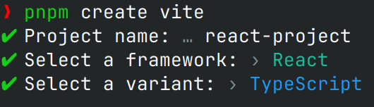

# react-quick-start

## 使用 vite 创建初始环境

### 使用 vite 创建 react + ts 项目

```bash
pnpm create vite
```



### 项目目录结构规范

目录及对应作用

- apis：接口
- assets：静态资源
- components：通用组件
- pages：页面级组件
- router：路由
- store：状态管理
- utils：工具函数

### 安装 SCSS

SCSS 是一种后缀为 .scss 的预编译 CSS 语言，支持一些原生 CSS 不支持的高级用法。

安装 sass 作为开发依赖

```bash
pnpm add -D sass
```

编写 index.scss，使用嵌套语法

```scss
body {
  div {
    color: green;
  }
}
```


### 安装 Ant Design 组件库

Ant Design 是 React PC 端组件库，内置了常用的现成组件

安装 AntD

```bash
pnpm add antd
```

引入组件测试

```tsx
import { Button } from "antd";

function App() {
  return (
    <>
      <div>this is app</div>
      <Button type="primary">Button</Button>
    </>
  );
}

export default App;
```


### 配置基础路由

1.安装路由包

```bash
pnpm add react-router-dom
```

2.准备两个基础路由组件 Layout、Login

Layout.tsx

```tsx
const Layout = () => {
  return (
    <>
      <div>this is layout</div>
    </>
  );
};

export default Layout;
```

Login.tsx

```tsx
const Login = () => {
  return (
    <>
      <div>this is login</div>
    </>
  );
};

export default Login;
```

3.在 router/index.tsx 中引入组件进行路由配置，导出 router 实例

```tsx
import Layout from "../pages/Layout";
import Login from "../pages/Login";

import { createBrowserRouter } from "react-router-dom";

const router = createBrowserRouter([
  {
    path: "/",
    element: <Layout />,
  },
  {
    path: "/login",
    element: <Login />,
  },
]);

export default router;
```

4.在入口文件中渲染，传入 router 实例

main.tsx

```tsx
import React from "react";
import ReactDOM from "react-dom/client";
import "./index.scss";
import { RouterProvider } from "react-router-dom";
import router from "./router";

ReactDOM.createRoot(document.getElementById("root")!).render(
  <React.StrictMode>
    <RouterProvider router={router} />
  </React.StrictMode>
);
```


### 配置 @ 别名路径

通过 @ 替代 src 路径，方便路径查找访问

安装 [@types/node](https://www.npmjs.com/package/@types/node) 解析路径

```bash
pnpm add @types/node
```

配置 vite.config.ts 解析路径

```ts
import { defineConfig } from "vite";
import react from "@vitejs/plugin-react";
import { resolve } from "path";

// https://vitejs.dev/config/
export default defineConfig({
  resolve: {
    alias: {
      "@": resolve(__dirname, "src"),
    },
  },
  plugins: [react()],
});
```

配置 tsconfig.json 进行别名提示

```json
{
  "compilerOptions": {
    /* path alias */
    "baseUrl": "./",
    "paths": {
      "@/*": ["src/*"]
    },
    /*
    ...
    */
  },
  "include": ["src"],
  "references": [{ "path": "./tsconfig.node.json" }]
}
```

修改引入方式

```tsx
import Layout from "@/pages/Layout";
import Login from "@/pages/Login";
```


## 登录功能

### 基础静态结构

主要组件：Card、Avatar、Form、Input、Button

pages/Login/index.tsx

```tsx
import { Avatar, Button, Card, Form, Input } from "antd";
import "./index.scss";
import avatar from "@/assets/avatar.avif";

const Login = () => {
  return (
    <div className="login">
      <Card className="login-container">
        <Avatar size={64} src={avatar} className="login-avatar" />
        <Form>
          <Form.Item>
            <Input size="large" placeholder="请输入手机号" />
          </Form.Item>
          <Form.Item>
            <Input size="large" placeholder="请输入验证码" />
          </Form.Item>
          <Form.Item>
            <Button type="primary" size="large">
              登录
            </Button>
          </Form.Item>
        </Form>
      </Card>
    </div>
  );
};

export default Login;
```

pages/Login/index.scss

```scss
.login {
  width: 100%;
  height: 100%;
  position: absolute;
  left: 0;
  top: 0;
  background: center/cover url("@/assets/background.avif");

  .login-avatar {
    width: 200px;
    height: 60px;
    display: block;
    margin: 0 auto 20px;
}

  .login-container {
    width: 440px;
    height: 320px;
    margin: 0 auto;
    top: 20%;
    background-color: rgba(255, 255, 255, 0.8);
    transform: translate(-50% -50%);
    box-shadow: 0 0 50px rgb(0 0 0 / 10%);
  }

  .login-checkbox-label {
    color: #1890ff;
  }
}
```


### 表单校验

在提交登录之前校验用户的输入是否符合预期。

Form.Item 设置 name 和 rules 属性，Form 设置失焦时触发校验，校验手机号格式

```tsx
import { Avatar, Button, Card, Form, Input } from "antd";
import "./index.scss";
import avatar from "@/assets/avatar.avif";

const Login = () => {
  return (
    <div className="login">
      <Card className="login-container">
        <Avatar size={64} src={avatar} className="login-avatar" />
        <Form validateTrigger="onBlur">
          <Form.Item
            hasFeedback
            name="phone"
            rules={[
              { required: true, message: "请输入手机号" },
              { pattern: /^1[3-9]\d{9}$/, message: "手机号格式不正确" },
            ]}
          >
            <Input size="large" placeholder="请输入手机号" />
          </Form.Item>
          <Form.Item
            hasFeedback
            name="code"
            rules={[{ required: true, message: "请输入验证码" }]}
          >
            <Input size="large" placeholder="请输入验证码" />
          </Form.Item>
          <Form.Item>
            <Button type="primary" size="large">
              登录
            </Button>
          </Form.Item>
        </Form>
      </Card>
    </div>
  );
};

export default Login;
```


### 获取表单数据

点击登录按钮时收集当前输入的内容，提交接口请求

给 Form 绑定 onFinish 回调函数，通过回调参数获取输入的内容

```tsx
import { Avatar, Button, Card, Form, FormProps, Input } from "antd";
import "./index.scss";
import avatar from "@/assets/avatar.avif";

type FieldType = {
  phone: string;
  code: string;
};

const Login = () => {
  const onFinish: FormProps<FieldType>["onFinish"] = (values) => {
    console.log(values);
  };

  return (
    <div className="login">
      <Card className="login-container">
        <Avatar size={64} src={avatar} className="login-avatar" />
        <Form validateTrigger="onBlur" onFinish={onFinish}>
          <Form.Item
            hasFeedback
            name="phone"
            rules={[
              { required: true, message: "请输入手机号" },
              { pattern: /^1[3-9]\d{9}$/, message: "手机号格式不正确" },
            ]}
          >
            <Input size="large" placeholder="请输入手机号" />
          </Form.Item>
          <Form.Item
            hasFeedback
            name="code"
            rules={[{ required: true, message: "请输入验证码" }]}
          >
            <Input size="large" placeholder="请输入验证码" />
          </Form.Item>
          <Form.Item>
            <Button type="primary" htmlType="submit" size="large">
              登录
            </Button>
          </Form.Item>
        </Form>
      </Card>
    </div>
  );
};

export default Login;
```


### 封装 request 请求模块

使用 axios 三方库统一封装

utils/request.ts 配置跟域名、超时时间、请求拦截器和响应拦截器

```ts
import axios, { AxiosError, AxiosInstance, AxiosResponse } from "axios";

const request: AxiosInstance = axios.create({
  baseURL: "",
  timeout: 5000,
});

// 请求拦截器
request.interceptors.request.use(
  (config) => {
    return config;
  },
  (error: AxiosError) => {
    return Promise.reject(error);
  }
);

// 响应拦截器
request.interceptors.response.use(
  (response: AxiosResponse) => {
    return response.data;
  },
  (error: AxiosError) => {
    return Promise.reject(error);
  }
);

export { request };
```

utils/index.ts 入口文件统一导出

```ts
import { request } from "./request";

export { request };
```


### 使用 Redux 管理 token

Token 作为用户的标识数据，需要在多个模块中共享

安装依赖

```bash
pnpm add @reduxjs/toolkit react-redux
```

store/modules/user.ts 编写 token 异步和同步方法

```ts
import { Dispatch, PayloadAction, createSlice } from "@reduxjs/toolkit";
import { request } from "@/utils";
import { LoginForm } from "@/pages/Login/types";

interface UserState {
  token: string;
}

const userStore = createSlice({
  name: "user",
  initialState: {
    token: "",
  } as UserState,
  reducers: {
    setToken(state, action: PayloadAction<string>) {
      state.token = action.payload;
    },
  },
});

const { setToken } = userStore.actions;

const userReducer = userStore.reducer;

const fetchLogin = (loginForm: LoginForm) => {
  return async (dispatch: Dispatch) => {
    const res = await request.post("/authorizations", loginForm);
    dispatch(setToken(res.data.token));
  };
};

export { fetchLogin, setToken };

export default userReducer;
```

pages/Login/types.ts 声明表单类型

```ts
export interface loginForm {
  phone: string;
  code: string;
}
```

store/index.ts 导出 store

```ts
import { configureStore } from "@reduxjs/toolkit";
import userReducer from "./modules/user";

export default configureStore({
  reducer: {
    user: userReducer,
  },
});
```

main.tsx 中配置 Provider 和 store

```tsx
import React from "react";
import ReactDOM from "react-dom/client";
import "./index.scss";
import { RouterProvider } from "react-router-dom";
import router from "./router";
import { Provider } from "react-redux";
import store from "./store";

ReactDOM.createRoot(document.getElementById("root")!).render(
  <React.StrictMode>
    <Provider store={store}>
      <RouterProvider router={router} />
    </Provider>
  </React.StrictMode>
);
```

hooks/userDispatch.ts 导出 store 对应的 dispatch

```ts
import { useDispatch } from "react-redux";
import store from "@/store";

const useUserDispatch = () => {
  const dispatch = useDispatch<typeof store.dispatch>();
  return dispatch;
};

export { useUserDispatch };
```

hooks/index.ts 入口文件导出

```ts
import { useUserDispatch } from "./userDispatch";

export { useUserDispatch };
```

pages/Login/inde.tsx 中发起请求

```tsx
const dispatch = useUserDispatch();
const onFinish: FormProps<FieldType>["onFinish"] = async (values) => {
  console.log(values);
  await dispatch(fetchLogin(values));
};
```

使用 apifox 或 postman 模拟 token 生成，响应示例如下

```json
{
    "data": {
        "token": "token..."
    }
}
```

onFinish 函数补充跳转逻辑

```tsx
const dispatch = useUserDispatch();
const navigate = useNavigate();
const onFinish: FormProps<FieldType>["onFinish"] = async (values) => {
  console.log(values);
  await dispatch(fetchLogin(values));
  navigate("/");
  message.success("登录成功");
};
```


### Token 持久化

防止刷新浏览器时 Token 丢失。Redux 基于浏览器内存存储，刷新时状态重置

一个比较通用的方案是使用浏览器自带的 LocalStorage

```ts
const userStore = createSlice({
  name: "user",
  initialState: {
    token: localStorage.getItem("token") || "",
  } as UserState,
  reducers: {
    setToken(state, action: PayloadAction<string>) {
      state.token = action.payload;
      localStorage.setItem("token", action.payload);
    },
  },
});
```


### 封装 Token 工具函数

utils/token.ts

```ts
const TOKEN = "token";

const setToken = (token: string) => {
  localStorage.setItem(TOKEN, token);
};

const getToken = (): string | null => {
  return localStorage.getItem(TOKEN);
};

const removeToken = () => {
  localStorage.removeItem(TOKEN);
};

export { setToken, getToken, removeToken };
```

utils/inde.ts

```ts
import { request } from "./request";
import { getToken, setToken, removeToken } from "./token";

export { request, getToken, setToken, removeToken };
```

在 store/modules/user.ts 中引入工具函数使用


## Token

### Axios 请求拦截器注入 Token

请求拦截器注入 Token  之后，接口请求时自动携带 Token

utils/request.ts

```ts
// 请求拦截器
request.interceptors.request.use(
  (config) => {
    const token = getToken();
    if (token) {
      config.headers.Authorization = `Bearer ${token}`;
    }
    return config;
  },
  (error: AxiosError) => {
    return Promise.reject(error);
  }
);
```

pages/Layout/index.tsx 发起请求测试

```tsx
import { request } from "@/utils";
import { useEffect } from "react";

const Layout = () => {
  useEffect(() => {
    request.get("/test");
  }, []);
  return (
    <>
      <div>this is layout</div>
    </>
  );
};

export default Layout;
```

可以在浏览器开发者工具中查看请求头信息


### 使用 Token 做路由权限控制

根据 Token 的有无控制当前路由是否可以跳转，避免未经认证访问数据

封装高阶组件 components/AuthRoute.tsx

```tsx
import { getToken } from "@/utils";
import React from "react";
import { Navigate } from "react-router-dom";

type Layout = {
  children: React.ReactNode;
};

export const AuthRoute = ({ children }: Layout) => {
  const token = getToken();
  if (token) {
    return <>{children}</>;
  } else {
    return <Navigate to="/login" replace />;
  }
};
```

router/index.tsx 配置路由

```tsx
import { AuthRoute } from "@/components/AuthRoute";

const router = createBrowserRouter([
  {
    path: "/",
    element: (
      <AuthRoute>
        <Layout />
      </AuthRoute>
    ),
  },
  {
    path: "/login",
    element: <Login />,
  },
]);
```

手动清空浏览器的 LocalStorage，刷新浏览器重定向回登录页


## Layout

### 基础静态结构

安装图标库

```bash
pnpm add @ant-design/icons
```

page/Layout/index.tsx

```tsx
import {
  HomeOutlined,
  DiffOutlined,
  EditOutlined,
  LogoutOutlined,
} from "@ant-design/icons";
import { request } from "@/utils";
import { Avatar, Layout, Menu, Popconfirm } from "antd";
import { useEffect } from "react";
import "./index.scss";

const { Header, Sider } = Layout;

const items = [
  {
    label: "Home",
    key: "1",
    icon: <HomeOutlined />,
  },
  {
    label: "article",
    key: "2",
    icon: <DiffOutlined />,
  },
  {
    label: "new",
    key: "3",
    icon: <EditOutlined />,
  },
];

const Main = () => {
  useEffect(() => {
    request.get("/test");
  }, []);
  return (
    <Layout>
      <Header className="header">
        <Avatar className="avatar" />
        <div className="user-info">
          <span className="user-name">user</span>
          <span className="user-logout">
            <Popconfirm title="是否确认退出？" okText="退出" cancelText="取消">
              <LogoutOutlined />
              退出
            </Popconfirm>
          </span>
        </div>
      </Header>
      <Layout>
        <Sider width={200} className="site-layout-backgroun">
          <Menu
            mode="inline"
            theme="dark"
            defaultSelectedKeys={["1"]}
            items={items}
            style={{ height: "100%", borderRight: 0 }}
          ></Menu>
        </Sider>
        <Layout className="layout-content" style={{ padding: 20 }}>
          内容
        </Layout>
      </Layout>
    </Layout>
  );
};

export default Main;
```

page/Layout/index.scss

```scss
.ant-layout {
  height: 100%;
}

.header {
  padding: 0;
}

.avatar {
  margin-left: 12px;
  border: 0;
  width: 40px;
  height: 40px;
  background: url("@/assets/avatar.avif") no-repeat center / 160px auto;
}

.layout-content {
  overflow-y: auto;
}

.user-info {
  position: absolute;
  right: 0;
  top: 0;
  padding-right: 20px;
  color: #fff;

  .user-name {
    margin-right: 20px;
  }

  .user-logout {
    display: inline-block;
    cursor: pointer;
  }
}
.ant-layout-header {
  padding: 0 !important;
}
```


### 样式初始化

使用 [Normalize.css](https://github.com/necolas/normalize.css) 初始化样式

```bash
pnpm add normalize.css
```

index.scss 调整全局样式

```scss
html,
body {
  margin: 0;
  height: 100%;
}

#root {
  height: 100%;
}
```


### 二级路由配置

准备三个二级路由组件

pages/Home/index.tsx

```tsx
const Home = () => {
  return <div>this is home</div>;
};

export default Home;
```

pages/Article/index.tsx

```tsx
const Article = () => {
  return <div>this is article</div>;
};

export default Article;
```

pages/Publish/index.tsx

```tsx
const Publish = () => {
  return <div>this is publish</div>;
};

export default Publish;
```

router/index.tsx 配置二级路由

```tsx
const router = createBrowserRouter([
  {
    path: "/",
    element: (
      <AuthRoute>
        <Layout />
      </AuthRoute>
    ),
    children: [
      {
        index: true,
        element: <Home />,
      },
      {
        path: "article",
        element: <Article />,
      },
      {
        path: "publish",
        element: <Publish />,
      },
    ],
  },
  {
    path: "/login",
    element: <Login />,
  },
]);
```

pages/Layout/index.tsx 添加路由出口

```tsx
<Layout className="layout-content" style={{ padding: 20 }}>
  <Outlet />
</Layout>
```

菜单组件绑定路由跳转

```tsx
<Menu
  mode="inline"
  theme="dark"
  defaultSelectedKeys={[selectedKey]}
  onClick={onMenuClick}
  items={items}
  style={{ height: "100%", borderRight: 0 }}
  ></Menu>
```

onMenuClick 函数实现

```tsx
const navigate = useNavigate();
const onMenuClick = ({ key }: { key: string }) => {
  const path = key;
  navigate(path);
};
```

items 的 key 值与路由路径匹配

```tsx
const items = [
  {
    label: "Home",
    key: "/",
    icon: <HomeOutlined />,
  },
  {
    label: "article",
    key: "/article",
    icon: <DiffOutlined />,
  },
  {
    label: "publish",
    key: "/publish",
    icon: <EditOutlined />,
  },
];
```

菜单高亮实现

```tsx
const location = useLocation();
const selectedKey = location.pathname;
```


### 展示个人信息

用户信息使用 redux 管理，在多个组件中共享

store/modules/user.ts 编写同步函数和异步函数并导出 interface 和 type

```ts
import { Dispatch, PayloadAction, createSlice } from "@reduxjs/toolkit";
import { request } from "@/utils";
import { LoginForm } from "@/pages/Login/types";
import { setToken as _setToken, getToken } from "@/utils";

export type UserInfo = {
  id: number;
  name: string;
  gender: number;
  birthday: string;
  phone: string;
  avatar: string;
};

export interface UserState {
  token: string;
  userInfo: UserInfo;
}

export interface RootState {
  user: UserState;
}

const userStore = createSlice({
  name: "user",
  initialState: {
    token: getToken() || "",
    userInfo: {},
  } as UserState,
  reducers: {
    setToken(state, action: PayloadAction<string>) {
      state.token = action.payload;
      _setToken(action.payload);
    },
    setUserInfo(state, action: PayloadAction<UserInfo>) {
      state.userInfo = action.payload;
    },
  },
});

const { setToken, setUserInfo } = userStore.actions;

const userReducer = userStore.reducer;

const fetchLogin = (loginForm: LoginForm) => {
  return async (dispatch: Dispatch) => {
    const res = await request.post("/authorizations", loginForm);
    dispatch(setToken(res.data.token));
  };
};

const fetchUserInfo = () => {
  return async (dispatch: Dispatch) => {
    const res = await request.get("/user/profile");
    dispatch(setUserInfo(res.data));
  };
};

export { fetchLogin, fetchUserInfo, setToken };

export default userReducer;
```

自定义 pre-typed 版本的 useSelector 的 hook

hooks/userSelector.ts

```ts
import { RootState, UserState } from "@/store/modules/user";
import { useSelector } from "react-redux";

const useUserSelector = () => {
  const user = useSelector<RootState, UserState>((state) => state.user);
  return user;
};

export { useUserSelector };
```

hooks/index.ts 导出

```ts
import { useUserDispatch } from "./userDispatch";
import { useUserSelector } from "./userSelector";

export { useUserDispatch, useUserSelector };
```

pages/Layout/index.tsx 获取用户信息

```tsx
const dispatch = useUserDispatch();
useEffect(() => {
  dispatch(fetchUserInfo());
}, [dispatch]);

const user = useUserSelector();
```

渲染到视图

```tsx
<span className="user-name">{user.userInfo.name}</span>
```


### 退出登录

二次确认，清除 Token，跳转到登录页面

store/modules/user.ts 编写 clearUserInfo 函数并导出

```ts
const userStore = createSlice({
  name: "user",
  initialState: {
    token: getToken() || "",
    userInfo: {},
  },
  reducers: {
    setToken(state, action: PayloadAction<string>) {
      state.token = action.payload;
      _setToken(action.payload);
    },
    setUserInfo(state, action: PayloadAction<UserInfo>) {
      state.userInfo = action.payload;
    },
    clearUserInfo(state) {
      state.token = "";
      state.userInfo = {};
      removeToken();
    },
  },
});
```

pages/Layout/index.tsx 组件绑定回调函数

```tsx
<Popconfirm
  title="是否确认退出？"
  okText="退出"
  cancelText="取消"
  onConfirm={onConfirm}
  >
  <LogoutOutlined />
  退出
</Popconfirm>
```

回调函数实现

```tsx
const onConfirm = () => {
  dispatch(clearUserInfo());
  navigate("/login");
};
```


### Token 失效

长时间未在网站中操作且规定的失效时间到达之后，使 Token 失效。

Token 失效后，前端再请求接口就会响应 401 状态码，然后清除无效的 Token，返回登录页面。

可以使用 apifox 的高级 Mock 功能对特定的 Token 返回 401 状态码，Token 可以在浏览器的 LocalStorage 中手动修改。

utils/request.ts

```ts
import { getToken, removeToken } from "./token";
import router from "@/router";

// 响应拦截器
request.interceptors.response.use(
  (response: AxiosResponse) => {
    return response.data;
  },
  (error: AxiosError) => {
    if (error.response?.status === 401) {
      removeToken();
      router.navigate("/login");
    }
    return Promise.reject(error);
  }
);
```


## Home

### Echarts 基础图表

使用 [Echarts](https://github.com/apache/echarts) 制作图表，参考官方文档示例调整

安装 echarts

```bash
pnpm add echarts
```

pages/Home/index.tsx

```tsx
import * as echarts from "echarts/core";
import { GridComponent, GridComponentOption } from "echarts/components";
import { BarChart, BarSeriesOption } from "echarts/charts";
import { CanvasRenderer } from "echarts/renderers";
import { useEffect, useRef } from "react";

echarts.use([GridComponent, BarChart, CanvasRenderer]);

type EChartsOption = echarts.ComposeOption<
  GridComponentOption | BarSeriesOption
>;

const option: EChartsOption = {
  xAxis: {
    type: "category",
    data: ["Vue", "React", "Angular"],
  },
  yAxis: {
    type: "value",
  },
  series: [
    {
      data: [10, 40, 70],
      type: "bar",
    },
  ],
};

const Home = () => {
  const chartRef = useRef(null);

  useEffect(() => {
    const chartDom = chartRef.current;
    const myChart = echarts.init(chartDom);
    option && myChart.setOption(option);
  });
  return (
    <div>
      <div ref={chartRef} style={{ width: "500px", height: "400px" }}></div>
    </div>
  );
};

export default Home;
```


### Echarts 组件封装

将组件封装便于复用

pages/Home/index.tsx 中的图表组件封装到 pages/Home/components/BasicBarChart.tsx 中，并解构参数

```tsx
import * as echarts from "echarts/core";
import {
  GridComponent,
  GridComponentOption,
  TitleComponent,
  TitleComponentOption,
} from "echarts/components";
import { BarChart, BarSeriesOption } from "echarts/charts";
import { CanvasRenderer } from "echarts/renderers";
import { useEffect, useRef } from "react";

echarts.use([GridComponent, TitleComponent, BarChart, CanvasRenderer]);

type EChartsOption = echarts.ComposeOption<
  GridComponentOption | TitleComponentOption | BarSeriesOption
>;

type PropsType = {
  title: string;
  xAxisData: string[];
  seriesData: number[];
};

const BasicBarChart = ({ title, xAxisData, seriesData }: PropsType) => {
  const chartRef = useRef(null);

  useEffect(() => {
    const option: EChartsOption = {
      title: {
        text: title,
      },
      xAxis: {
        type: "category",
        data: xAxisData,
      },
      yAxis: {
        type: "value",
      },
      series: [
        {
          data: seriesData,
          type: "bar",
        },
      ],
    };

    const chartDom = chartRef.current;
    const myChart = echarts.init(chartDom);
    option && myChart.setOption(option);
  });
  return (
    <div>
      <div ref={chartRef} style={{ width: "500px", height: "400px" }}></div>
    </div>
  );
};

export default BasicBarChart;
```

在原来的 pages/Home/index.tsx 中导入并传入不同的参数

```tsx
import BasicBarChart from "./components/BasicBarChart";

const Home = () => {
  const xAxisData = ["Vue", "React", "Angular"];

  return (
    <div>
      <BasicBarChart
        title={"前端框架使用量"}
        xAxisData={xAxisData}
        seriesData={[90, 90, 70]}
      />
      <BasicBarChart
        title={"前端框架满意度"}
        xAxisData={xAxisData}
        seriesData={[90, 90, 60]}
      />
    </div>
  );
};

export default Home;
```


## 接口封装优化

将接口方法请求方法从现有的代码中抽离出来封装到 apis 模块

apis/user.ts

```ts
import { LoginForm } from "@/pages/Login/types";
import { request } from "@/utils";

export const loginApi = (formData: LoginForm) => {
  return request({
    url: "/authorizations",
    method: "post",
    data: formData,
  });
};

export const getUserInfoApi = () => {
  return request({
    url: "/user/profile",
    method: "get",
  });
};
```

store/modules/user.ts

```ts
const fetchLogin = (loginForm: LoginForm) => {
  return async (dispatch: Dispatch) => {
    const res = await loginApi(loginForm);
    dispatch(setToken(res.data.token));
  };
};

const fetchUserInfo = () => {
  return async (dispatch: Dispatch) => {
    const res = await getUserInfoApi();
    dispatch(setUserInfo(res.data));
  };
};
```


## 文章发布

### 基础结构

主要组件：Breadcrumb、Form、Input、Select-Option、Button

pages/Publish/index.tsx

```tsx
import { Breadcrumb, Button, Card, Form, Input, Select, Space } from "antd";
import { Link } from "react-router-dom";
import "./index.scss";

const Publish = () => {
  return (
    <div className="publish">
      <Card
        title={
          <Breadcrumb
            items={[{ title: <Link to="/">首页</Link> }, { title: "发布文章" }]}
          />
        }
      >
        <Form
          labelCol={{ span: 4 }}
          wrapperCol={{ span: 16 }}
          initialValues={{ type: 1 }}
        >
          <Form.Item
            label="标题"
            name="title"
            rules={[{ required: true, message: "请输入标题" }]}
          >
            <Input placeholder="请输入文章标题" style={{ width: 400 }} />
          </Form.Item>
          <Form.Item
            label="频道"
            name="channel_id"
            rules={[{ required: true, message: "请选择频道" }]}
          >
            <Select placeholder="请选择文章频道" style={{ width: 400 }}>
              <Select.Option value={1}>前端</Select.Option>
            </Select>
          </Form.Item>
          <Form.Item
            label="内容"
            name="content"
            rules={[{ required: true, message: "请输入内容" }]}
          ></Form.Item>
          <Form.Item wrapperCol={{ offset: 4 }}>
            <Space>
              <Button size="large" type="primary" htmlType="submit">
                发布
              </Button>
            </Space>
          </Form.Item>
        </Form>
      </Card>
    </div>
  );
};

export default Publish;
```

pages/Publish/index.scss

```scss
.publish {
  position: relative;
}

.ant-upload-list {
  .ant-upload-list-picture-card-cotainer,
  .ant-upload-select {
    width: 146px;
    height: 146px;
  }
}
```


### 富文本编辑器

安装 [lexical](https://github.com/facebook/lexical) 富文本编辑器

```bash
pnpm add lexical @lexical/react
```

可参考 lexical 官方文档和这两个 commit ([commit1](https://github.com/s-chance/react-learning/commit/caa22a0fd206ea206639177e5692195230420a31)、[commit2](https://github.com/s-chance/react-learning/commit/32173d322569c9ca163624f64eccde1a77986713)) 使用 lexical 富文本编辑器


### 频道数据获取渲染

apis/articles.ts 封装接口函数

```ts
import { request } from "@/utils";

export const getChannelApi = () => {
  return request({
    url: "/channels",
    method: "get",
  });
};
```

pages/Publish/indedx.tsx 使用 useState 保存数据，使用 useEffect 调用接口获取数据，存入 state

```tsx
type ChannelsType = [
  {
    id: string;
    name: string;
  }
];
const [channelList, setChannelList] = useState<ChannelsType>([
  { id: "", name: "" },
]);

useEffect(() => {
  const getChannelList = async () => {
    const res = await getChannelApi();
    setChannelList(res.data.channels);
  };
  getChannelList();
}, []);
```

数据绑定下拉框组件

```tsx
<Select placeholder="请选择文章频道" style={{ width: 400 }}>
  {channelList.map((item) => (
    <Select.Option key={item.id} value={item.id}>
      {item.name}
    </Select.Option>
  ))}
</Select>
```


### 收集表单数据提交

ant design 的 Form 组件如何收集来自 lexical 富文本编辑器的内容，可参考官方文档和此 [commit](https://github.com/s-chance/react-learning/commit/10ac7dde2009b1f9ca9dc12a2e5c92f144090097) 变更

apis/article.ts 封装接口函数

```ts
export const createArticleApi = (data: FormType) => {
  return request({
    url: "article",
    method: "post",
    data: data,
  });
};
```

pages/Publish/types.ts 统一表单类型

```ts
export type FormType = {
  title: string;
  content: string;
  cover: {
    type: number;
    images: string[];
  };
  channel_id: number;
};
```

pages/Publish/index.tsx 中 Form 组件绑定 onFinish 函数，点击按钮发起请求

```tsx
const onFinish = (formValue: FormType) => {
  createArticleApi(formValue);
};
```


## 文章封面

### 基础结构

pages/Publish/index.tsx 封面上传组件

```tsx
<Form.Item label="封面">
  <Form.Item name="type">
    <Radio.Group>
      <Radio value={1}>单个</Radio>
      <Radio value={2}>多个</Radio>
      <Radio value={3}>无</Radio>
    </Radio.Group>
  </Form.Item>
  <Upload
    listType="picture-card"
    showUploadList
    action={"http://127.0.0.1:4523/m1/4549877-0-default/upload"}
    name="image"
    onChange={handleUploadChange}
    >
    <div style={{ marginTop: 8 }}>
      <PlusOutlined />
    </div>
  </Upload>
</Form.Item>
```

保存封面状态数据

```tsx
const [imageList, setImageList] = useState<UploadFile[]>([]);

const handleUploadChange = (file: UploadChangeParam) => {
  setImageList(file.fileList);
};
```


### 封面类型切换

pages/Publish/index.tsx 中 Radio.Group 组件绑定 onTypeChange 函数

```tsx
<Radio.Group onChange={onTypeChange}>
  <Radio value={1}>单个</Radio>
  <Radio value={2}>多个</Radio>
  <Radio value={3}>无</Radio>
</Radio.Group>
```

```tsx
const [imageType, setImageType] = useState<number>();
const onTypeChange = ({ target }: RadioChangeEvent) => {
  setImageType(target.value);
};
```

使用 imageType 表达式条件渲染上传组件

```tsx
{(imageType === 1 || imageType === 2) && (
  <Upload
    listType="picture-card"
    showUploadList
    action={"http://127.0.0.1:4523/m1/4549877-0-default/upload"}
    name="image"
    onChange={handleUploadChange}
    >
    <div style={{ marginTop: 8 }}>
      <PlusOutlined />
    </div>
  </Upload>
)}
```


### 控制上传图片数量

上传组件设置 maxCount 属性，根据 imageType 设置上传图片数量

```tsx
<Upload
  listType="picture-card"
  showUploadList
  action={"http://127.0.0.1:4523/m1/4549877-0-default/upload"}
  name="image"
  onChange={handleUploadChange}
  maxCount={imageType === 1 ? 1 : 3}
  >
  <div style={{ marginTop: 8 }}>
    <PlusOutlined />
  </div>
</Upload>
```


### 发布带封面的文章

将单选框和上传组件的数据绑定到要提交的数据中

```tsx
const onFinish = (formValue: FormType) => {
  const maxCount = imageType === 1 ? 1 : 3;
  if (imageList.length > maxCount) return message.warning("图片数量过多");
  const data = {
    ...formValue,
    cover: {
      type: imageType || 0,
      images: imageList.map((item) => item.response.data.url),
    },
  };
  createArticleApi(data);
};
```


## 文章列表

### 基础结构

pages/Article/index.tsx

```tsx
import { DeleteOutlined, EditOutlined } from "@ant-design/icons";
import {
  Breadcrumb,
  Button,
  Card,
  DatePicker,
  Form,
  Radio,
  Select,
  Space,
  Table,
} from "antd";
import locale from "antd/es/date-picker/locale/zh_CN";
import { Option } from "antd/es/mentions";
import { Link } from "react-router-dom";
import img404 from "@/assets/404.jpg";

const { RangePicker } = DatePicker;

const Article = () => {
  const columns = [
    {
      title: "封面",
      dataIndex: "cover",
      render: (cover) => {
        return (
          
        );
      },
    },
    { title: "标题", dataIndex: "title" },
    { title: "状态", dataIndex: "status" },
    { title: "发布时间", dataIndex: "pubdate" },
    { title: "阅读数", dataIndex: "read_count" },
    { title: "评论数", dataIndex: "comment_count" },
    { title: "点赞数", dataIndex: "like_count" },
    {
      title: "操作",
      render: (data) => {
        return (
          <Space size="middle">
            <Button type="primary" shape="circle" icon={<EditOutlined />} />
            <Button
              type="primary"
              danger
              shape="circle"
              icon={<DeleteOutlined />}
            />
          </Space>
        );
      },
    },
  ];

  const data = [
    {
      id: "8218",
      comment_count: 0,
      cover: {
        images: [],
      },
      like_count: 0,
      pubdate: "2021-10-20 10:00:00",
      read_count: 12,
      status: 2,
      title: "测试文章",
    },
  ];
  return (
    <div>
      <Card
        title={
          <Breadcrumb
            items={[{ title: <Link to="/">首页</Link> }, { title: "文章列表" }]}
          />
        }
        style={{ marginBottom: 20 }}
      >
        <Form initialValues={{ status: '' }}>
          <Form.Item label="状态" name="status">
            <Radio.Group>
              <Radio value={''}>全部</Radio>
              <Radio value={0}>未发布</Radio>
              <Radio value={1}>已发布</Radio>
            </Radio.Group>
          </Form.Item>

          <Form.Item label="频道" name="channel_id">
            <Select
              placeholder="请选择频道"
              defaultValue="前端"
              style={{ width: 120 }}
            >
              <Option value="后端">后端</Option>
              <Option value="前端">前端</Option>
            </Select>
          </Form.Item>

          <Form.Item label="日期" name="date">
            <RangePicker locale={locale}></RangePicker>
          </Form.Item>

          <Form.Item>
            <Button type="primary" htmlType="submit" style={{ marginLeft: 40 }}>
              筛选
            </Button>
          </Form.Item>
        </Form>
      </Card>
      <Card title={`根据筛选条件共查询到 count 条结果: `}>
        <Table rowKey="id" columns={columns} dataSource={data} />
      </Card>
    </div>
  );
};

export default Article;
```


### 渲染频道数据

自定义 hook 获取频道数据

hooks/channel.ts

```ts
import { getChannelApi } from "@/apis/article";
import { useEffect, useState } from "react";

type ChannelsType = [
  {
    id: string;
    name: string;
  }
];

const useChannel = () => {
  const [channelList, setChannelList] = useState<ChannelsType>([
    { id: "", name: "" },
  ]);
  useEffect(() => {
    const getChannelList = async () => {
      const res = await getChannelApi();
      setChannelList(res.data.channels);
    };
    getChannelList();
  }, []);
  return { channelList };
};

export { useChannel };
```

在 hooks/index.ts 中导出


原有的获取频道数据代码优化

pages/Publish/index.tsx 原代码

```tsx
type ChannelsType = [
  {
    id: string;
    name: string;
  }
];
const [channelList, setChannelList] = useState<ChannelsType>([
  { id: "", name: "" },
]);

useEffect(() => {
  const getChannelList = async () => {
    const res = await getChannelApi();
    setChannelList(res.data.channels);
  };
  getChannelList();
}, []);
```

优化为如下代码

```tsx
const { channelList } = useChannel();
```


在 pages/Article/index.tsx 中同样引入 channelList 获取频道数据，然后渲染到表单项

```tsx
<Form.Item label="频道" name="channel_id">
  <Select
    placeholder="请选择频道"
    style={{ width: 120 }}
    >
    {channelList.map((item) => (
      <Select.Option key={item.id} value={item.id}>
        {item.name}
      </Select.Option>
    ))}
  </Select>
</Form.Item>
```


### 渲染table文章列表

apis/article.ts 封装文章列表请求函数

```ts
export const getArticleListApi = (params?: ArticleQueryParams) => {
  return request({
    url: "/articles",
    method: "get",
    params,
  });
};
```

其中 ArticleQueryParams 在 pages/Article/types.ts 中定义

```ts
export type ArticleQueryParams = {
  status?: string;
  channel_id?: string;
  begin_pubdate?: string;
  end_pubdate?: string;
  page?: number;
  per_page?: number;
};
```

在 pages/Article/index.tsx 中引入请求函数，记录状态，并绑定到组件上

```tsx
const [list, setList] = useState([]);
const [count, setCount] = useState(0);
useEffect(() => {
  const getList = async () => {
    const res = await getArticleListApi();
    setList(res.data.results);
    setCount(res.data.total_count);
  };
  getList();
}, []);

```

```tsx
<Card title={`根据筛选条件共查询到 ${count} 条结果: `}>
  <Table rowKey="id" columns={columns} dataSource={list} />
</Card>
```


### 适配文章状态

可以使用三元条件渲染或使用枚举渲染

pages/Article/index.tsx

```tsx
const status: { [key: number]: React.ReactNode } = {
  1: <Tag color="warning">待审核</Tag>,
  2: <Tag color="success">审核通过</Tag>,
};
```

```tsx
const columns = [
  // ...
  {
    title: "状态",
    dataIndex: "status",
    // data === 1 待审核
    // data === 2 审核通过
    render: (data: number) => status[data],
  },
  // ...
]
```


### 筛选功能实现

收集表单数据提交接口请求

pages/Article/index.tsx

```tsx
const [queryParams, setQueryParams] = useState<ArticleQueryParams>({
  status: "",
  channel_id: "",
  begin_pubdate: "",
  end_pubdate: "",
  page: 1,
  per_page: 10,
});
```

```tsx
useEffect(() => {
  const getList = async () => {
    const res = await getArticleListApi(queryParams);
    setList(res.data.results);
    setCount(res.data.total_count);
  };
  getList();
}, [queryParams]);
```

Form 组件设置 onFinish 属性，绑定回调函数

```tsx
<Form initialValues={{ status: "" }} onFinish={onFinish}>
```

安装 dayjs 处理日期格式化

```bash
pnpm add dayjs
```

onFinish 函数将表单数据更新到 queryParams 状态数据

```tsx
type ParamsType = {
  status?: string;
  channel_id?: string;
  date?: [dayjs.Dayjs?, dayjs.Dayjs?];
};

const onFinish = (newParams: ParamsType) => {
  setQueryParams({
    ...queryParams,
    status: newParams.status,
    channel_id: newParams.channel_id,
    begin_pubdate: newParams.date?.[0]?.format("YYYY-MM-DD"),
    end_pubdate: newParams.date?.[1]?.format("YYYY-MM-DD"),
  });
};
```


### 分页功能实现

Table 组件绑设置 pagination 属性

pages/Article/index.tsx

```tsx
<Table
  rowKey="id"
  columns={columns}
  dataSource={list}
  pagination={{
    total: count,
    pageSize: queryParams.per_page,
    onChange: onPageChange,
  }}
/>
```

count 是总数，queryParams.per_page 是每页条数，onPageChange 回调函数用于获取当前页号

onPageChange 函数携带页号设置请求参数，请求参数一旦变动，自动通过 useEffect 触发接口请求

```tsx
const onPageChange = (page: number) => {
  setQueryParams({
    ...queryParams,
    page,
  });
};
```


### 删除功能实现

点击按钮获取文章数据，根据 id 进行删除，删除之后更新视图

引入 PopConfirm 组件，设置 onConfirm 属性的回调函数

pages/Article/index.tsx

```tsx
const columns = [
  // ...
  {
    title: "操作",
    render: (data: ArticleType) => {
      return (
        <Space size="middle">
          <Button type="primary" shape="circle" icon={<EditOutlined />} />
          <Popconfirm
            title="删除文章"
            description="确认删除当前文章？"
            onConfirm={() => onConfirm(data)}
            okText="Yes"
            cancelText="No"
            >
            <Button
              type="primary"
              danger
              shape="circle"
              icon={<DeleteOutlined />}
              />
          </Popconfirm>
        </Space>
      );
    },
  },
];
```

ArticleType 类型注解

pages/Article/types.ts

```ts
export type ArticleType = {
  id: string;
  title: string;
  status: string;
  read_count: number;
  comment_count: number;
  like_count: number;
  pubdate: string;
  cover: {
    images: string[];
    type: number;
  };
};
```

封装接口请求

apis/article.ts

```ts
export const delArticleApi = (id: string) => {
  return request({
    url: `/articles/${id}`,
    method: "delete",
  });
};
```

onConfirm 回调函数实现，调用 setQueryParams 自动触发 hook，更新视图

pages/Article/index.tsx

```tsx
const onConfirm = async (data: ArticleType) => {
  await delArticleApi(data.id);
  setQueryParams({
    ...queryParams,
  });
};
```


### 携带数据跳转

点击编辑按钮时，携带数据跳转到编辑页

pages/Article/index.tsx

```tsx
const navigate = useNavigate();
```

```tsx
<Button
  type="primary"
  shape="circle"
  icon={<EditOutlined />}
  onClick={() => navigate(`/publish?id=${data.id}`)}
/>
```


## 编辑文章

### 数据回填

根据携带的 id 数据查询完整数据，填充至页面

封装接口函数，获取指定 id 的文章

apis/article.ts

```ts
export const getArtcicleByIdApi = (id: string) => {
  return request({
    url: `/articles/${id}`,
    method: "get",
  });
};
```


使用 useSearchParams 函数获取路径参数，发起接口请求

使用 useForm 函数获取当前表单实例，并设置数据

pages/Publish/index.tsx

```tsx
const [form] = Form.useForm();

const [searchParams] = useSearchParams();
const articleId = searchParams.get("id");

useEffect(() => {
  const getArticle = async () => {
    if (articleId !== null) {
      const res = await getArtcicleByIdApi(articleId);
      form.setFieldsValue(res.data);
    }
  };
  getArticle();
}, [articleId, form]);
```

useForm 返回的表单实例需要通过当前表单组件的 form 属性绑定

```tsx
const [form] = Form.useForm();
<Form form={form}>
</Form>
```

关于类型问题，Select.Option 组件需要根据 channel_id 的类型进行对应的处理，才能正确匹配 value

```tsx
// 若后端定义channel_id为number类型，则此处使用Number转换
// 若后端定义channel_id为string类型，则此处不需要转换
<Select.Option key={item.id} value={Number(item.id)}>
  {item.name}
</Select.Option>
```


### 封面信息回填

pages/Publish/index.tsx 手动指定 cover 的 type 属性，并将 images 数据更新到视图

```tsx
  useEffect(() => {
    const getArticle = async () => {
      if (articleId !== null) {
        const res = await getArtcicleByIdApi(articleId);
        const { cover } = res.data;
        form.setFieldsValue({
          ...res.data,
          type: cover.type,
        });
        setImageType(cover.type);
        setImageList(
          cover.images.map((url: string) => {
            return { url };
          })
        );
      }
    };
    getArticle();
  }, [articleId, form]);
```

Upload 组件设置 fileList 属性用于展示图片

```tsx
<Upload
  listType="picture-card"
  showUploadList
  action={"http://127.0.0.1:4523/m1/4549877-0-default/upload"}
  name="image"
  onChange={handleUploadChange}
  maxCount={imageType === 1 ? 1 : 3}
  fileList={imageList}
  >
  <div style={{ marginTop: 8 }}>
    <PlusOutlined />
  </div>
</Upload>
```


### Lexical 数据回填

可参考 lexical 官方文档和此 [commit](https://github.com/s-chance/react-learning/commit/32173d322569c9ca163624f64eccde1a77986713) 进行 lexical 富文本编辑器的数据回填


### 根据id适配导航栏状态

pages/Publish/index.tsx

```tsx
<Breadcrumb
  items={[
    { title: <Link to="/">首页</Link> },
    { title: `${articleId ? "编辑" : "发布"}文章` },
  ]}
/>
```


### 更新文章

修改文章内容，提交更新

由于组件的数据结构和接口请求的数据结构不一致，需要手动转换适配

pages/Publish/types.ts 定义文章更新参数类型

```ts
export type ArticleUpdateType = {
  id: string;
  title: string;
  channel_id: number;
  content: string;
  cover: {
    type: number;
    images: string[];
  };
  pubdate: string;
};
```

apis/article.ts 封装接口请求

```ts
export const updateArticleApi = (data: ArticleUpdateType) => {
  return request({
    url: `/articles/${data.id}`,
    method: "put",
    data,
  });
};
```

pages/Publish/index.tsx 重新设计 onFinish 函数，根据 id 有无发起新增或更新请求，手动补齐更新文章所需的 id、pubdate 信息

```tsx
const onFinish = (formValue: FormType) => {
  const maxCount = imageType === 1 ? 1 : 3;
  if (imageList.length > maxCount) return message.warning("图片数量过多");
  const data = {
    ...formValue,
    cover: {
      type: imageType || 0,
      images: imageList.map((item) => {
        if (item.response?.data) {
          return item.response.data.url;
        } else {
          return item.url;
        }
      }),
    },
  };
  if (articleId) {
    updateArticleApi({
      ...data,
      id: articleId,
      pubdate: dayjs().format("YYYY-MM-DD HH:mm:ss"),
    });
  } else {
    createArticleApi(data);
  }
};
```


## 项目打包和本地预览

将项目中的源代码和资源文件进行处理，生成在生产环境中运行的静态文件

打包命令

```bash
pnpm run build
```

本地预览

vite 项目可使用 vite 提供的本地预览服务，通过静态服务器模拟生产服务器运行项目

```bash
pnpm run preview
```

其它项目可以安装 serve 包提供本地预览服务

```bash
pnpm install -g serve
```

启动服务，访问项目

```bash
serve -s ./build
```


## 打包优化

### 配置路由懒加载

路由懒加载是指路由的 JS 资源只有在被访问时才会动态获取，目的是为了优化项目首次打开的时间

router/index.tsx 引入 lazy 函数，使用 Suspense 组件包围需要导航的组件

```tsx
import { Suspense, lazy } from "react";

const Home = lazy(() => import("@/pages/Home"));
const Article = lazy(() => import("@/pages/Article"));
const Publish = lazy(() => import("@/pages/Publish"));

const router = createBrowserRouter([
  {
    path: "/",
    element: (
      <AuthRoute>
        <Layout />
      </AuthRoute>
    ),
    children: [
      {
        index: true,
        element: (
          <Suspense fallback={"加载中"}>
            <Home />
          </Suspense>
        ),
      },
      {
        path: "article",
        element: (
          <Suspense fallback={"加载中"}>
            <Article />
          </Suspense>
        ),
      },
      {
        path: "publish",
        element: (
          <Suspense fallback={"加载中"}>
            <Publish />
          </Suspense>
        ),
      },
    ],
  },
  {
    path: "/login",
    element: <Login />,
  },
]);
```


### 包体积分析

通过可视化的方式，直观地体现项目中各种包打包之后的体积大小，方便优化

安装 source-map-explorer 包

```bash
pnpm add -D source-map-explorer
```

配置 vitete.config.ts 启用 sourcemap

```ts
import { defineConfig } from "vite";
import react from "@vitejs/plugin-react";
import { resolve } from "path";

// https://vitejs.dev/config/
export default defineConfig({
  resolve: {
    alias: {
      "@": resolve(__dirname, "src"),
    },
  },
  plugins: [react()],
  build: {
    sourcemap: true,
  },
});
```

配置 package.json

```json
"scripts": {
  "dev": "vite",
  "build": "tsc && vite build",
  "lint": "eslint . --ext ts,tsx --report-unused-disable-directives --max-warnings 0",
  "preview": "vite preview",
  "analyze": "source-map-explorer ./dist/**/*.js --html result.html"
},
```

重新打包项目并生成分析报告

```bash
pnpm run build
pnpm run analyze
```


source-map-explorer 包更多与 webpack 集成，vite 项目更推荐使用 [rollup-plugin-visualizer](https://github.com/btd/rollup-plugin-visualizer)

安装 rollup-plugin-visualizer 包

```bash
pnpm add -D rollup-plugin-visualizer
```

配置 vite.config.ts

```ts
import { defineConfig, type PluginOption } from "vite";
import react from "@vitejs/plugin-react";
import { resolve } from "path";
import { visualizer } from "rollup-plugin-visualizer";

// https://vitejs.dev/config/
export default defineConfig({
  resolve: {
    alias: {
      "@": resolve(__dirname, "src"),
    },
  },
  plugins: [react(), visualizer() as PluginOption],
});
```

执行打包命令，会自动生成分析报告

```bash
pnpm run build
```


### CDN优化

CDN是一种内容分发网络服务，当用户请求网站内容时，由离用户最近的服务器将缓存的资源内容传递给用户。

可以将体积较大的非业务JS文件，比如 react、react-dom 放到CDN服务器。

体积大的文件利用CDN文件在浏览器的缓存特性加快加载时间，非业务JS文件变动不频繁，无需频繁更新缓存。

#### 方式一

安装 [rollup-plugin-external-globals](https://www.npmjs.com/package/rollup-plugin-external-globals) 包，这种方式需要手动在 html 文件中引入 cdn 链接

```bash
pnpm add -D rollup-plugin-external-globals
```

vite.config.ts 配置排除打包

```ts
import { defineConfig, type PluginOption } from "vite";
import react from "@vitejs/plugin-react";
import { resolve } from "path";
import { visualizer } from "rollup-plugin-visualizer";
import externalGlobals from "rollup-plugin-external-globals";

// https://vitejs.dev/config/
export default defineConfig({
  resolve: {
    alias: {
      "@": resolve(__dirname, "src"),
    },
  },
  plugins: [react(), visualizer() as PluginOption],
  build: {
    rollupOptions: {
      external: ["react", "react-dom", "dayjs", "antd"],
      plugins: [
        externalGlobals({
          react: "React",
          "react-dom": "ReactDOM",
          dayjs: "dayjs",
          antd: "antd",
        }),
      ],
    },
  },
});
```

在 index.html 中手动加入 cdn 链接

```html
<!doctype html>
<html lang="en">
  <head>
    <meta charset="UTF-8" />
    <link rel="icon" type="image/svg+xml" href="/vite.svg" />
    <meta name="viewport" content="width=device-width, initial-scale=1.0" />
    <title>Vite + React + TS</title>
    <script src="https://cdnjs.cloudflare.com/ajax/libs/react/18.3.1/umd/react.production.min.js"></script>
    <script src="https://cdnjs.cloudflare.com/ajax/libs/react-dom/18.3.1/umd/react-dom.production.min.js"></script>
    <script src="https://cdnjs.cloudflare.com/ajax/libs/dayjs/1.11.11/dayjs.min.js"></script>
    <script src="https://cdnjs.cloudflare.com/ajax/libs/antd/5.17.4/antd.min.js"></script>
  </head>
  <body>
    <div id="root"></div>
    <script type="module" src="/src/main.tsx"></script>
  </body>
</html>
```

打包项目并访问

```bash
pnpm run build && pnpm run preview
```

#### 

#### 方式二

安装 [vite-plugin-cdn-import](https://github.com/MMF-FE/vite-plugin-cdn-import) 包，这种方式不需要修改 html 文件

```bash
pnpm add -D vite-plugin-cdn-import
```

配置 vite.config.ts

```ts
import { defineConfig, type PluginOption } from "vite";
import react from "@vitejs/plugin-react";
import { resolve } from "path";
import { visualizer } from "rollup-plugin-visualizer";
// import externalGlobals from "rollup-plugin-external-globals";
import { Plugin as importToCDN } from "vite-plugin-cdn-import";

// https://vitejs.dev/config/
export default defineConfig({
  resolve: {
    alias: {
      "@": resolve(__dirname, "src"),
    },
  },
  plugins: [
    react(),
    visualizer() as PluginOption,
    importToCDN({
      prodUrl: "https://cdnjs.cloudflare.com/ajax/libs/{name}/{version}/{path}",
      modules: [
        {
          name: "react",
          var: "React",
          path: `umd/react.production.min.js`,
        },
        {
          name: "react-dom",
          var: "ReactDOM",
          path: `umd/react-dom.production.min.js`,
        },
        {
          name: "dayjs",
          var: "dayjs",
          path: `dayjs.min.js`,
        },
        {
          name: "antd",
          var: "antd",
          path: `antd.min.js`,
        },
      ],
    }),
  ],
  build: {
    rollupOptions: {
      external: ["react", "react-dom", "dayjs", "antd"],
    },
  },
});
```

打包项目并访问

```bash
pnpm run build && pnpm run preview
```


参考的一些方案

[vite打包: 体积/速度优化/global/external/终极优化方案](https://js.work/posts/078d2a14386df)

[Vite 打包配置说明及插件使用](https://www.cnblogs.com/echohye/p/17868551.html)


